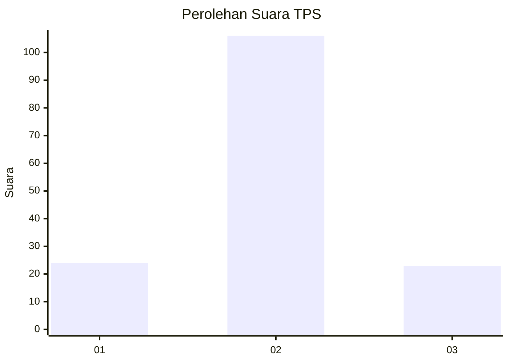

# Hasil

## Grafik

## Tabel

| No. | Nama Paslon    | Suara | Suara (raw) | Persentase |
|:--- |:-------------- | -----:| -----------:| ----------:|
| 1   | ANIES MUHAIMIN | 24    | [24][p-1]   | 15,69      |
| 2   | PRABOWO GIBRAN | 106   | [106][p-2]  | 69,28      |
| 3   | GANJAR MAHFUD  | 23    | [23][p-3]   | 15,03      |

[p-1]: https://github.com/gigit-pemilu/pemilu-2024-33-jawa-tengah/blob/main/pilpres/hitung-suara/sub/33-jawa-tengah/sub/05-kebumen/sub/17-rowokele/sub/2001-redisari/sub/003-tps/sub/paslon-1.txt
[p-2]: https://github.com/gigit-pemilu/pemilu-2024-33-jawa-tengah/blob/main/pilpres/hitung-suara/sub/33-jawa-tengah/sub/05-kebumen/sub/17-rowokele/sub/2001-redisari/sub/003-tps/sub/paslon-2.txt
[p-3]: https://github.com/gigit-pemilu/pemilu-2024-33-jawa-tengah/blob/main/pilpres/hitung-suara/sub/33-jawa-tengah/sub/05-kebumen/sub/17-rowokele/sub/2001-redisari/sub/003-tps/sub/paslon-3.txt

## Foto C Plano

https://sirekap-obj-formc.kpu.go.id/1338/pemilu/ppwp/33/05/17/20/01/3305172001003-20240217-172052--6021bf03-139b-4621-80cd-5cc2a020e313.jpg

https://sirekap-obj-formc.kpu.go.id/1338/pemilu/ppwp/33/05/17/20/01/3305172001003-20240215-005728--8fcd1344-7205-40a3-9de9-3ca10080bd51.jpg

https://sirekap-obj-formc.kpu.go.id/1338/pemilu/ppwp/33/05/17/20/01/3305172001003-20240215-010028--d5f5ab18-de03-4ec5-b1bc-681a04897f0d.jpg

## Metadata

| Key        | Value               |
| ---------- | ------------------- |
| Time Stamp | 2024-02-17 17:30:00 |

