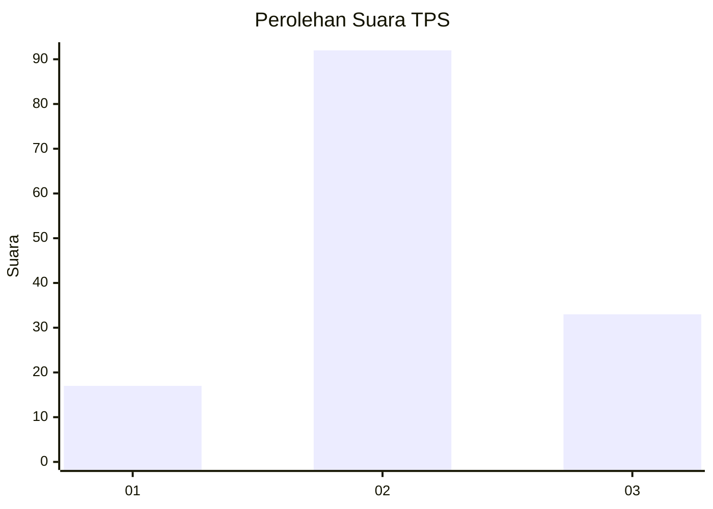
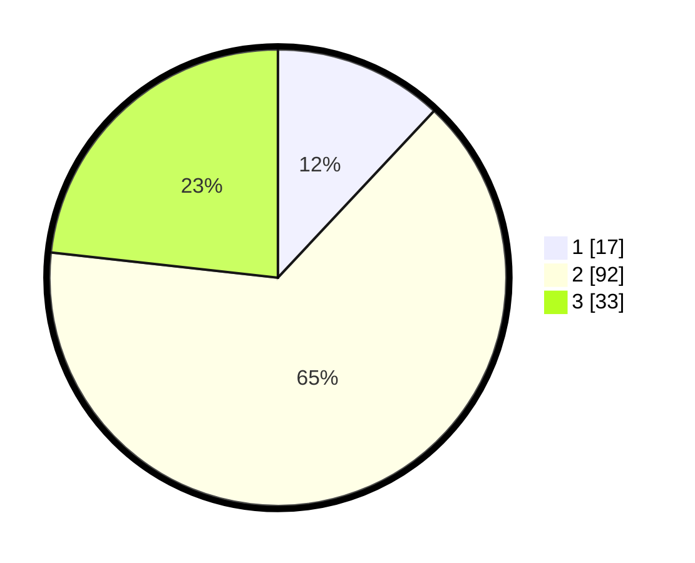

# Hasil

## Grafik

## Tabel

| No. | Nama Paslon    | Suara | Suara (raw) | Persentase |
|:--- |:-------------- | -----:| -----------:| ----------:|
| 1   | ANIES MUHAIMIN | 17    | [17][p-1]   | 11,97      |
| 2   | PRABOWO GIBRAN | 92    | [92][p-2]   | 64,79      |
| 3   | GANJAR MAHFUD  | 33    | [33][p-3]   | 23,24      |

[p-1]: https://github.com/gigit-pemilu/pemilu-2024-33-jawa-tengah/blob/main/pilpres/hitung-suara/sub/33-jawa-tengah/sub/05-kebumen/sub/17-rowokele/sub/2003-pringtutul/sub/013-tps/sub/paslon-1.txt
[p-2]: https://github.com/gigit-pemilu/pemilu-2024-33-jawa-tengah/blob/main/pilpres/hitung-suara/sub/33-jawa-tengah/sub/05-kebumen/sub/17-rowokele/sub/2003-pringtutul/sub/013-tps/sub/paslon-2.txt
[p-3]: https://github.com/gigit-pemilu/pemilu-2024-33-jawa-tengah/blob/main/pilpres/hitung-suara/sub/33-jawa-tengah/sub/05-kebumen/sub/17-rowokele/sub/2003-pringtutul/sub/013-tps/sub/paslon-3.txt

## Foto C Plano

https://sirekap-obj-formc.kpu.go.id/e366/pemilu/ppwp/33/05/17/20/03/3305172003013-20240217-081123--d9734a69-30c9-4316-968b-da83002a3bb8.jpg

https://sirekap-obj-formc.kpu.go.id/e366/pemilu/ppwp/33/05/17/20/03/3305172003013-20240217-081122--1987e586-f7a3-413d-be03-1843b080e7c0.jpg

https://sirekap-obj-formc.kpu.go.id/e366/pemilu/ppwp/33/05/17/20/03/3305172003013-20240217-105254--786d597f-31b5-4a41-b98b-30539eb42e4b.jpg

## Metadata

| Key        | Value               |
| ---------- | ------------------- |
| Time Stamp | 2024-02-17 11:00:02 |

