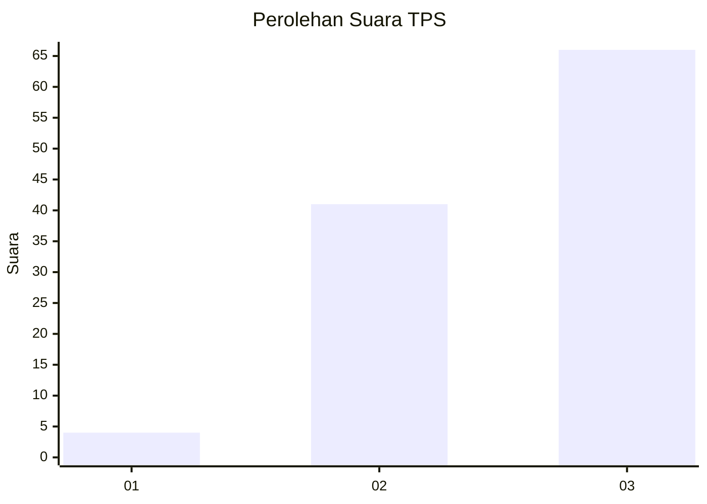
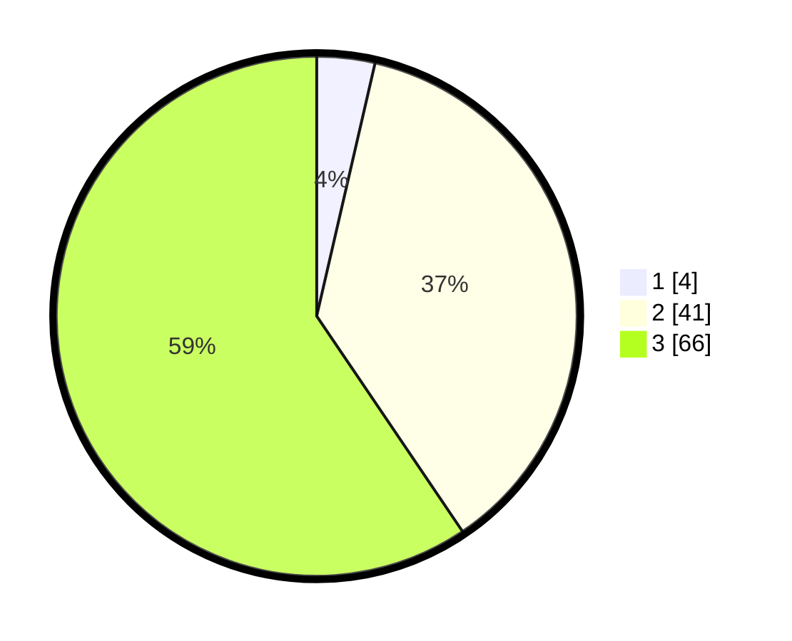

# Hasil

## Grafik

## Tabel

| No. | Nama Paslon    | Suara | Suara (raw) | Persentase |
|:--- |:-------------- | -----:| -----------:| ----------:|
| 1   | ANIES MUHAIMIN | 4     | [4][p-1]    | 3,60       |
| 2   | PRABOWO GIBRAN | 41    | [41][p-2]   | 36,94      |
| 3   | GANJAR MAHFUD  | 66    | [66][p-3]   | 59,46      |

[p-1]: https://github.com/gigit-pemilu/pemilu-2024/blob/main/pilpres/hitung-suara/sub/33-jawa-tengah/sub/05-kebumen/sub/18-sempor/sub/2014-kedungwringin/sub/010-tps/sub/paslon-1.txt
[p-2]: https://github.com/gigit-pemilu/pemilu-2024/blob/main/pilpres/hitung-suara/sub/33-jawa-tengah/sub/05-kebumen/sub/18-sempor/sub/2014-kedungwringin/sub/010-tps/sub/paslon-2.txt
[p-3]: https://github.com/gigit-pemilu/pemilu-2024/blob/main/pilpres/hitung-suara/sub/33-jawa-tengah/sub/05-kebumen/sub/18-sempor/sub/2014-kedungwringin/sub/010-tps/sub/paslon-3.txt

## Foto C Plano

https://sirekap-obj-formc.kpu.go.id/0a2e/pemilu/ppwp/33/05/18/20/14/3305182014010-20240216-152438--77b9ce2f-a246-4b2e-b8ab-50dbdc0332c7.jpg

https://sirekap-obj-formc.kpu.go.id/0a2e/pemilu/ppwp/33/05/18/20/14/3305182014010-20240216-152459--7e7fdda1-40a7-4f9c-96f7-3c7250cd4d54.jpg

https://sirekap-obj-formc.kpu.go.id/0a2e/pemilu/ppwp/33/05/18/20/14/3305182014010-20240216-152520--01eb4d21-aead-48cb-949b-4301840f150c.jpg

## Metadata

| Key        | Value               |
| ---------- | ------------------- |
| Time Stamp | 2024-02-16 16:25:10 |

