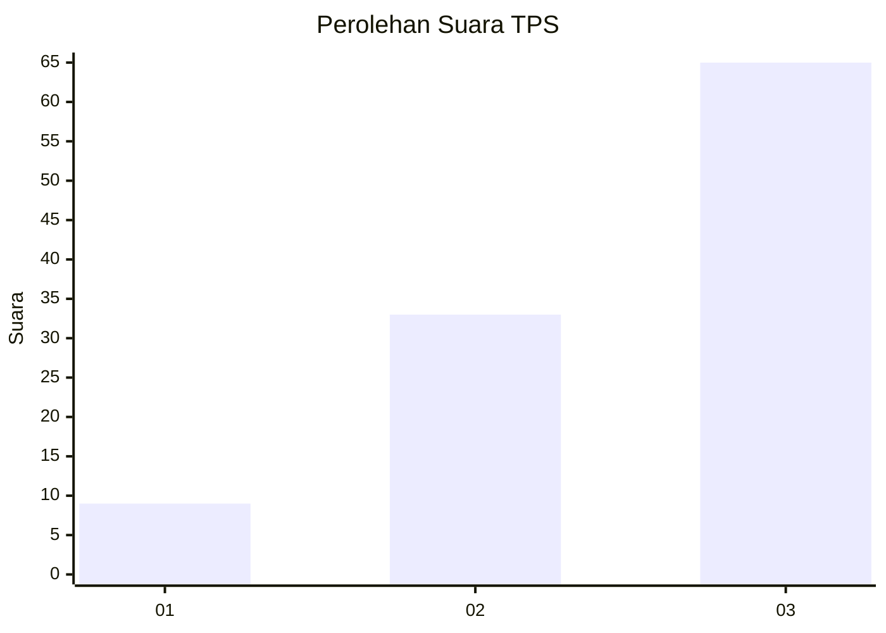
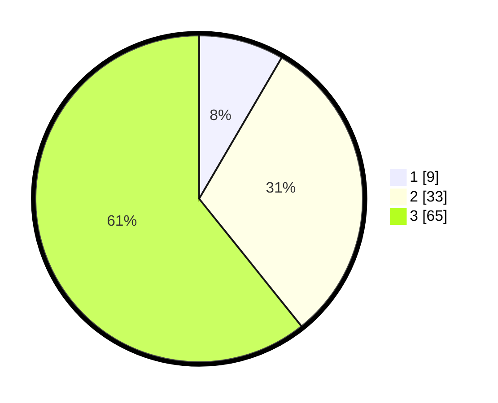

# Hasil

## Grafik

## Tabel

| No. | Nama Paslon    | Suara | Suara (raw) | Persentase |
|:--- |:-------------- | -----:| -----------:| ----------:|
| 1   | ANIES MUHAIMIN | 9     | [9][p-1]    | 8,41       |
| 2   | PRABOWO GIBRAN | 33    | [33][p-2]   | 30,84      |
| 3   | GANJAR MAHFUD  | 65    | [65][p-3]   | 60,75      |

[p-1]: https://github.com/gigit-pemilu/pemilu-2024-33-jawa-tengah/blob/main/pilpres/hitung-suara/sub/33-jawa-tengah/sub/05-kebumen/sub/18-sempor/sub/2014-kedungwringin/sub/013-tps/sub/paslon-1.txt
[p-2]: https://github.com/gigit-pemilu/pemilu-2024-33-jawa-tengah/blob/main/pilpres/hitung-suara/sub/33-jawa-tengah/sub/05-kebumen/sub/18-sempor/sub/2014-kedungwringin/sub/013-tps/sub/paslon-2.txt
[p-3]: https://github.com/gigit-pemilu/pemilu-2024-33-jawa-tengah/blob/main/pilpres/hitung-suara/sub/33-jawa-tengah/sub/05-kebumen/sub/18-sempor/sub/2014-kedungwringin/sub/013-tps/sub/paslon-3.txt

## Foto C Plano

https://sirekap-obj-formc.kpu.go.id/d2c1/pemilu/ppwp/33/05/18/20/14/3305182014013-20240214-141716--d20e7cff-d159-4a96-98bf-cd51bd1c56b0.jpg

https://sirekap-obj-formc.kpu.go.id/d2c1/pemilu/ppwp/33/05/18/20/14/3305182014013-20240214-141809--61544eac-a5f2-42fa-a404-4bd034798e7b.jpg

https://sirekap-obj-formc.kpu.go.id/d2c1/pemilu/ppwp/33/05/18/20/14/3305182014013-20240214-141902--70081813-27a4-4f25-a888-2c369279238b.jpg

## Metadata

| Key        | Value               |
| ---------- | ------------------- |
| Time Stamp | 2024-02-16 10:30:29 |

