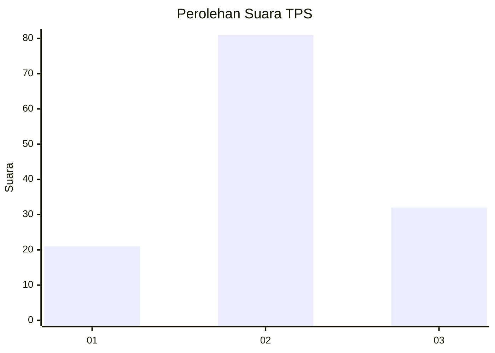
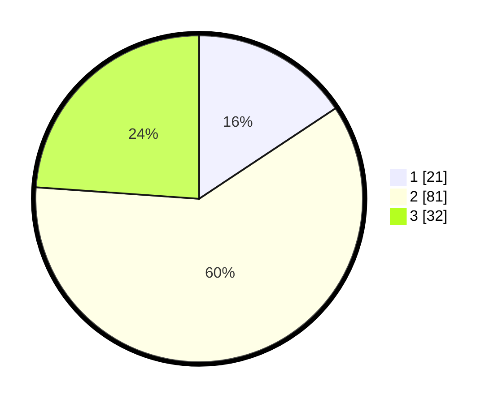

# Hasil

## Grafik

## Tabel

| No. | Nama Paslon    | Suara | Suara (raw) | Persentase |
|:--- |:-------------- | -----:| -----------:| ----------:|
| 1   | ANIES MUHAIMIN | 21    | [21][p-1]   | 15,67      |
| 2   | PRABOWO GIBRAN | 81    | [81][p-2]   | 60,45      |
| 3   | GANJAR MAHFUD  | 32    | [32][p-3]   | 23,88      |

[p-1]: https://github.com/gigit-pemilu/pemilu-2024/blob/main/pilpres/hitung-suara/sub/33-jawa-tengah/sub/05-kebumen/sub/19-gombong/sub/1009-wonokriyo/sub/001-tps/sub/paslon-1.txt
[p-2]: https://github.com/gigit-pemilu/pemilu-2024/blob/main/pilpres/hitung-suara/sub/33-jawa-tengah/sub/05-kebumen/sub/19-gombong/sub/1009-wonokriyo/sub/001-tps/sub/paslon-2.txt
[p-3]: https://github.com/gigit-pemilu/pemilu-2024/blob/main/pilpres/hitung-suara/sub/33-jawa-tengah/sub/05-kebumen/sub/19-gombong/sub/1009-wonokriyo/sub/001-tps/sub/paslon-3.txt

## Foto C Plano

https://sirekap-obj-formc.kpu.go.id/36c3/pemilu/ppwp/33/05/19/10/09/3305191009001-20240214-212948--48c2cda6-27e8-4e2c-80bd-93f3e9fc962f.jpg

https://sirekap-obj-formc.kpu.go.id/36c3/pemilu/ppwp/33/05/19/10/09/3305191009001-20240214-213158--ef11de89-e112-453b-93cc-35ee9f6734f5.jpg

https://sirekap-obj-formc.kpu.go.id/36c3/pemilu/ppwp/33/05/19/10/09/3305191009001-20240214-213337--5a9597b1-5f1f-4cd2-856b-831418be5031.jpg

## Metadata

| Key        | Value               |
| ---------- | ------------------- |
| Time Stamp | 2024-02-19 18:00:00 |

