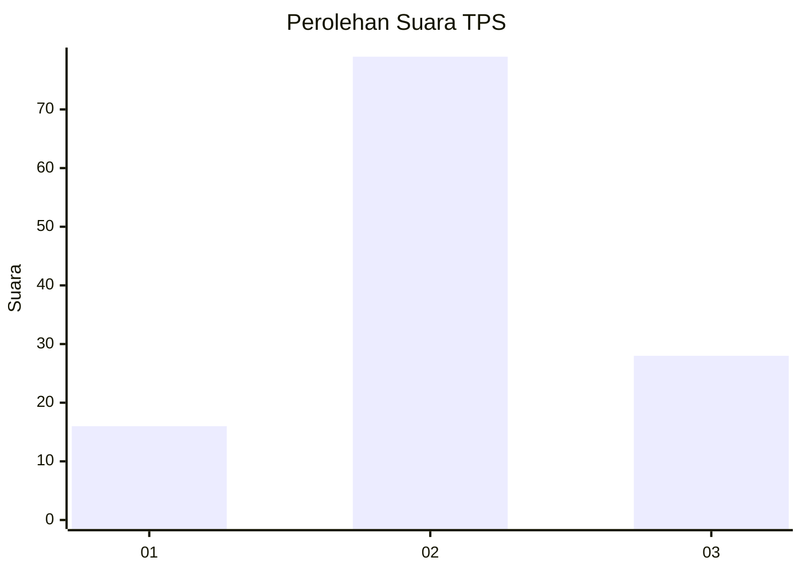
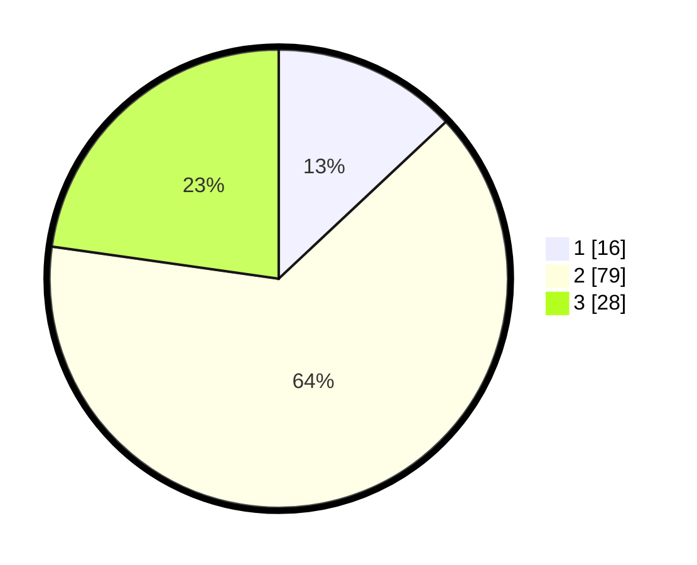

# Hasil

## Grafik

## Tabel

| No. | Nama Paslon    | Suara | Suara (raw) | Persentase |
|:--- |:-------------- | -----:| -----------:| ----------:|
| 1   | ANIES MUHAIMIN | 16    | [16][p-1]   | 13,01      |
| 2   | PRABOWO GIBRAN | 79    | [79][p-2]   | 64,23      |
| 3   | GANJAR MAHFUD  | 28    | [28][p-3]   | 22,76      |

[p-1]: https://github.com/gigit-pemilu/pemilu-2024/blob/main/pilpres/hitung-suara/sub/33-jawa-tengah/sub/05-kebumen/sub/19-gombong/sub/2012-sidayu/sub/007-tps/sub/paslon-1.txt
[p-2]: https://github.com/gigit-pemilu/pemilu-2024/blob/main/pilpres/hitung-suara/sub/33-jawa-tengah/sub/05-kebumen/sub/19-gombong/sub/2012-sidayu/sub/007-tps/sub/paslon-2.txt
[p-3]: https://github.com/gigit-pemilu/pemilu-2024/blob/main/pilpres/hitung-suara/sub/33-jawa-tengah/sub/05-kebumen/sub/19-gombong/sub/2012-sidayu/sub/007-tps/sub/paslon-3.txt

## Foto C Plano

https://sirekap-obj-formc.kpu.go.id/9274/pemilu/ppwp/33/05/19/20/12/3305192012007-20240215-194739--71d50528-27f5-43c0-b93d-f1b211adf141.jpg

https://sirekap-obj-formc.kpu.go.id/9274/pemilu/ppwp/33/05/19/20/12/3305192012007-20240215-150525--ead4d28d-4c57-4394-8850-3783413d819f.jpg

https://sirekap-obj-formc.kpu.go.id/9274/pemilu/ppwp/33/05/19/20/12/3305192012007-20240214-195345--e326357f-e17c-4998-bf1f-eb79456dc66d.jpg

## Metadata

| Key        | Value               |
| ---------- | ------------------- |
| Time Stamp | 2024-02-15 20:00:44 |

