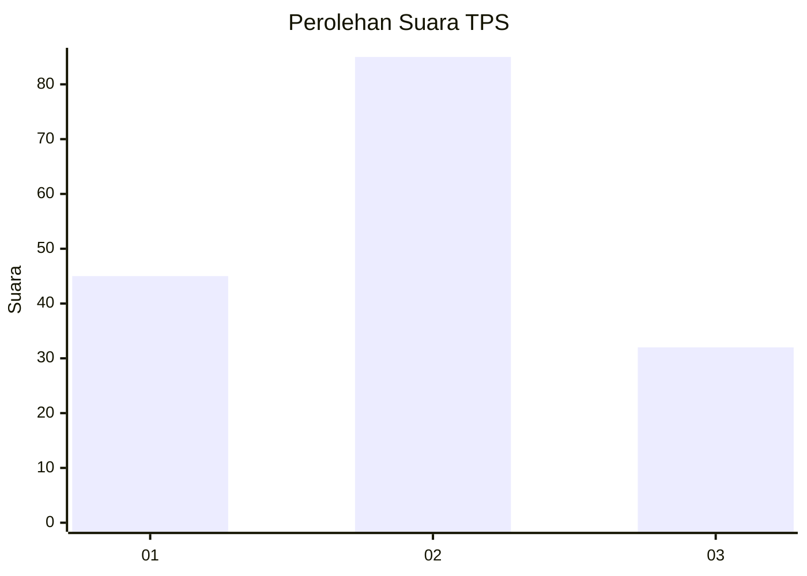
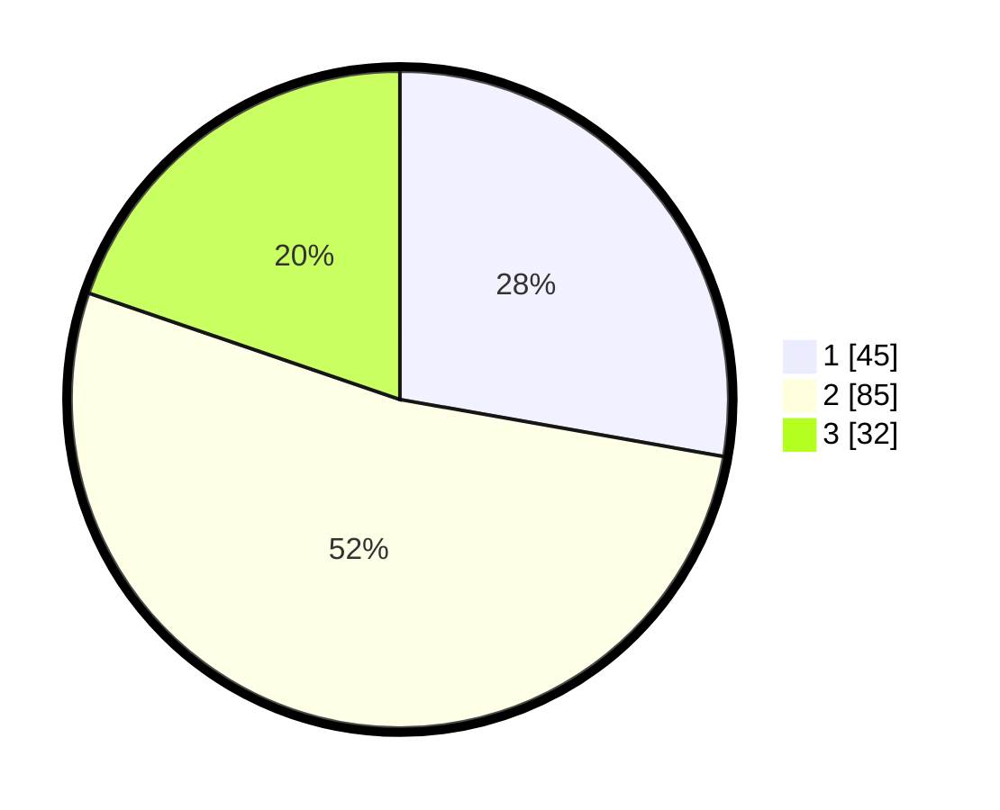

# Hasil

## Grafik

## Tabel

| No. | Nama Paslon    | Suara | Suara (raw) | Persentase |
|:--- |:-------------- | -----:| -----------:| ----------:|
| 1   | ANIES MUHAIMIN | 45    | [45][p-1]   | 27,78      |
| 2   | PRABOWO GIBRAN | 85    | [85][p-2]   | 52,47      |
| 3   | GANJAR MAHFUD  | 32    | [32][p-3]   | 19,75      |

[p-1]: https://github.com/gigit-pemilu/pemilu-2024-33-jawa-tengah/blob/main/pilpres/hitung-suara/sub/33-jawa-tengah/sub/05-kebumen/sub/19-gombong/sub/2014-klopogodo/sub/011-tps/sub/paslon-1.txt
[p-2]: https://github.com/gigit-pemilu/pemilu-2024-33-jawa-tengah/blob/main/pilpres/hitung-suara/sub/33-jawa-tengah/sub/05-kebumen/sub/19-gombong/sub/2014-klopogodo/sub/011-tps/sub/paslon-2.txt
[p-3]: https://github.com/gigit-pemilu/pemilu-2024-33-jawa-tengah/blob/main/pilpres/hitung-suara/sub/33-jawa-tengah/sub/05-kebumen/sub/19-gombong/sub/2014-klopogodo/sub/011-tps/sub/paslon-3.txt

## Foto C Plano

https://sirekap-obj-formc.kpu.go.id/39be/pemilu/ppwp/33/05/19/20/14/3305192014011-20240215-190029--ad4f98f3-c137-4673-ac0f-200f19cf82af.jpg

https://sirekap-obj-formc.kpu.go.id/39be/pemilu/ppwp/33/05/19/20/14/3305192014011-20240216-203657--5fa3a011-cc48-42de-8ed3-1154e97df5e1.jpg

https://sirekap-obj-formc.kpu.go.id/39be/pemilu/ppwp/33/05/19/20/14/3305192014011-20240216-203849--0163bbae-1827-4271-bf30-bcaa51e7919e.jpg

## Metadata

| Key        | Value               |
| ---------- | ------------------- |
| Time Stamp | 2024-02-16 22:30:00 |

