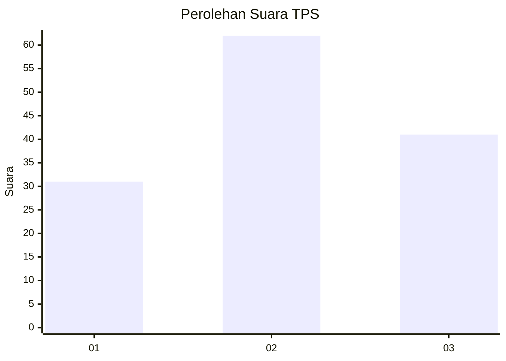
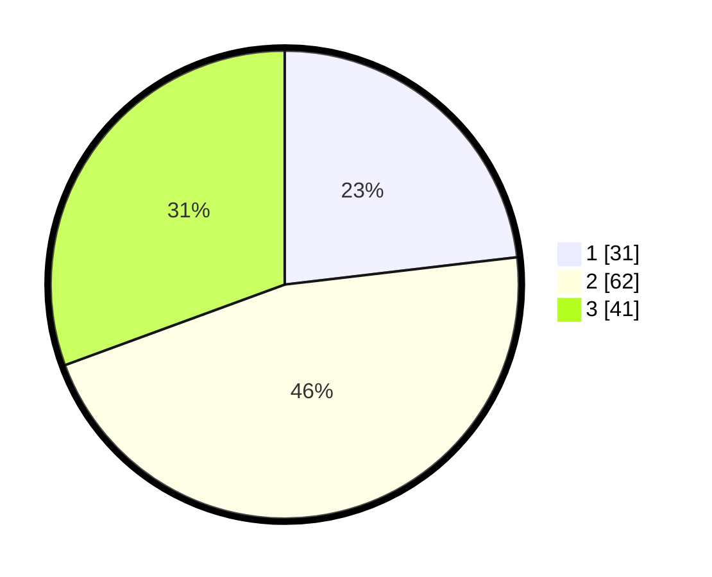

# Hasil

## Grafik

## Tabel

| No. | Nama Paslon    | Suara | Suara (raw) | Persentase |
|:--- |:-------------- | -----:| -----------:| ----------:|
| 1   | ANIES MUHAIMIN | 31    | [31][p-1]   | 23,13      |
| 2   | PRABOWO GIBRAN | 62    | [62][p-2]   | 46,27      |
| 3   | GANJAR MAHFUD  | 41    | [41][p-3]   | 30,60      |

[p-1]: https://github.com/gigit-pemilu/pemilu-2024/blob/main/pilpres/hitung-suara/sub/33-jawa-tengah/sub/05-kebumen/sub/19-gombong/sub/2014-klopogodo/sub/012-tps/sub/paslon-1.txt
[p-2]: https://github.com/gigit-pemilu/pemilu-2024/blob/main/pilpres/hitung-suara/sub/33-jawa-tengah/sub/05-kebumen/sub/19-gombong/sub/2014-klopogodo/sub/012-tps/sub/paslon-2.txt
[p-3]: https://github.com/gigit-pemilu/pemilu-2024/blob/main/pilpres/hitung-suara/sub/33-jawa-tengah/sub/05-kebumen/sub/19-gombong/sub/2014-klopogodo/sub/012-tps/sub/paslon-3.txt

## Foto C Plano

https://sirekap-obj-formc.kpu.go.id/0ea3/pemilu/ppwp/33/05/19/20/14/3305192014012-20240214-194300--94f1b12f-f650-420d-bfb7-c827a4ebfe37.jpg

https://sirekap-obj-formc.kpu.go.id/0ea3/pemilu/ppwp/33/05/19/20/14/3305192014012-20240214-194335--f8fae0f6-e48a-40ee-adea-391494b46f11.jpg

https://sirekap-obj-formc.kpu.go.id/0ea3/pemilu/ppwp/33/05/19/20/14/3305192014012-20240214-201951--e2c54b03-863f-4cf2-b4ad-f9a9cc028b27.jpg

## Metadata

| Key        | Value               |
| ---------- | ------------------- |
| Time Stamp | 2024-02-24 22:31:28 |

