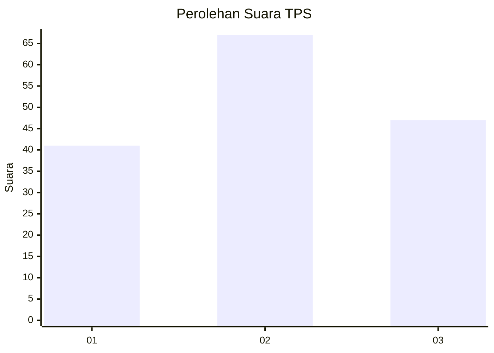
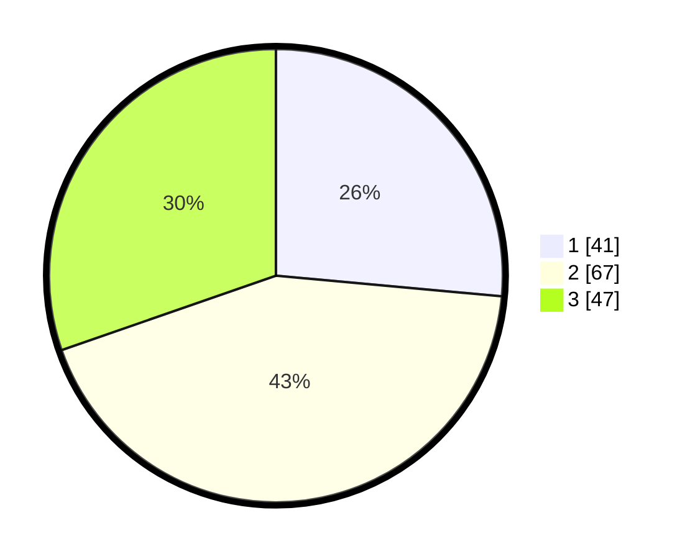

# Hasil

## Grafik

## Tabel

| No. | Nama Paslon    | Suara | Suara (raw) | Persentase |
|:--- |:-------------- | -----:| -----------:| ----------:|
| 1   | ANIES MUHAIMIN | 41    | [41][p-1]   | 26,45      |
| 2   | PRABOWO GIBRAN | 67    | [67][p-2]   | 43,23      |
| 3   | GANJAR MAHFUD  | 47    | [47][p-3]   | 30,32      |

[p-1]: https://github.com/gigit-pemilu/pemilu-2024/blob/main/pilpres/hitung-suara/sub/33-jawa-tengah/sub/05-kebumen/sub/20-karanganyar/sub/1007-plarangan/sub/002-tps/sub/paslon-1.txt
[p-2]: https://github.com/gigit-pemilu/pemilu-2024/blob/main/pilpres/hitung-suara/sub/33-jawa-tengah/sub/05-kebumen/sub/20-karanganyar/sub/1007-plarangan/sub/002-tps/sub/paslon-2.txt
[p-3]: https://github.com/gigit-pemilu/pemilu-2024/blob/main/pilpres/hitung-suara/sub/33-jawa-tengah/sub/05-kebumen/sub/20-karanganyar/sub/1007-plarangan/sub/002-tps/sub/paslon-3.txt

## Foto C Plano

https://sirekap-obj-formc.kpu.go.id/c49b/pemilu/ppwp/33/05/20/10/07/3305201007002-20240215-023200--af7653ec-4832-43ff-a78c-5ce1907c1dff.jpg

https://sirekap-obj-formc.kpu.go.id/c49b/pemilu/ppwp/33/05/20/10/07/3305201007002-20240215-023949--c243bdf2-ae4b-4461-9dd7-a45efa2ef751.jpg

https://sirekap-obj-formc.kpu.go.id/c49b/pemilu/ppwp/33/05/20/10/07/3305201007002-20240214-224827--6ba8be01-016d-4a4c-b5a6-e6371e04ffac.jpg

## Metadata

| Key        | Value               |
| ---------- | ------------------- |
| Time Stamp | 2024-02-15 21:30:27 |

