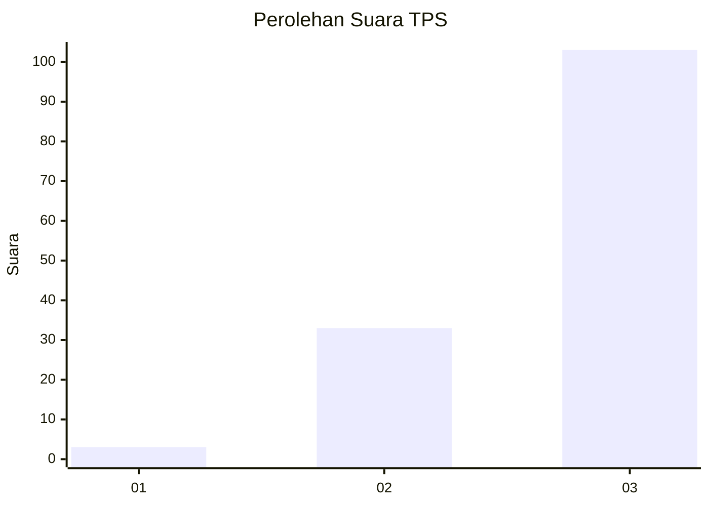
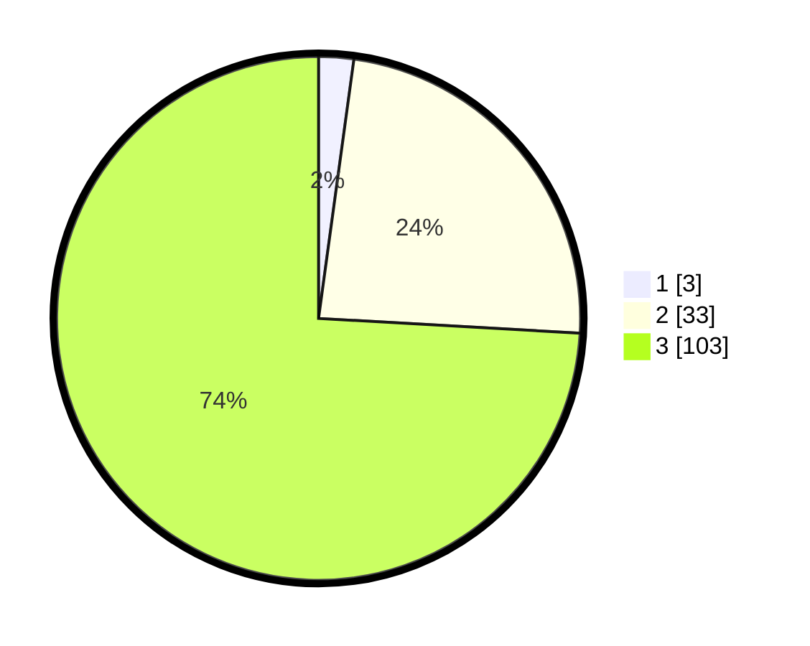

# Hasil

## Grafik

## Tabel

| No. | Nama Paslon    | Suara | Suara (raw) | Persentase |
|:--- |:-------------- | -----:| -----------:| ----------:|
| 1   | ANIES MUHAIMIN | 3     | [3][p-1]    | 2,16       |
| 2   | PRABOWO GIBRAN | 33    | [33][p-2]   | 23,74      |
| 3   | GANJAR MAHFUD  | 103   | [103][p-3]  | 74,10      |

[p-1]: https://github.com/gigit-pemilu/pemilu-2024-33-jawa-tengah/blob/main/pilpres/hitung-suara/sub/33-jawa-tengah/sub/05-kebumen/sub/20-karanganyar/sub/1007-plarangan/sub/014-tps/sub/paslon-1.txt
[p-2]: https://github.com/gigit-pemilu/pemilu-2024-33-jawa-tengah/blob/main/pilpres/hitung-suara/sub/33-jawa-tengah/sub/05-kebumen/sub/20-karanganyar/sub/1007-plarangan/sub/014-tps/sub/paslon-2.txt
[p-3]: https://github.com/gigit-pemilu/pemilu-2024-33-jawa-tengah/blob/main/pilpres/hitung-suara/sub/33-jawa-tengah/sub/05-kebumen/sub/20-karanganyar/sub/1007-plarangan/sub/014-tps/sub/paslon-3.txt

## Foto C Plano

https://sirekap-obj-formc.kpu.go.id/8ad3/pemilu/ppwp/33/05/20/10/07/3305201007014-20240214-225051--5f79a3b6-2118-40e0-8e71-1d55c372bc13.jpg

https://sirekap-obj-formc.kpu.go.id/8ad3/pemilu/ppwp/33/05/20/10/07/3305201007014-20240214-225159--e70e19b9-2d14-4d2d-b10b-007be42d113b.jpg

https://sirekap-obj-formc.kpu.go.id/8ad3/pemilu/ppwp/33/05/20/10/07/3305201007014-20240214-225238--483e4386-81f3-42e3-9f13-6db2418b92fd.jpg

## Metadata

| Key        | Value               |
| ---------- | ------------------- |
| Time Stamp | 2024-02-15 22:00:27 |

