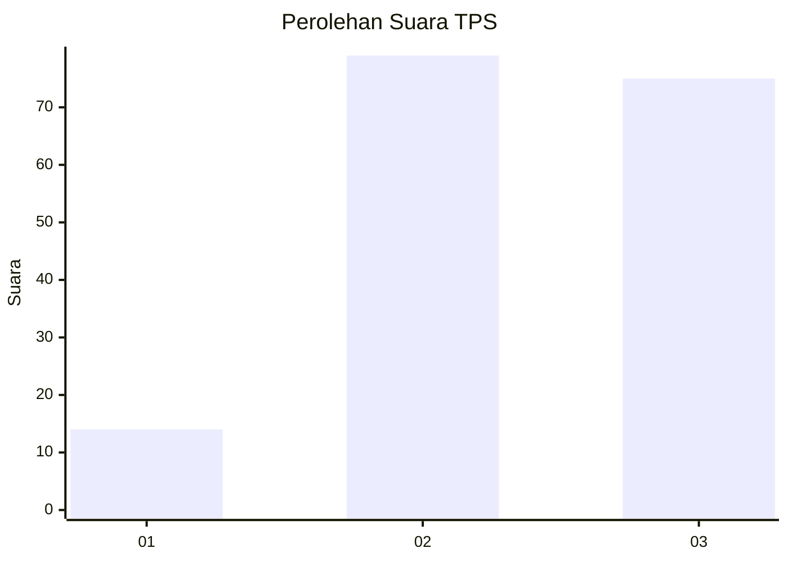
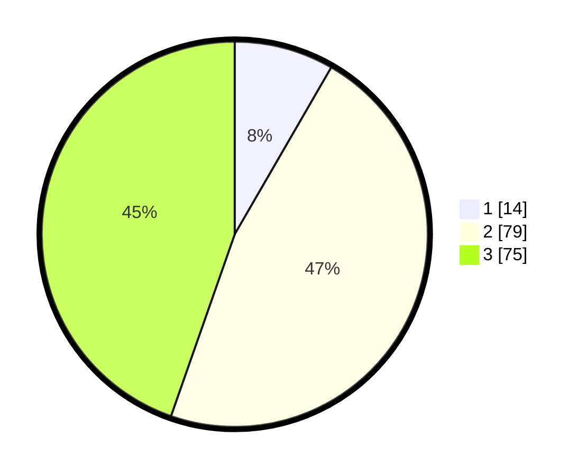

# Hasil

## Grafik

## Tabel

| No. | Nama Paslon    | Suara | Suara (raw) | Persentase |
|:--- |:-------------- | -----:| -----------:| ----------:|
| 1   | ANIES MUHAIMIN | 14    | [14][p-1]   | 8,33       |
| 2   | PRABOWO GIBRAN | 79    | [79][p-2]   | 47,02      |
| 3   | GANJAR MAHFUD  | 75    | [75][p-3]   | 44,64      |

[p-1]: https://github.com/gigit-pemilu/pemilu-2024/blob/main/pilpres/hitung-suara/sub/33-jawa-tengah/sub/05-kebumen/sub/20-karanganyar/sub/2005-candi/sub/001-tps/sub/paslon-1.txt
[p-2]: https://github.com/gigit-pemilu/pemilu-2024/blob/main/pilpres/hitung-suara/sub/33-jawa-tengah/sub/05-kebumen/sub/20-karanganyar/sub/2005-candi/sub/001-tps/sub/paslon-2.txt
[p-3]: https://github.com/gigit-pemilu/pemilu-2024/blob/main/pilpres/hitung-suara/sub/33-jawa-tengah/sub/05-kebumen/sub/20-karanganyar/sub/2005-candi/sub/001-tps/sub/paslon-3.txt

## Foto C Plano

https://sirekap-obj-formc.kpu.go.id/5bc3/pemilu/ppwp/33/05/20/20/05/3305202005001-20240215-010031--33c6ac41-d91c-45a3-9a0f-eded3c84efd1.jpg

https://sirekap-obj-formc.kpu.go.id/5bc3/pemilu/ppwp/33/05/20/20/05/3305202005001-20240215-010105--be0e219e-139f-42f2-9d15-e9d2c5768591.jpg

https://sirekap-obj-formc.kpu.go.id/5bc3/pemilu/ppwp/33/05/20/20/05/3305202005001-20240215-010326--39fd6920-2b4c-4fe1-8184-ae8a0999eebf.jpg

## Metadata

| Key        | Value               |
| ---------- | ------------------- |
| Time Stamp | 2024-02-15 22:00:27 |

