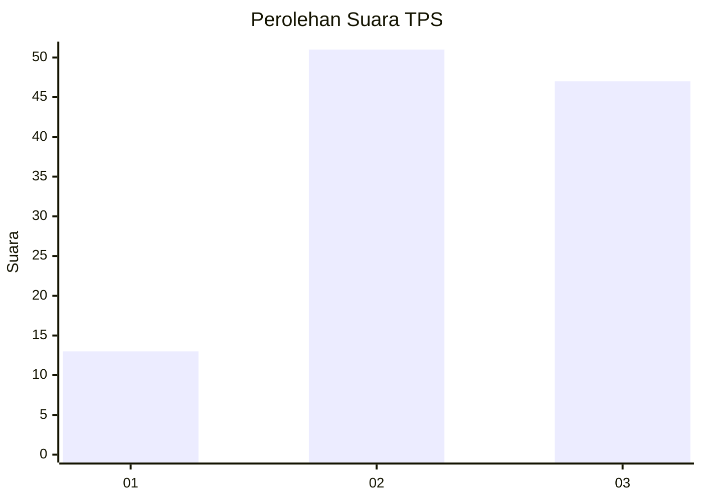
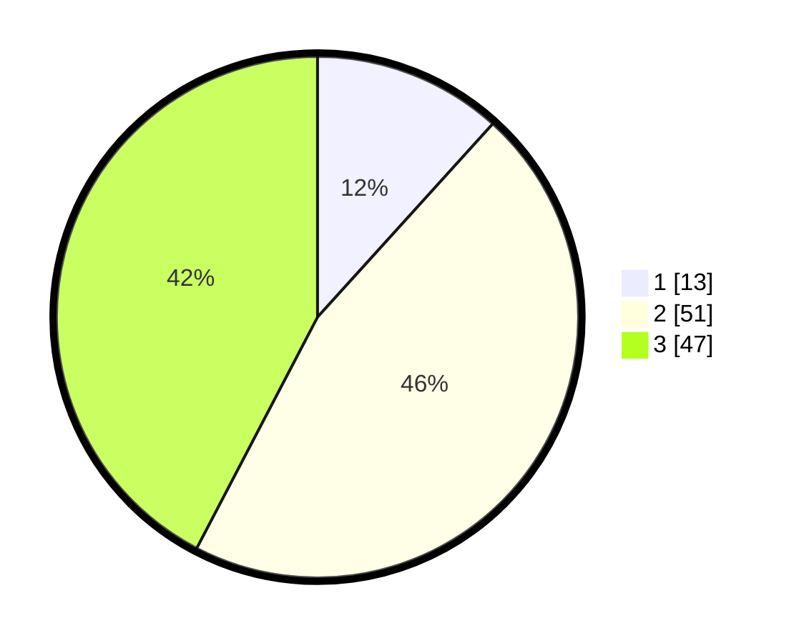

# Hasil

## Grafik

## Tabel

| No. | Nama Paslon    | Suara | Suara (raw) | Persentase |
|:--- |:-------------- | -----:| -----------:| ----------:|
| 1   | ANIES MUHAIMIN | 13    | [13][p-1]   | 11,71      |
| 2   | PRABOWO GIBRAN | 51    | [51][p-2]   | 45,95      |
| 3   | GANJAR MAHFUD  | 47    | [47][p-3]   | 42,34      |

[p-1]: https://github.com/gigit-pemilu/pemilu-2024/blob/main/pilpres/hitung-suara/sub/33-jawa-tengah/sub/05-kebumen/sub/20-karanganyar/sub/2005-candi/sub/010-tps/sub/paslon-1.txt
[p-2]: https://github.com/gigit-pemilu/pemilu-2024/blob/main/pilpres/hitung-suara/sub/33-jawa-tengah/sub/05-kebumen/sub/20-karanganyar/sub/2005-candi/sub/010-tps/sub/paslon-2.txt
[p-3]: https://github.com/gigit-pemilu/pemilu-2024/blob/main/pilpres/hitung-suara/sub/33-jawa-tengah/sub/05-kebumen/sub/20-karanganyar/sub/2005-candi/sub/010-tps/sub/paslon-3.txt

## Foto C Plano

https://sirekap-obj-formc.kpu.go.id/d4f9/pemilu/ppwp/33/05/20/20/05/3305202005010-20240214-230804--efd30bf5-8a56-48aa-9001-47f15935f9ef.jpg

https://sirekap-obj-formc.kpu.go.id/d4f9/pemilu/ppwp/33/05/20/20/05/3305202005010-20240215-014312--5f8e1bf9-c711-463d-b293-dfb28a3c9ab6.jpg

https://sirekap-obj-formc.kpu.go.id/d4f9/pemilu/ppwp/33/05/20/20/05/3305202005010-20240215-014522--2c489291-4c6f-407d-9c9e-144da56edbeb.jpg

## Metadata

| Key        | Value               |
| ---------- | ------------------- |
| Time Stamp | 2024-02-15 16:30:25 |

