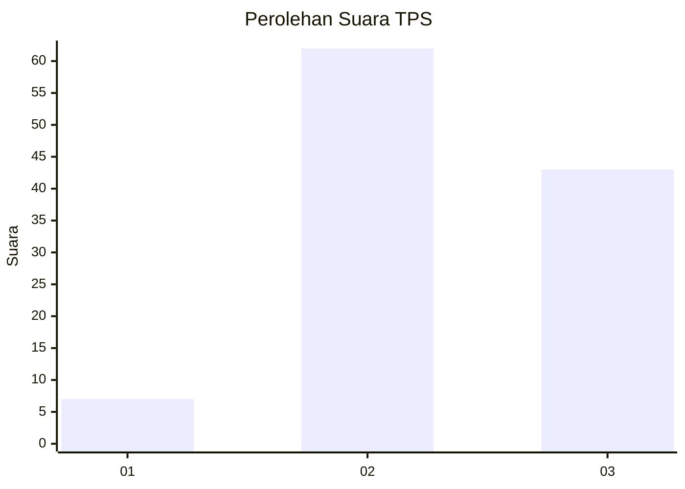
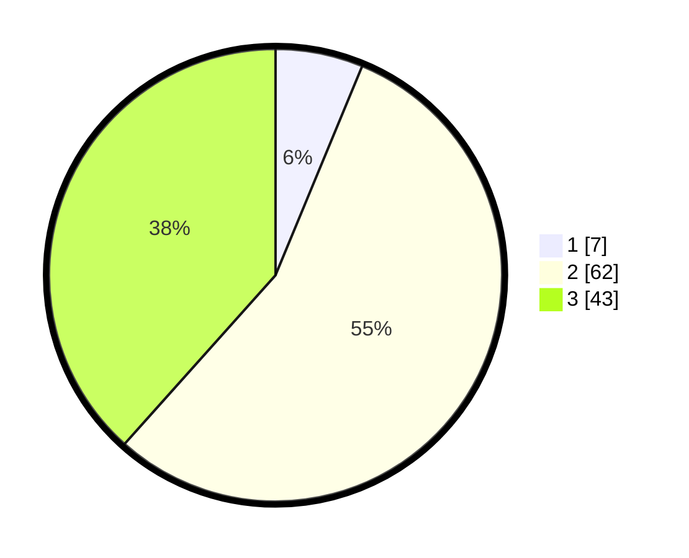

# Hasil

## Grafik

## Tabel

| No. | Nama Paslon    | Suara | Suara (raw) | Persentase |
|:--- |:-------------- | -----:| -----------:| ----------:|
| 1   | ANIES MUHAIMIN | 7     | [7][p-1]    | 6,25       |
| 2   | PRABOWO GIBRAN | 62    | [62][p-2]   | 55,36      |
| 3   | GANJAR MAHFUD  | 43    | [43][p-3]   | 38,39      |

[p-1]: https://github.com/gigit-pemilu/pemilu-2024-33-jawa-tengah/blob/main/pilpres/hitung-suara/sub/33-jawa-tengah/sub/05-kebumen/sub/20-karanganyar/sub/2006-giripurno/sub/011-tps/sub/paslon-1.txt
[p-2]: https://github.com/gigit-pemilu/pemilu-2024-33-jawa-tengah/blob/main/pilpres/hitung-suara/sub/33-jawa-tengah/sub/05-kebumen/sub/20-karanganyar/sub/2006-giripurno/sub/011-tps/sub/paslon-2.txt
[p-3]: https://github.com/gigit-pemilu/pemilu-2024-33-jawa-tengah/blob/main/pilpres/hitung-suara/sub/33-jawa-tengah/sub/05-kebumen/sub/20-karanganyar/sub/2006-giripurno/sub/011-tps/sub/paslon-3.txt

## Foto C Plano

https://sirekap-obj-formc.kpu.go.id/f54a/pemilu/ppwp/33/05/20/20/06/3305202006011-20240214-141537--bbc7387f-a482-43b5-a105-a9afc77a3fb7.jpg

https://sirekap-obj-formc.kpu.go.id/f54a/pemilu/ppwp/33/05/20/20/06/3305202006011-20240214-141401--32fe67f5-60a7-4a08-a9fd-336bf045c00b.jpg

https://sirekap-obj-formc.kpu.go.id/f54a/pemilu/ppwp/33/05/20/20/06/3305202006011-20240214-141615--93c0a39b-63aa-4761-a7bf-9910656da60f.jpg

## Metadata

| Key        | Value               |
| ---------- | ------------------- |
| Time Stamp | 2024-02-15 01:47:43 |

