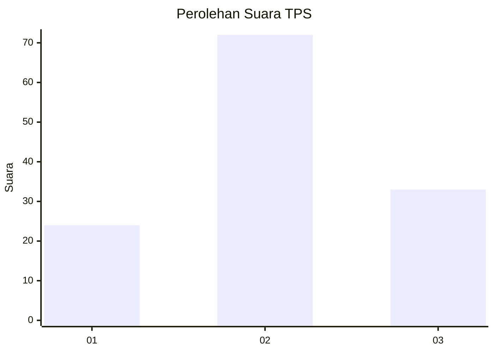
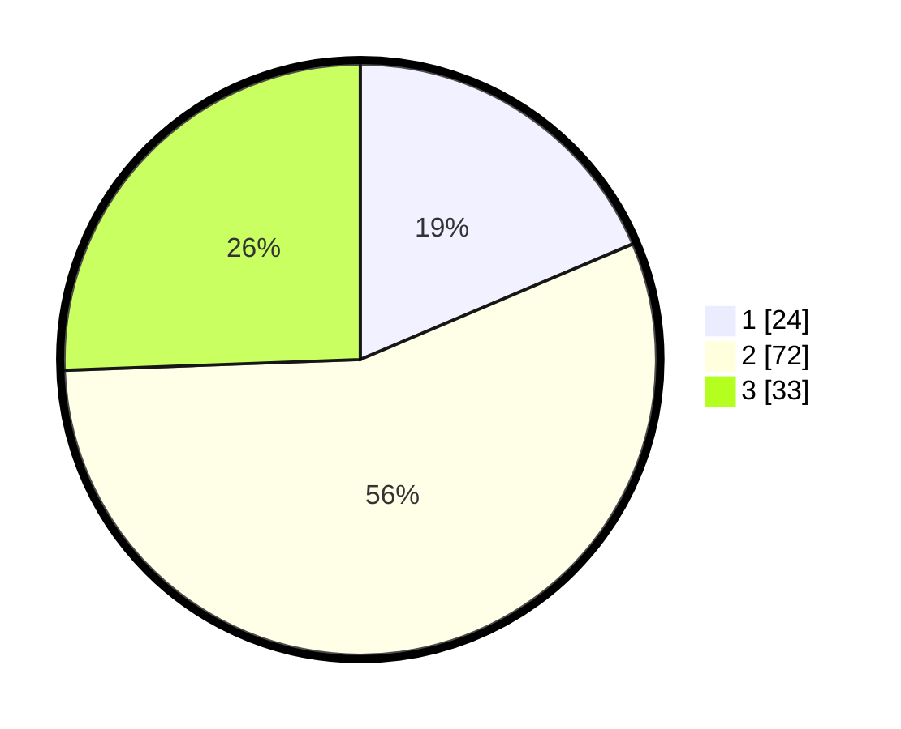

# Hasil

## Grafik

## Tabel

| No. | Nama Paslon    | Suara | Suara (raw) | Persentase |
|:--- |:-------------- | -----:| -----------:| ----------:|
| 1   | ANIES MUHAIMIN | 24    | [24][p-1]   | 18,60      |
| 2   | PRABOWO GIBRAN | 72    | [72][p-2]   | 55,81      |
| 3   | GANJAR MAHFUD  | 33    | [33][p-3]   | 25,58      |

[p-1]: https://github.com/gigit-pemilu/pemilu-2024/blob/main/pilpres/hitung-suara/sub/33-jawa-tengah/sub/05-kebumen/sub/20-karanganyar/sub/2008-karangkemiri/sub/004-tps/sub/paslon-1.txt
[p-2]: https://github.com/gigit-pemilu/pemilu-2024/blob/main/pilpres/hitung-suara/sub/33-jawa-tengah/sub/05-kebumen/sub/20-karanganyar/sub/2008-karangkemiri/sub/004-tps/sub/paslon-2.txt
[p-3]: https://github.com/gigit-pemilu/pemilu-2024/blob/main/pilpres/hitung-suara/sub/33-jawa-tengah/sub/05-kebumen/sub/20-karanganyar/sub/2008-karangkemiri/sub/004-tps/sub/paslon-3.txt

## Foto C Plano

https://sirekap-obj-formc.kpu.go.id/e810/pemilu/ppwp/33/05/20/20/08/3305202008004-20240214-235143--2b18f3d6-81f6-4c58-8ecf-5a8e7f0036a1.jpg

https://sirekap-obj-formc.kpu.go.id/e810/pemilu/ppwp/33/05/20/20/08/3305202008004-20240215-000556--68317457-f12d-4828-9b6c-07c799210deb.jpg

https://sirekap-obj-formc.kpu.go.id/e810/pemilu/ppwp/33/05/20/20/08/3305202008004-20240214-235351--a2ab620e-3ae5-43cc-b5aa-acf596f7b95e.jpg

## Metadata

| Key        | Value               |
| ---------- | ------------------- |
| Time Stamp | 2024-02-15 22:30:27 |

