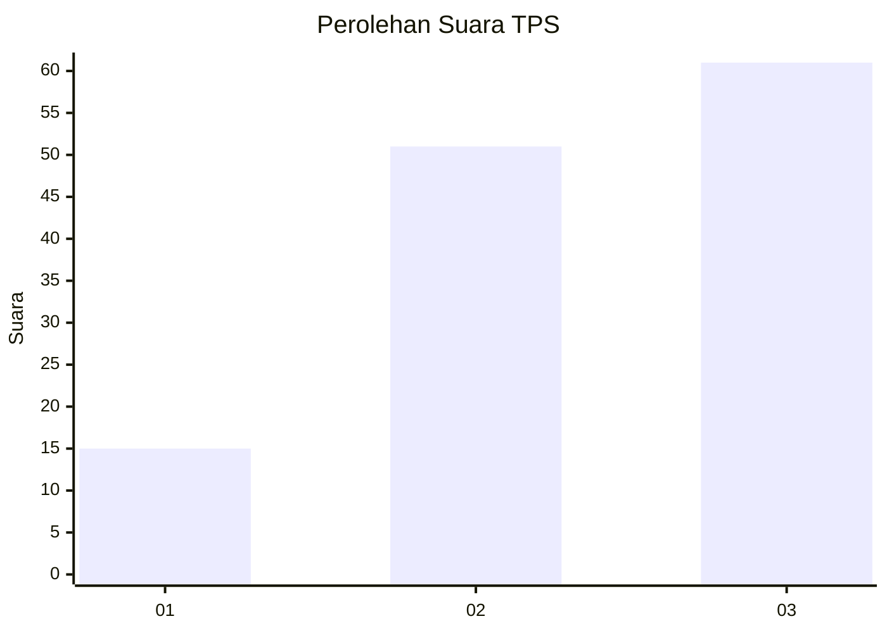
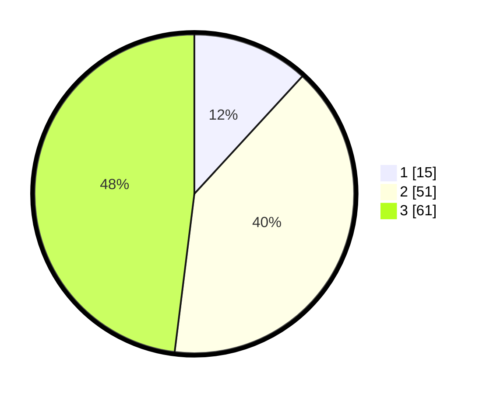

# Hasil

## Grafik

## Tabel

| No. | Nama Paslon    | Suara | Suara (raw) | Persentase |
|:--- |:-------------- | -----:| -----------:| ----------:|
| 1   | ANIES MUHAIMIN | 15    | [15][p-1]   | 11,81      |
| 2   | PRABOWO GIBRAN | 51    | [51][p-2]   | 40,16      |
| 3   | GANJAR MAHFUD  | 61    | [61][p-3]   | 48,03      |

[p-1]: https://github.com/gigit-pemilu/pemilu-2024/blob/main/pilpres/hitung-suara/sub/33-jawa-tengah/sub/05-kebumen/sub/20-karanganyar/sub/2009-wonorejo/sub/005-tps/sub/paslon-1.txt
[p-2]: https://github.com/gigit-pemilu/pemilu-2024/blob/main/pilpres/hitung-suara/sub/33-jawa-tengah/sub/05-kebumen/sub/20-karanganyar/sub/2009-wonorejo/sub/005-tps/sub/paslon-2.txt
[p-3]: https://github.com/gigit-pemilu/pemilu-2024/blob/main/pilpres/hitung-suara/sub/33-jawa-tengah/sub/05-kebumen/sub/20-karanganyar/sub/2009-wonorejo/sub/005-tps/sub/paslon-3.txt

## Foto C Plano

https://sirekap-obj-formc.kpu.go.id/787a/pemilu/ppwp/33/05/20/20/09/3305202009005-20240215-014240--2f5f13b7-cffe-4024-8d26-858c4a3769cf.jpg

https://sirekap-obj-formc.kpu.go.id/787a/pemilu/ppwp/33/05/20/20/09/3305202009005-20240215-014334--d5971f92-3384-4cd9-861f-a8dc17c4810e.jpg

https://sirekap-obj-formc.kpu.go.id/787a/pemilu/ppwp/33/05/20/20/09/3305202009005-20240215-014425--f25b9a33-80bd-4c1c-969d-a689bba29a1c.jpg

## Metadata

| Key        | Value               |
| ---------- | ------------------- |
| Time Stamp | 2024-02-19 18:00:00 |

