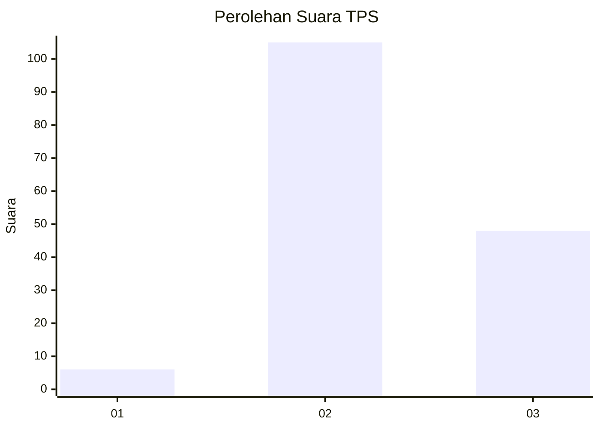

# Hasil

## Grafik

## Tabel

| No. | Nama Paslon    | Suara | Suara (raw) | Persentase |
|:--- |:-------------- | -----:| -----------:| ----------:|
| 1   | ANIES MUHAIMIN | 6     | [6][p-1]    | 3,77       |
| 2   | PRABOWO GIBRAN | 105   | [105][p-2]  | 66,04      |
| 3   | GANJAR MAHFUD  | 48    | [48][p-3]   | 30,19      |

[p-1]: https://github.com/gigit-pemilu/pemilu-2024-33-jawa-tengah/blob/main/pilpres/hitung-suara/sub/33-jawa-tengah/sub/05-kebumen/sub/20-karanganyar/sub/2009-wonorejo/sub/010-tps/sub/paslon-1.txt
[p-2]: https://github.com/gigit-pemilu/pemilu-2024-33-jawa-tengah/blob/main/pilpres/hitung-suara/sub/33-jawa-tengah/sub/05-kebumen/sub/20-karanganyar/sub/2009-wonorejo/sub/010-tps/sub/paslon-2.txt
[p-3]: https://github.com/gigit-pemilu/pemilu-2024-33-jawa-tengah/blob/main/pilpres/hitung-suara/sub/33-jawa-tengah/sub/05-kebumen/sub/20-karanganyar/sub/2009-wonorejo/sub/010-tps/sub/paslon-3.txt

## Foto C Plano

https://sirekap-obj-formc.kpu.go.id/4345/pemilu/ppwp/33/05/20/20/09/3305202009010-20240214-212125--bf6b1b68-1b72-445b-9fcc-0d790831a46d.jpg

https://sirekap-obj-formc.kpu.go.id/4345/pemilu/ppwp/33/05/20/20/09/3305202009010-20240214-212029--055e73c4-a954-411f-8fd4-f8b6ddfdc994.jpg

https://sirekap-obj-formc.kpu.go.id/4345/pemilu/ppwp/33/05/20/20/09/3305202009010-20240214-211941--8f34f988-5706-4b6c-ae77-54097e04cb8e.jpg

## Metadata

| Key        | Value               |
| ---------- | ------------------- |
| Time Stamp | 2024-02-15 22:40:13 |

