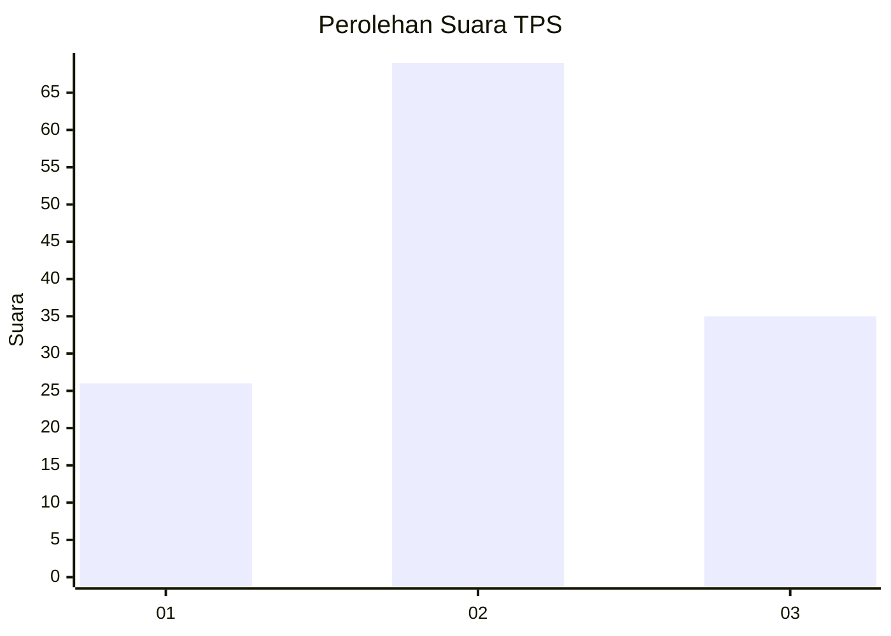
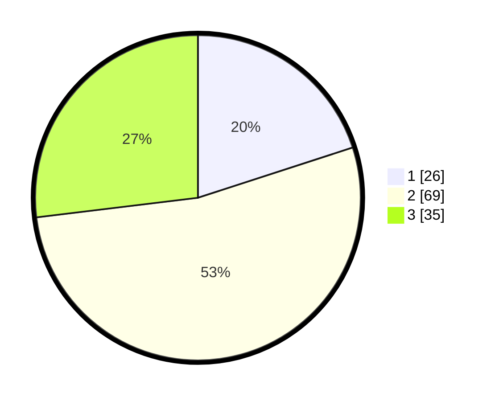

# Hasil

## Grafik

## Tabel

| No. | Nama Paslon    | Suara | Suara (raw) | Persentase |
|:--- |:-------------- | -----:| -----------:| ----------:|
| 1   | ANIES MUHAIMIN | 26    | [26][p-1]   | 20,00      |
| 2   | PRABOWO GIBRAN | 69    | [69][p-2]   | 53,08      |
| 3   | GANJAR MAHFUD  | 35    | [35][p-3]   | 26,92      |

[p-1]: https://github.com/gigit-pemilu/pemilu-2024-33-jawa-tengah/blob/main/pilpres/hitung-suara/sub/33-jawa-tengah/sub/05-kebumen/sub/20-karanganyar/sub/2010-grenggeng/sub/003-tps/sub/paslon-1.txt
[p-2]: https://github.com/gigit-pemilu/pemilu-2024-33-jawa-tengah/blob/main/pilpres/hitung-suara/sub/33-jawa-tengah/sub/05-kebumen/sub/20-karanganyar/sub/2010-grenggeng/sub/003-tps/sub/paslon-2.txt
[p-3]: https://github.com/gigit-pemilu/pemilu-2024-33-jawa-tengah/blob/main/pilpres/hitung-suara/sub/33-jawa-tengah/sub/05-kebumen/sub/20-karanganyar/sub/2010-grenggeng/sub/003-tps/sub/paslon-3.txt

## Foto C Plano

https://sirekap-obj-formc.kpu.go.id/9c00/pemilu/ppwp/33/05/20/20/10/3305202010003-20240215-035154--96930db8-5123-47ec-9fc1-404b10083c5e.jpg

https://sirekap-obj-formc.kpu.go.id/9c00/pemilu/ppwp/33/05/20/20/10/3305202010003-20240215-035203--ae7e6265-4310-4fbf-89e9-ea886b4f144c.jpg

https://sirekap-obj-formc.kpu.go.id/9c00/pemilu/ppwp/33/05/20/20/10/3305202010003-20240215-035207--d0d31eab-5622-41a3-9b9f-0d010d573531.jpg

## Metadata

| Key        | Value               |
| ---------- | ------------------- |
| Time Stamp | 2024-02-19 11:00:00 |

