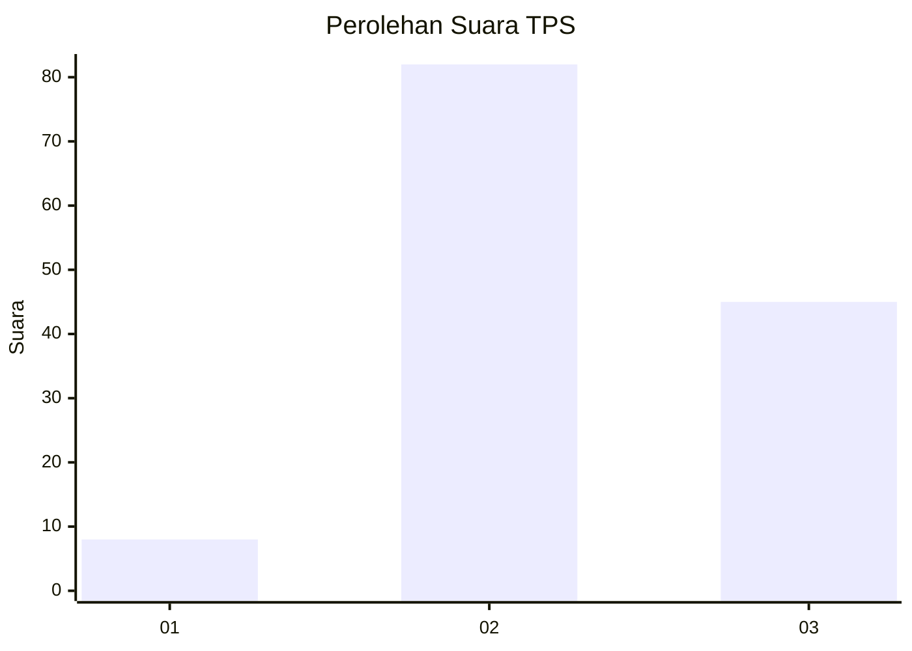
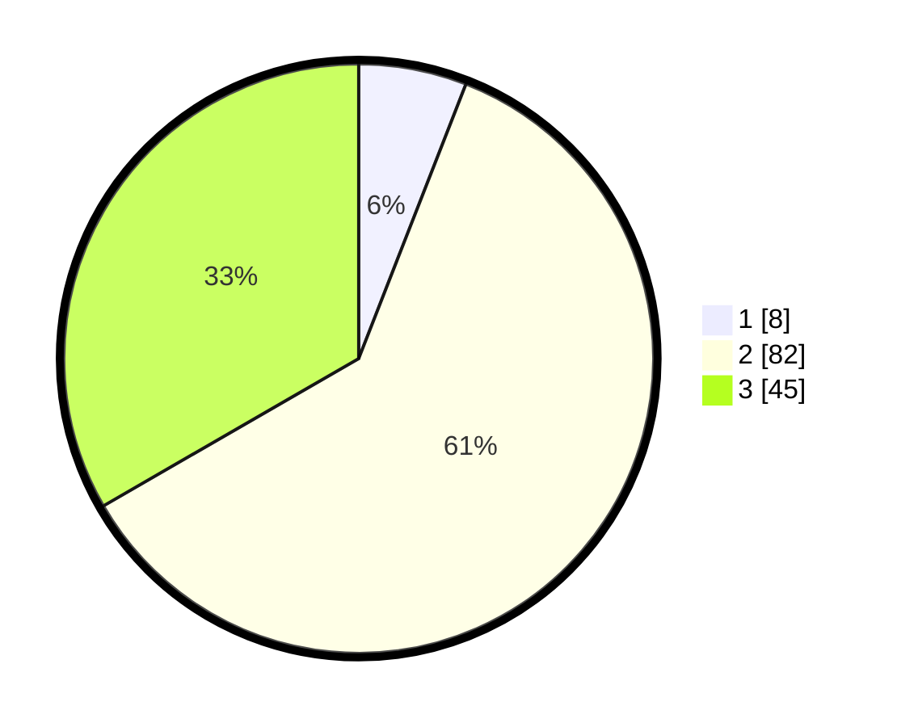

# Hasil

## Grafik

## Tabel

| No. | Nama Paslon    | Suara | Suara (raw) | Persentase |
|:--- |:-------------- | -----:| -----------:| ----------:|
| 1   | ANIES MUHAIMIN | 8     | [8][p-1]    | 5,93       |
| 2   | PRABOWO GIBRAN | 82    | [82][p-2]   | 60,74      |
| 3   | GANJAR MAHFUD  | 45    | [45][p-3]   | 33,33      |

[p-1]: https://github.com/gigit-pemilu/pemilu-2024/blob/main/pilpres/hitung-suara/sub/33-jawa-tengah/sub/05-kebumen/sub/20-karanganyar/sub/2010-grenggeng/sub/017-tps/sub/paslon-1.txt
[p-2]: https://github.com/gigit-pemilu/pemilu-2024/blob/main/pilpres/hitung-suara/sub/33-jawa-tengah/sub/05-kebumen/sub/20-karanganyar/sub/2010-grenggeng/sub/017-tps/sub/paslon-2.txt
[p-3]: https://github.com/gigit-pemilu/pemilu-2024/blob/main/pilpres/hitung-suara/sub/33-jawa-tengah/sub/05-kebumen/sub/20-karanganyar/sub/2010-grenggeng/sub/017-tps/sub/paslon-3.txt

## Foto C Plano

https://sirekap-obj-formc.kpu.go.id/5c1e/pemilu/ppwp/33/05/20/20/10/3305202010017-20240215-021542--b1aea153-a511-4040-9f48-b3ba012f819d.jpg

https://sirekap-obj-formc.kpu.go.id/5c1e/pemilu/ppwp/33/05/20/20/10/3305202010017-20240215-021656--cf6f4d33-3ffa-4b3d-9215-c7117e37052d.jpg

https://sirekap-obj-formc.kpu.go.id/5c1e/pemilu/ppwp/33/05/20/20/10/3305202010017-20240215-021817--8c99e096-58a3-421b-b55c-b1cf587f6e9b.jpg

## Metadata

| Key        | Value               |
| ---------- | ------------------- |
| Time Stamp | 2024-02-19 18:00:00 |

