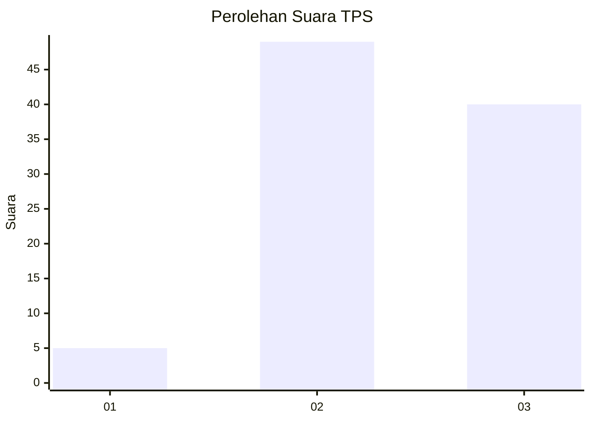
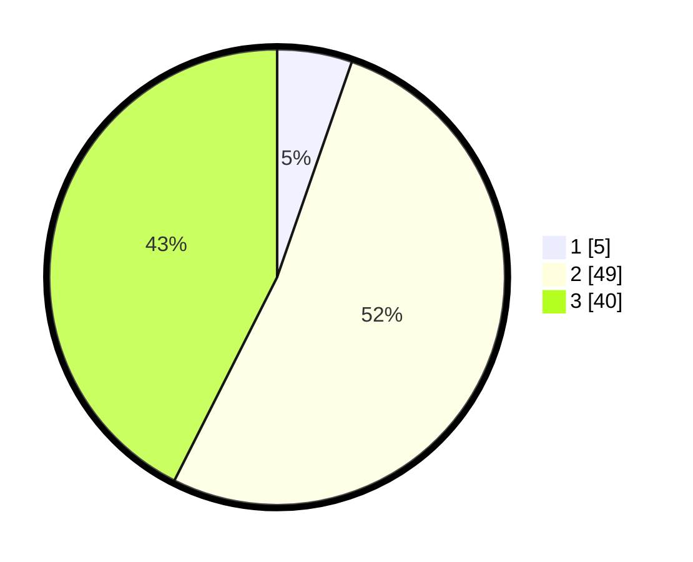

# Hasil

## Grafik

## Tabel

| No. | Nama Paslon    | Suara | Suara (raw) | Persentase |
|:--- |:-------------- | -----:| -----------:| ----------:|
| 1   | ANIES MUHAIMIN | 5     | [5][p-1]    | 5,32       |
| 2   | PRABOWO GIBRAN | 49    | [49][p-2]   | 52,13      |
| 3   | GANJAR MAHFUD  | 40    | [40][p-3]   | 42,55      |

[p-1]: https://github.com/gigit-pemilu/pemilu-2024-33-jawa-tengah/blob/main/pilpres/hitung-suara/sub/33-jawa-tengah/sub/05-kebumen/sub/20-karanganyar/sub/2010-grenggeng/sub/019-tps/sub/paslon-1.txt
[p-2]: https://github.com/gigit-pemilu/pemilu-2024-33-jawa-tengah/blob/main/pilpres/hitung-suara/sub/33-jawa-tengah/sub/05-kebumen/sub/20-karanganyar/sub/2010-grenggeng/sub/019-tps/sub/paslon-2.txt
[p-3]: https://github.com/gigit-pemilu/pemilu-2024-33-jawa-tengah/blob/main/pilpres/hitung-suara/sub/33-jawa-tengah/sub/05-kebumen/sub/20-karanganyar/sub/2010-grenggeng/sub/019-tps/sub/paslon-3.txt

## Foto C Plano

https://sirekap-obj-formc.kpu.go.id/a517/pemilu/ppwp/33/05/20/20/10/3305202010019-20240214-155538--5a34cfc7-9ab0-4dd6-aca1-643ee2c0c814.jpg

https://sirekap-obj-formc.kpu.go.id/a517/pemilu/ppwp/33/05/20/20/10/3305202010019-20240217-180032--d16ad609-6d82-4686-b4b3-4cde1cfc46cc.jpg

https://sirekap-obj-formc.kpu.go.id/a517/pemilu/ppwp/33/05/20/20/10/3305202010019-20240217-180016--8e8c830f-0f67-496d-8800-dc484d750396.jpg

## Metadata

| Key        | Value               |
| ---------- | ------------------- |
| Time Stamp | 2024-02-19 18:00:00 |

