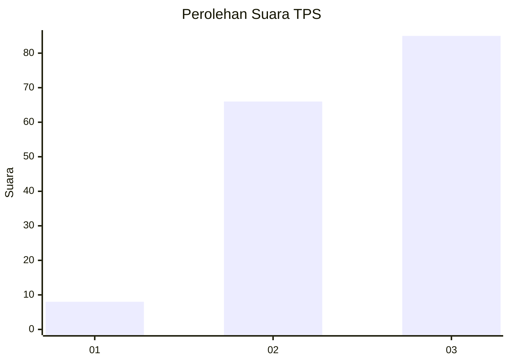
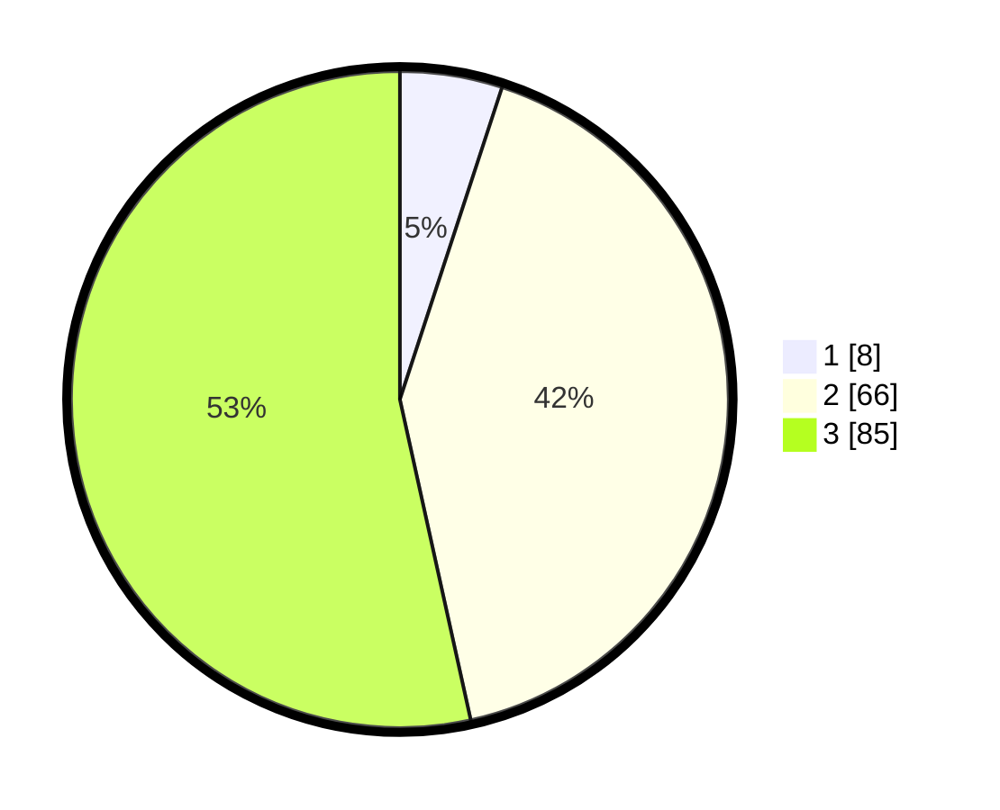

# Hasil

## Grafik

## Tabel

| No. | Nama Paslon    | Suara | Suara (raw) | Persentase |
|:--- |:-------------- | -----:| -----------:| ----------:|
| 1   | ANIES MUHAIMIN | 8     | [8][p-1]    | 5,03       |
| 2   | PRABOWO GIBRAN | 66    | [66][p-2]   | 41,51      |
| 3   | GANJAR MAHFUD  | 85    | [85][p-3]   | 53,46      |

[p-1]: https://github.com/gigit-pemilu/pemilu-2024-33-jawa-tengah/blob/main/pilpres/hitung-suara/sub/33-jawa-tengah/sub/05-kebumen/sub/20-karanganyar/sub/2011-pohkumbang/sub/013-tps/sub/paslon-1.txt
[p-2]: https://github.com/gigit-pemilu/pemilu-2024-33-jawa-tengah/blob/main/pilpres/hitung-suara/sub/33-jawa-tengah/sub/05-kebumen/sub/20-karanganyar/sub/2011-pohkumbang/sub/013-tps/sub/paslon-2.txt
[p-3]: https://github.com/gigit-pemilu/pemilu-2024-33-jawa-tengah/blob/main/pilpres/hitung-suara/sub/33-jawa-tengah/sub/05-kebumen/sub/20-karanganyar/sub/2011-pohkumbang/sub/013-tps/sub/paslon-3.txt

## Foto C Plano

https://sirekap-obj-formc.kpu.go.id/4cbf/pemilu/ppwp/33/05/20/20/11/3305202011013-20240214-141015--73a741a7-92fe-4c67-b868-091063921709.jpg

https://sirekap-obj-formc.kpu.go.id/4cbf/pemilu/ppwp/33/05/20/20/11/3305202011013-20240214-141505--3b28216a-56a2-4d35-a0e9-d724bf01741e.jpg

https://sirekap-obj-formc.kpu.go.id/4cbf/pemilu/ppwp/33/05/20/20/11/3305202011013-20240214-222232--cd80a809-8d3f-434e-9579-62e67a9c1f84.jpg

## Metadata

| Key        | Value               |
| ---------- | ------------------- |
| Time Stamp | 2024-02-15 00:41:44 |

