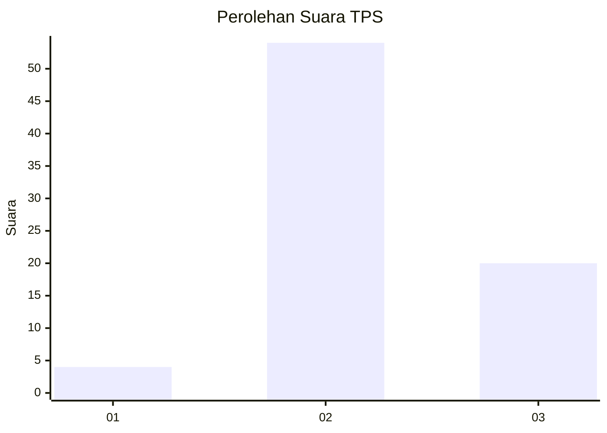
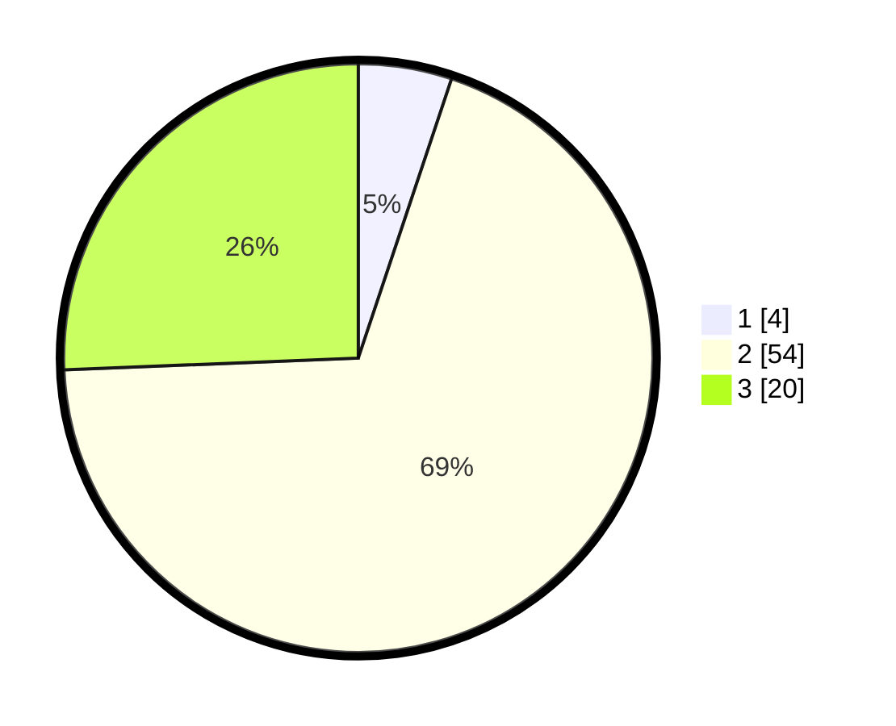

# Hasil

## Grafik

## Tabel

| No. | Nama Paslon    | Suara | Suara (raw) | Persentase |
|:--- |:-------------- | -----:| -----------:| ----------:|
| 1   | ANIES MUHAIMIN | 4     | [4][p-1]    | 5,13       |
| 2   | PRABOWO GIBRAN | 54    | [54][p-2]   | 69,23      |
| 3   | GANJAR MAHFUD  | 20    | [20][p-3]   | 25,64      |

[p-1]: https://github.com/gigit-pemilu/pemilu-2024-33-jawa-tengah/blob/main/pilpres/hitung-suara/sub/33-jawa-tengah/sub/05-kebumen/sub/21-karanggayam/sub/2010-kebakalan/sub/004-tps/sub/paslon-1.txt
[p-2]: https://github.com/gigit-pemilu/pemilu-2024-33-jawa-tengah/blob/main/pilpres/hitung-suara/sub/33-jawa-tengah/sub/05-kebumen/sub/21-karanggayam/sub/2010-kebakalan/sub/004-tps/sub/paslon-2.txt
[p-3]: https://github.com/gigit-pemilu/pemilu-2024-33-jawa-tengah/blob/main/pilpres/hitung-suara/sub/33-jawa-tengah/sub/05-kebumen/sub/21-karanggayam/sub/2010-kebakalan/sub/004-tps/sub/paslon-3.txt

## Foto C Plano

https://sirekap-obj-formc.kpu.go.id/230f/pemilu/ppwp/33/05/21/20/10/3305212010004-20240214-221140--faa6b69f-b9b5-420c-8ae4-c993cd26a8af.jpg

https://sirekap-obj-formc.kpu.go.id/230f/pemilu/ppwp/33/05/21/20/10/3305212010004-20240214-223508--60ab6f3f-f4e9-4c9b-b0b1-6bf981a6544c.jpg

https://sirekap-obj-formc.kpu.go.id/230f/pemilu/ppwp/33/05/21/20/10/3305212010004-20240214-223111--9f6bc461-d371-4437-8506-6f83f5c01333.jpg

## Metadata

| Key        | Value               |
| ---------- | ------------------- |
| Time Stamp | 2024-02-16 12:51:22 |

