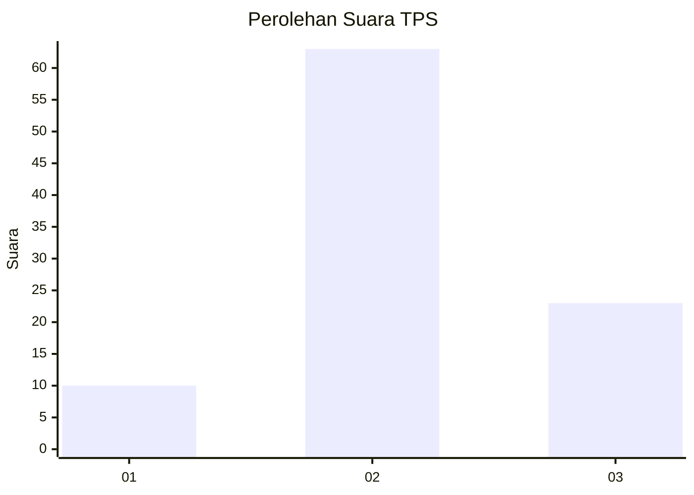
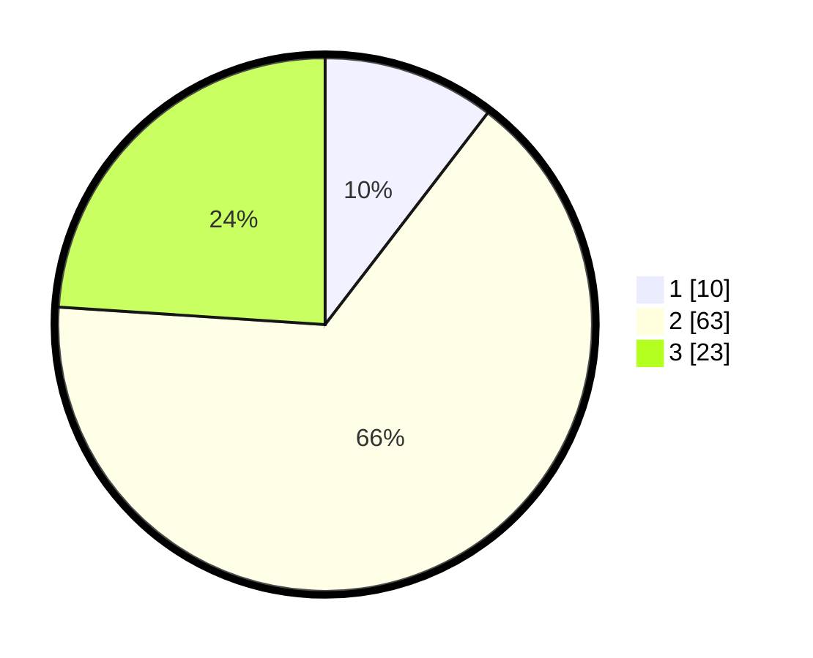

# Hasil

## Grafik

## Tabel

| No. | Nama Paslon    | Suara | Suara (raw) | Persentase |
|:--- |:-------------- | -----:| -----------:| ----------:|
| 1   | ANIES MUHAIMIN | 10    | [10][p-1]   | 10,42      |
| 2   | PRABOWO GIBRAN | 63    | [63][p-2]   | 65,63      |
| 3   | GANJAR MAHFUD  | 23    | [23][p-3]   | 23,96      |

[p-1]: https://github.com/gigit-pemilu/pemilu-2024-33-jawa-tengah/blob/main/pilpres/hitung-suara/sub/33-jawa-tengah/sub/05-kebumen/sub/21-karanggayam/sub/2010-kebakalan/sub/005-tps/sub/paslon-1.txt
[p-2]: https://github.com/gigit-pemilu/pemilu-2024-33-jawa-tengah/blob/main/pilpres/hitung-suara/sub/33-jawa-tengah/sub/05-kebumen/sub/21-karanggayam/sub/2010-kebakalan/sub/005-tps/sub/paslon-2.txt
[p-3]: https://github.com/gigit-pemilu/pemilu-2024-33-jawa-tengah/blob/main/pilpres/hitung-suara/sub/33-jawa-tengah/sub/05-kebumen/sub/21-karanggayam/sub/2010-kebakalan/sub/005-tps/sub/paslon-3.txt

## Foto C Plano

https://sirekap-obj-formc.kpu.go.id/97a8/pemilu/ppwp/33/05/21/20/10/3305212010005-20240215-090625--e930c3ce-8489-4f02-95cc-07f161e06b4d.jpg

https://sirekap-obj-formc.kpu.go.id/97a8/pemilu/ppwp/33/05/21/20/10/3305212010005-20240215-063756--8b2cc5ae-c67a-4e1e-8882-618cca3ea4b2.jpg

https://sirekap-obj-formc.kpu.go.id/97a8/pemilu/ppwp/33/05/21/20/10/3305212010005-20240215-042125--f4f81dad-3b1c-4d4f-afb5-4c49ada29089.jpg

## Metadata

| Key        | Value               |
| ---------- | ------------------- |
| Time Stamp | 2024-02-15 22:00:27 |

