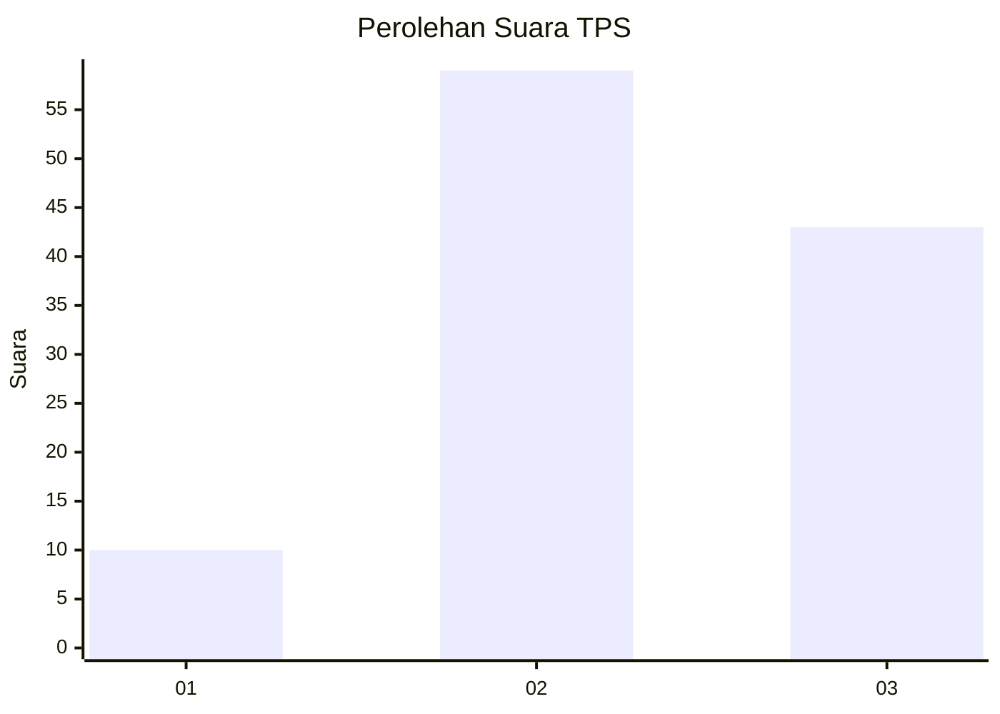
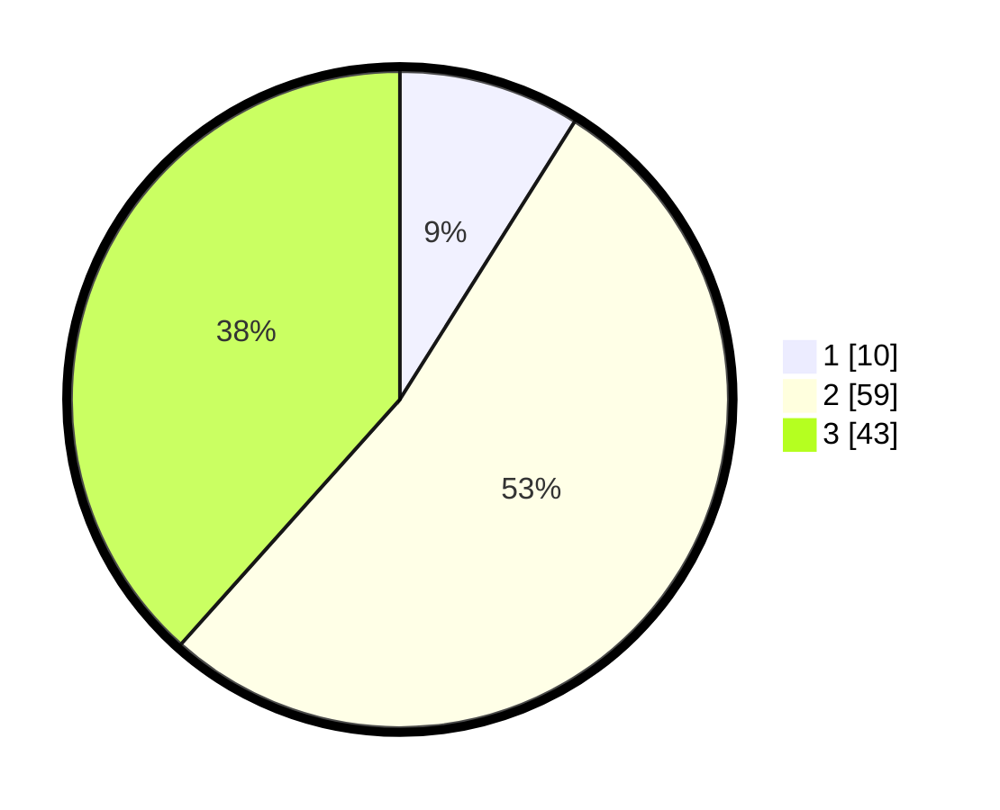

# Hasil

## Grafik

## Tabel

| No. | Nama Paslon    | Suara | Suara (raw) | Persentase |
|:--- |:-------------- | -----:| -----------:| ----------:|
| 1   | ANIES MUHAIMIN | 10    | [10][p-1]   | 8,93       |
| 2   | PRABOWO GIBRAN | 59    | [59][p-2]   | 52,68      |
| 3   | GANJAR MAHFUD  | 43    | [43][p-3]   | 38,39      |

[p-1]: https://github.com/gigit-pemilu/pemilu-2024-33-jawa-tengah/blob/main/pilpres/hitung-suara/sub/33-jawa-tengah/sub/05-kebumen/sub/21-karanggayam/sub/2012-wonotirto/sub/003-tps/sub/paslon-1.txt
[p-2]: https://github.com/gigit-pemilu/pemilu-2024-33-jawa-tengah/blob/main/pilpres/hitung-suara/sub/33-jawa-tengah/sub/05-kebumen/sub/21-karanggayam/sub/2012-wonotirto/sub/003-tps/sub/paslon-2.txt
[p-3]: https://github.com/gigit-pemilu/pemilu-2024-33-jawa-tengah/blob/main/pilpres/hitung-suara/sub/33-jawa-tengah/sub/05-kebumen/sub/21-karanggayam/sub/2012-wonotirto/sub/003-tps/sub/paslon-3.txt

## Foto C Plano

https://sirekap-obj-formc.kpu.go.id/54bb/pemilu/ppwp/33/05/21/20/12/3305212012003-20240214-223222--47e1a3c0-f452-4f56-b1f6-d98cf388e888.jpg

https://sirekap-obj-formc.kpu.go.id/54bb/pemilu/ppwp/33/05/21/20/12/3305212012003-20240214-223449--cc0570ca-4576-43ea-b642-cf0c8d58c68b.jpg

https://sirekap-obj-formc.kpu.go.id/54bb/pemilu/ppwp/33/05/21/20/12/3305212012003-20240214-223632--8535ee1e-0d49-4703-a68c-51c0dff1cc73.jpg

## Metadata

| Key        | Value               |
| ---------- | ------------------- |
| Time Stamp | 2024-02-15 17:00:25 |

