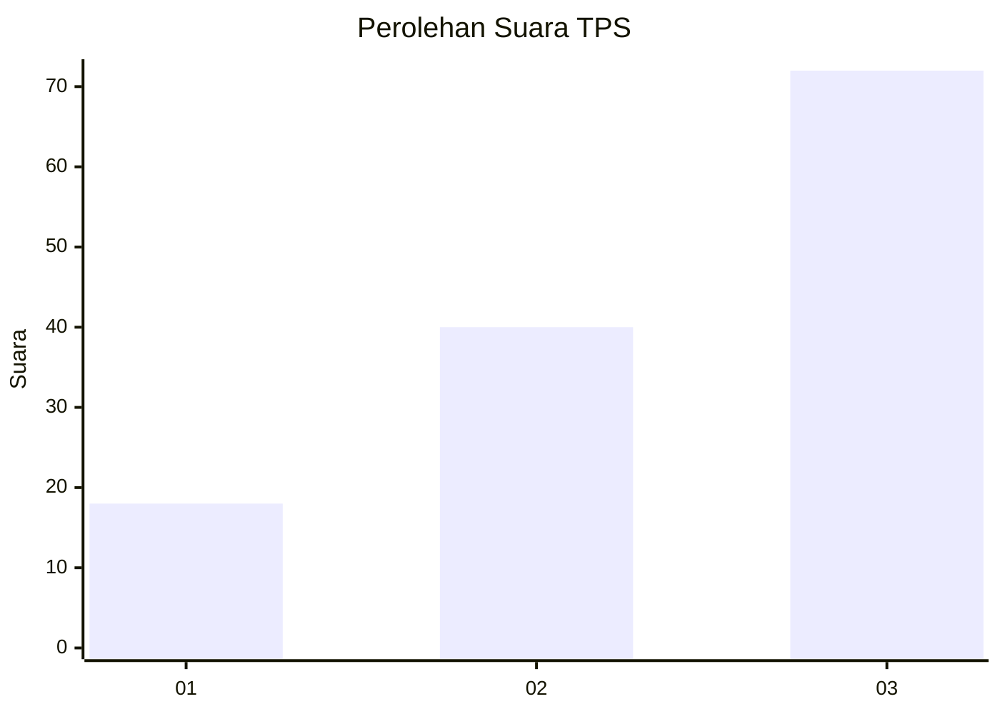
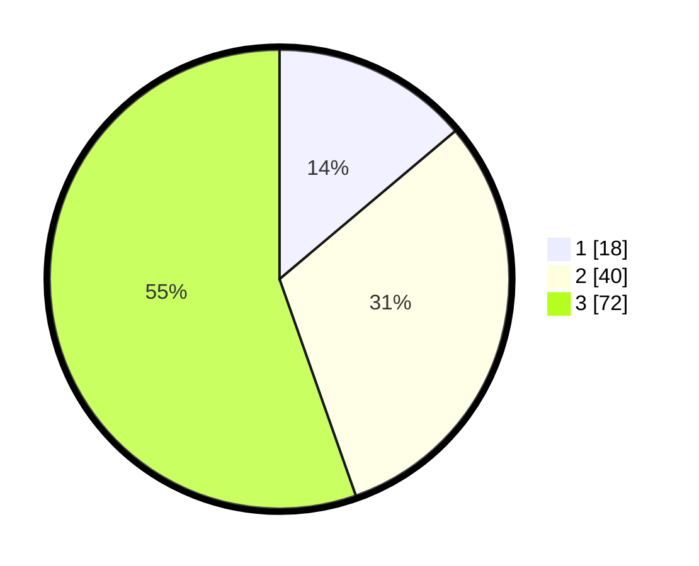

# Hasil

## Grafik

## Tabel

| No. | Nama Paslon    | Suara | Suara (raw) | Persentase |
|:--- |:-------------- | -----:| -----------:| ----------:|
| 1   | ANIES MUHAIMIN | 18    | [18][p-1]   | 13,85      |
| 2   | PRABOWO GIBRAN | 40    | [40][p-2]   | 30,77      |
| 3   | GANJAR MAHFUD  | 72    | [72][p-3]   | 55,38      |

[p-1]: https://github.com/gigit-pemilu/pemilu-2024/blob/main/pilpres/hitung-suara/sub/33-jawa-tengah/sub/05-kebumen/sub/21-karanggayam/sub/2017-glontor/sub/012-tps/sub/paslon-1.txt
[p-2]: https://github.com/gigit-pemilu/pemilu-2024/blob/main/pilpres/hitung-suara/sub/33-jawa-tengah/sub/05-kebumen/sub/21-karanggayam/sub/2017-glontor/sub/012-tps/sub/paslon-2.txt
[p-3]: https://github.com/gigit-pemilu/pemilu-2024/blob/main/pilpres/hitung-suara/sub/33-jawa-tengah/sub/05-kebumen/sub/21-karanggayam/sub/2017-glontor/sub/012-tps/sub/paslon-3.txt

## Foto C Plano

https://sirekap-obj-formc.kpu.go.id/cdcf/pemilu/ppwp/33/05/21/20/17/3305212017012-20240218-171817--232c064c-e94d-4b30-94ee-315dda70636a.jpg

https://sirekap-obj-formc.kpu.go.id/cdcf/pemilu/ppwp/33/05/21/20/17/3305212017012-20240218-160409--f0b693d2-d8a8-4a1f-82fa-d0cabaaaca4d.jpg

https://sirekap-obj-formc.kpu.go.id/cdcf/pemilu/ppwp/33/05/21/20/17/3305212017012-20240218-161135--98a81010-88c9-42c6-88ce-fa68f0806690.jpg

## Metadata

| Key        | Value               |
| ---------- | ------------------- |
| Time Stamp | 2024-02-19 18:00:00 |

