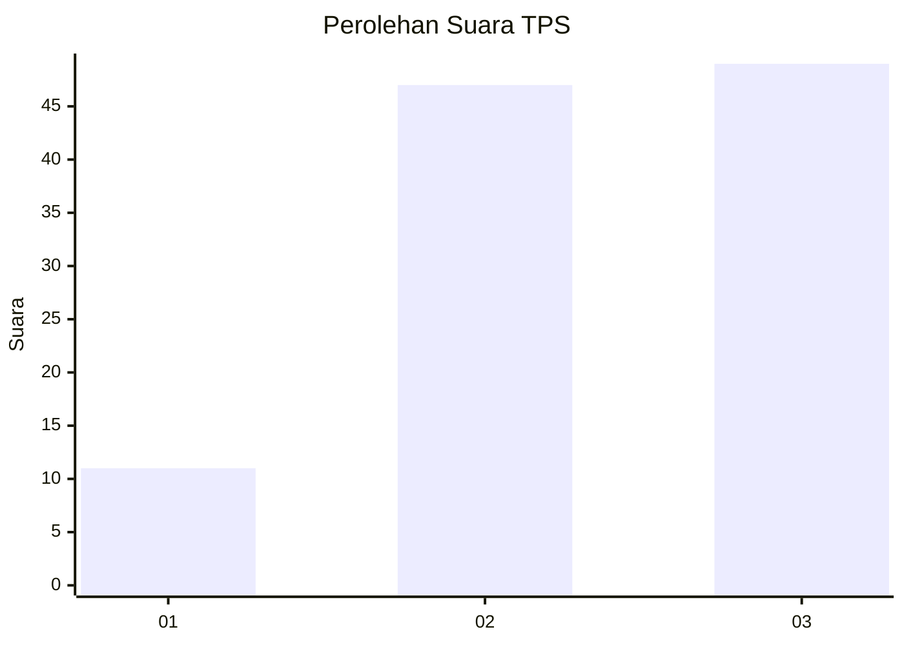
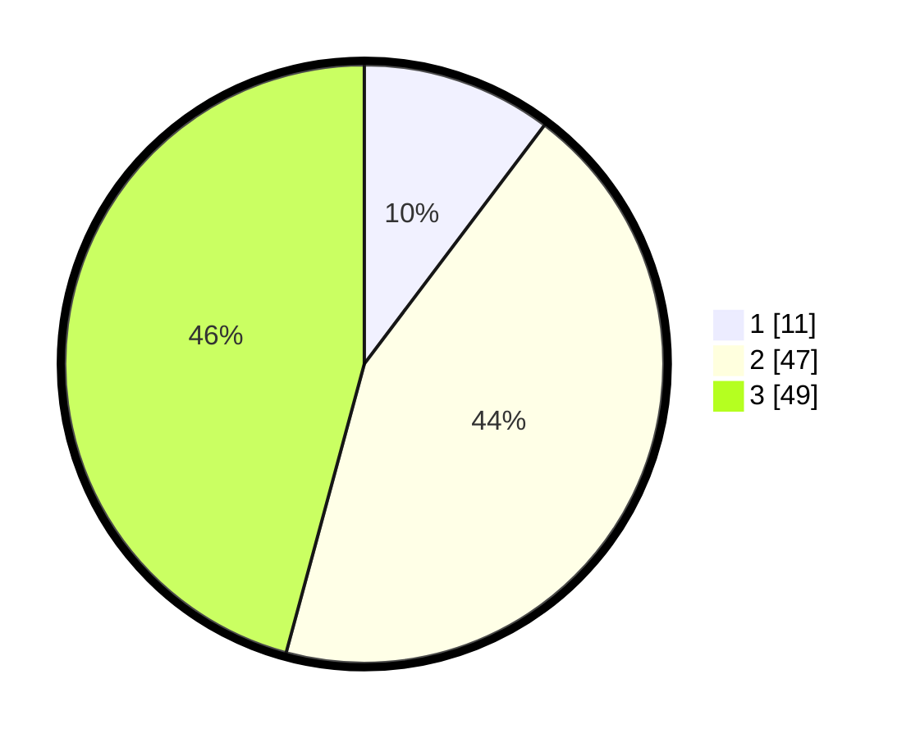

# Hasil

## Grafik

## Tabel

| No. | Nama Paslon    | Suara | Suara (raw) | Persentase |
|:--- |:-------------- | -----:| -----------:| ----------:|
| 1   | ANIES MUHAIMIN | 11    | [11][p-1]   | 10,28      |
| 2   | PRABOWO GIBRAN | 47    | [47][p-2]   | 43,93      |
| 3   | GANJAR MAHFUD  | 49    | [49][p-3]   | 45,79      |

[p-1]: https://github.com/gigit-pemilu/pemilu-2024/blob/main/pilpres/hitung-suara/sub/33-jawa-tengah/sub/05-kebumen/sub/22-sadang/sub/2001-pucangan/sub/010-tps/sub/paslon-1.txt
[p-2]: https://github.com/gigit-pemilu/pemilu-2024/blob/main/pilpres/hitung-suara/sub/33-jawa-tengah/sub/05-kebumen/sub/22-sadang/sub/2001-pucangan/sub/010-tps/sub/paslon-2.txt
[p-3]: https://github.com/gigit-pemilu/pemilu-2024/blob/main/pilpres/hitung-suara/sub/33-jawa-tengah/sub/05-kebumen/sub/22-sadang/sub/2001-pucangan/sub/010-tps/sub/paslon-3.txt

## Foto C Plano

https://sirekap-obj-formc.kpu.go.id/70b0/pemilu/ppwp/33/05/22/20/01/3305222001010-20240214-224209--4a848439-7f0e-4dab-86d4-f78fd37708fe.jpg

https://sirekap-obj-formc.kpu.go.id/70b0/pemilu/ppwp/33/05/22/20/01/3305222001010-20240214-155550--86964842-8be1-4b92-af93-a26aa3600922.jpg

https://sirekap-obj-formc.kpu.go.id/70b0/pemilu/ppwp/33/05/22/20/01/3305222001010-20240215-015705--932ad889-34fb-4379-be89-394f0f77d55b.jpg

## Metadata

| Key        | Value               |
| ---------- | ------------------- |
| Time Stamp | 2024-02-15 15:00:29 |

