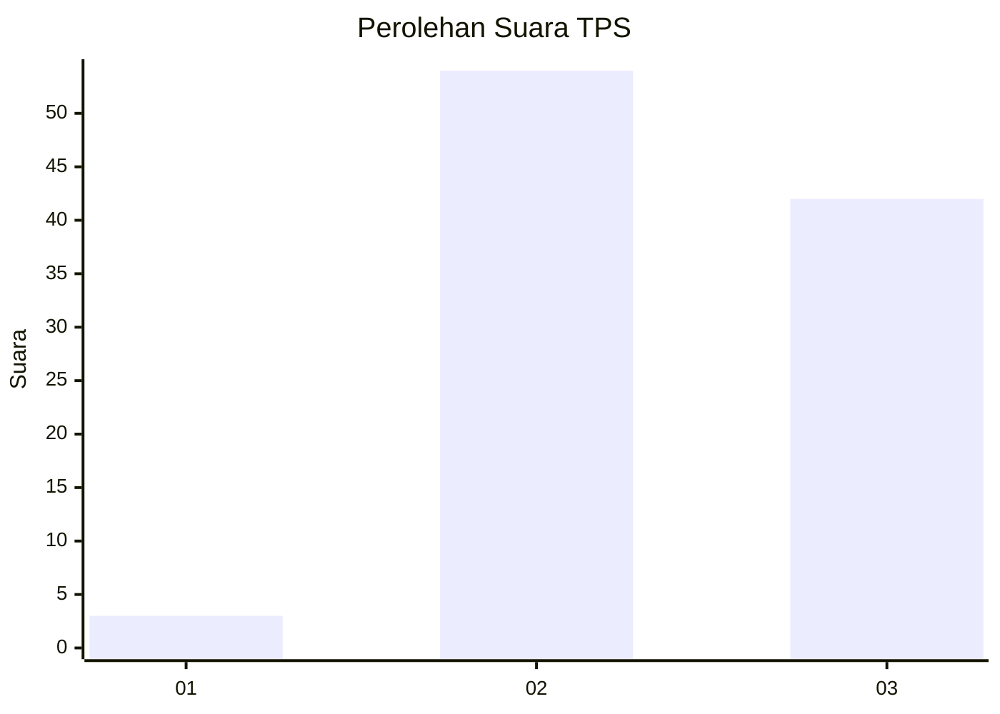
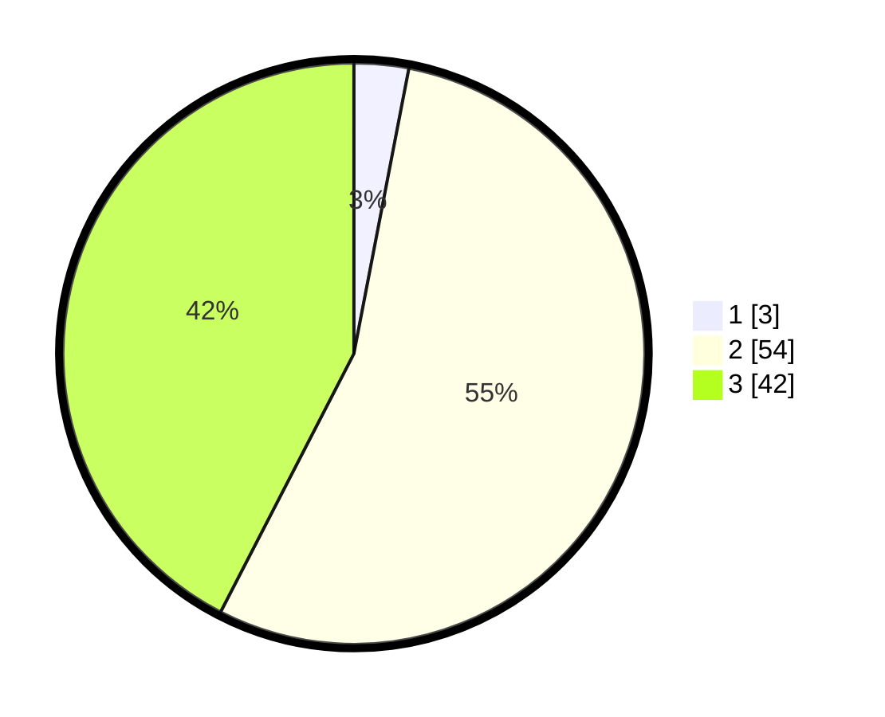

# Hasil

## Grafik

## Tabel

| No. | Nama Paslon    | Suara | Suara (raw) | Persentase |
|:--- |:-------------- | -----:| -----------:| ----------:|
| 1   | ANIES MUHAIMIN | 3     | [3][p-1]    | 3,03       |
| 2   | PRABOWO GIBRAN | 54    | [54][p-2]   | 54,55      |
| 3   | GANJAR MAHFUD  | 42    | [42][p-3]   | 42,42      |

[p-1]: https://github.com/gigit-pemilu/pemilu-2024-33-jawa-tengah/blob/main/pilpres/hitung-suara/sub/33-jawa-tengah/sub/05-kebumen/sub/22-sadang/sub/2002-seboro/sub/019-tps/sub/paslon-1.txt
[p-2]: https://github.com/gigit-pemilu/pemilu-2024-33-jawa-tengah/blob/main/pilpres/hitung-suara/sub/33-jawa-tengah/sub/05-kebumen/sub/22-sadang/sub/2002-seboro/sub/019-tps/sub/paslon-2.txt
[p-3]: https://github.com/gigit-pemilu/pemilu-2024-33-jawa-tengah/blob/main/pilpres/hitung-suara/sub/33-jawa-tengah/sub/05-kebumen/sub/22-sadang/sub/2002-seboro/sub/019-tps/sub/paslon-3.txt

## Foto C Plano

https://sirekap-obj-formc.kpu.go.id/76e5/pemilu/ppwp/33/05/22/20/02/3305222002019-20240217-163826--0fae7845-8491-442a-867a-fba08d2cc1ee.jpg

https://sirekap-obj-formc.kpu.go.id/76e5/pemilu/ppwp/33/05/22/20/02/3305222002019-20240217-204223--b5450f2e-f9da-489a-8e31-39f16ff73a17.jpg

https://sirekap-obj-formc.kpu.go.id/76e5/pemilu/ppwp/33/05/22/20/02/3305222002019-20240215-032052--a0569d43-ba67-42e4-ae91-15fe7451e637.jpg

## Metadata

| Key        | Value               |
| ---------- | ------------------- |
| Time Stamp | 2024-02-19 06:16:00 |

