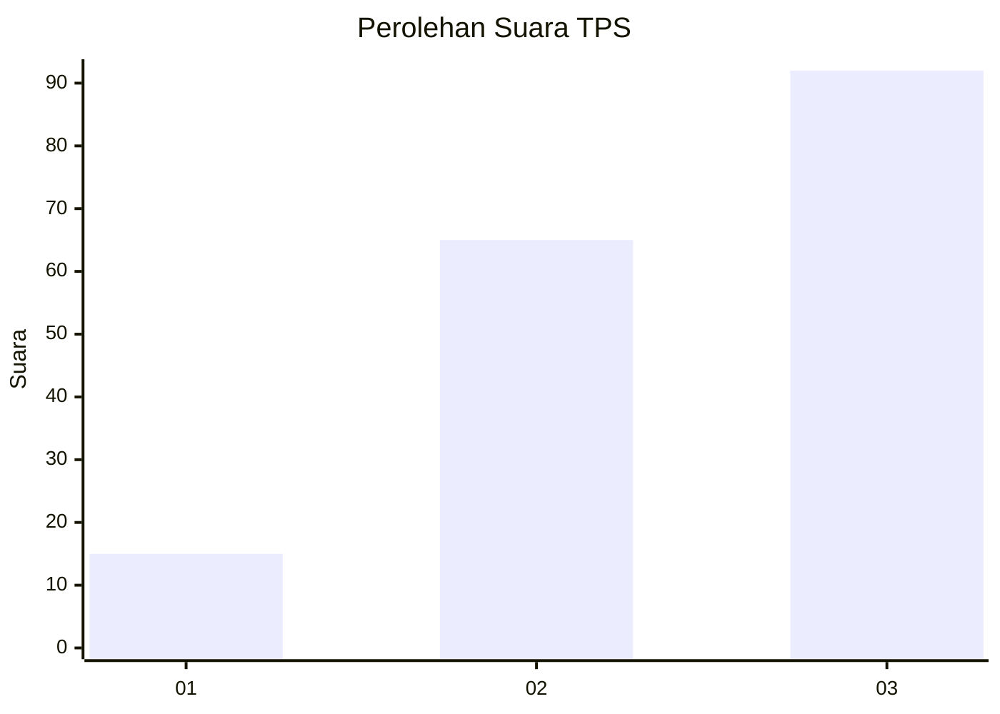
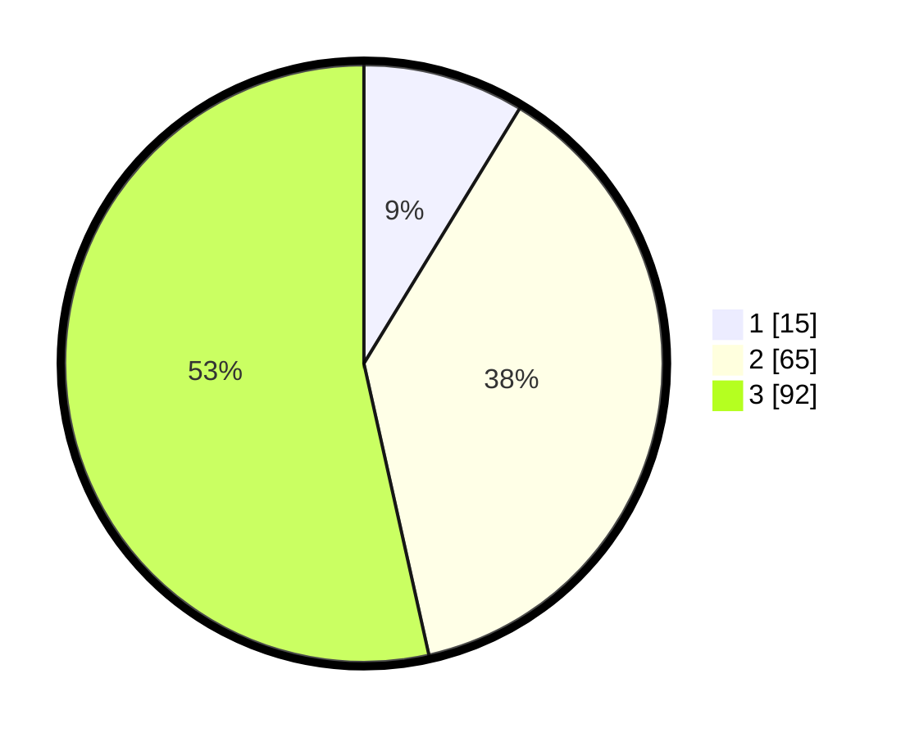

# Hasil

## Grafik

## Tabel

| No. | Nama Paslon    | Suara | Suara (raw) | Persentase |
|:--- |:-------------- | -----:| -----------:| ----------:|
| 1   | ANIES MUHAIMIN | 15    | [15][p-1]   | 8,72       |
| 2   | PRABOWO GIBRAN | 65    | [65][p-2]   | 37,79      |
| 3   | GANJAR MAHFUD  | 92    | [92][p-3]   | 53,49      |

[p-1]: https://github.com/gigit-pemilu/pemilu-2024/blob/main/pilpres/hitung-suara/sub/33-jawa-tengah/sub/05-kebumen/sub/22-sadang/sub/2004-sadangkulon/sub/001-tps/sub/paslon-1.txt
[p-2]: https://github.com/gigit-pemilu/pemilu-2024/blob/main/pilpres/hitung-suara/sub/33-jawa-tengah/sub/05-kebumen/sub/22-sadang/sub/2004-sadangkulon/sub/001-tps/sub/paslon-2.txt
[p-3]: https://github.com/gigit-pemilu/pemilu-2024/blob/main/pilpres/hitung-suara/sub/33-jawa-tengah/sub/05-kebumen/sub/22-sadang/sub/2004-sadangkulon/sub/001-tps/sub/paslon-3.txt

## Foto C Plano

https://sirekap-obj-formc.kpu.go.id/f10b/pemilu/ppwp/33/05/22/20/04/3305222004001-20240215-104558--9a6ecc75-10a3-4d36-81de-7c5a63a5589e.jpg

https://sirekap-obj-formc.kpu.go.id/f10b/pemilu/ppwp/33/05/22/20/04/3305222004001-20240215-104635--f9abaf2f-b8b0-4e24-866d-17bae993e3b6.jpg

https://sirekap-obj-formc.kpu.go.id/f10b/pemilu/ppwp/33/05/22/20/04/3305222004001-20240215-104812--f1a5f1c1-ed73-423a-93f1-6da861368eb5.jpg

## Metadata

| Key        | Value               |
| ---------- | ------------------- |
| Time Stamp | 2024-02-15 21:30:27 |

