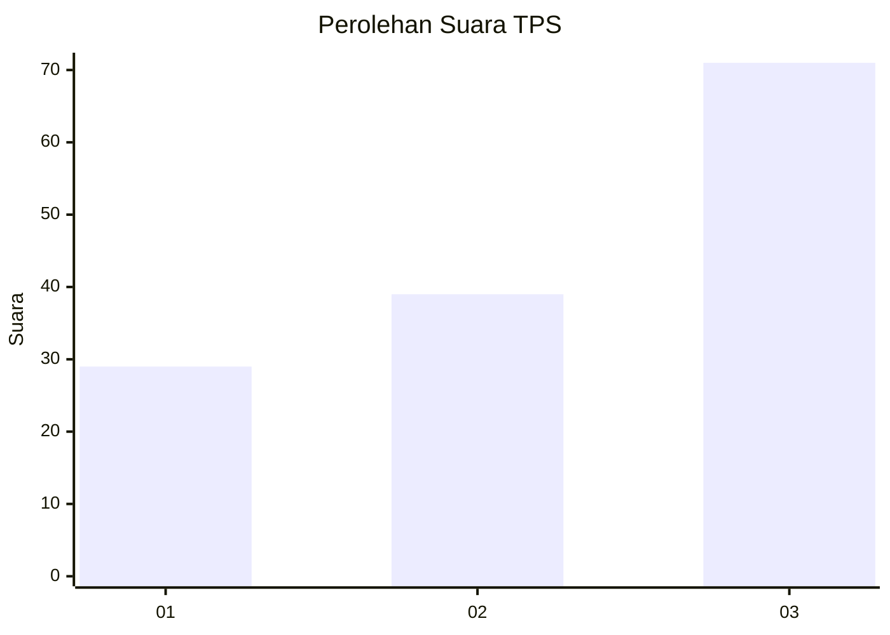
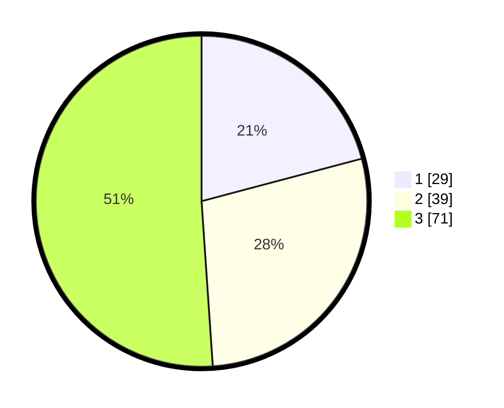

# Hasil

## Grafik

## Tabel

| No. | Nama Paslon    | Suara | Suara (raw) | Persentase |
|:--- |:-------------- | -----:| -----------:| ----------:|
| 1   | ANIES MUHAIMIN | 29    | [29][p-1]   | 20,86      |
| 2   | PRABOWO GIBRAN | 39    | [39][p-2]   | 28,06      |
| 3   | GANJAR MAHFUD  | 71    | [71][p-3]   | 51,08      |

[p-1]: https://github.com/gigit-pemilu/pemilu-2024-33-jawa-tengah/blob/main/pilpres/hitung-suara/sub/33-jawa-tengah/sub/05-kebumen/sub/22-sadang/sub/2004-sadangkulon/sub/007-tps/sub/paslon-1.txt
[p-2]: https://github.com/gigit-pemilu/pemilu-2024-33-jawa-tengah/blob/main/pilpres/hitung-suara/sub/33-jawa-tengah/sub/05-kebumen/sub/22-sadang/sub/2004-sadangkulon/sub/007-tps/sub/paslon-2.txt
[p-3]: https://github.com/gigit-pemilu/pemilu-2024-33-jawa-tengah/blob/main/pilpres/hitung-suara/sub/33-jawa-tengah/sub/05-kebumen/sub/22-sadang/sub/2004-sadangkulon/sub/007-tps/sub/paslon-3.txt

## Foto C Plano

https://sirekap-obj-formc.kpu.go.id/fabd/pemilu/ppwp/33/05/22/20/04/3305222004007-20240214-191357--e915d91d-32a7-4d6c-ba0f-8598555f21bf.jpg

https://sirekap-obj-formc.kpu.go.id/fabd/pemilu/ppwp/33/05/22/20/04/3305222004007-20240214-191850--c9862644-1032-459d-9b53-67f5a1c39880.jpg

https://sirekap-obj-formc.kpu.go.id/fabd/pemilu/ppwp/33/05/22/20/04/3305222004007-20240214-192208--6cdcd8db-f7d0-4a27-bc3a-54ee6adedc4e.jpg

## Metadata

| Key        | Value               |
| ---------- | ------------------- |
| Time Stamp | 2024-02-15 17:00:25 |

