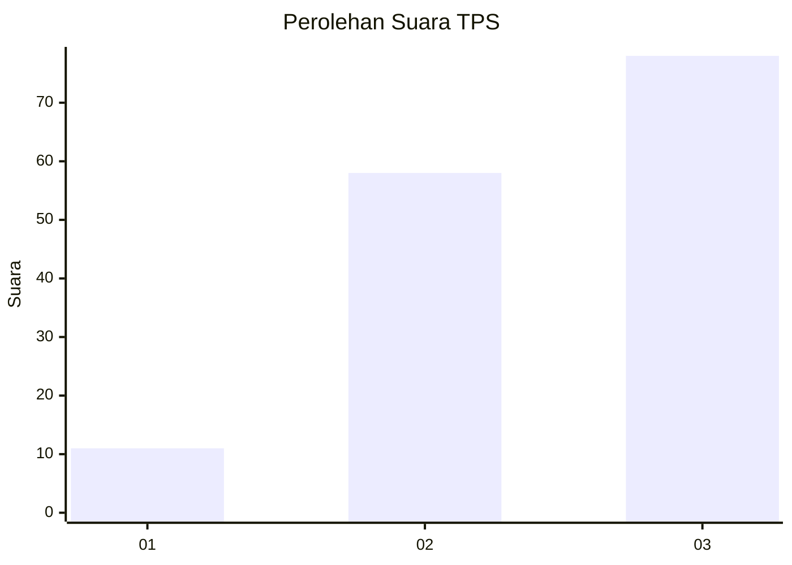
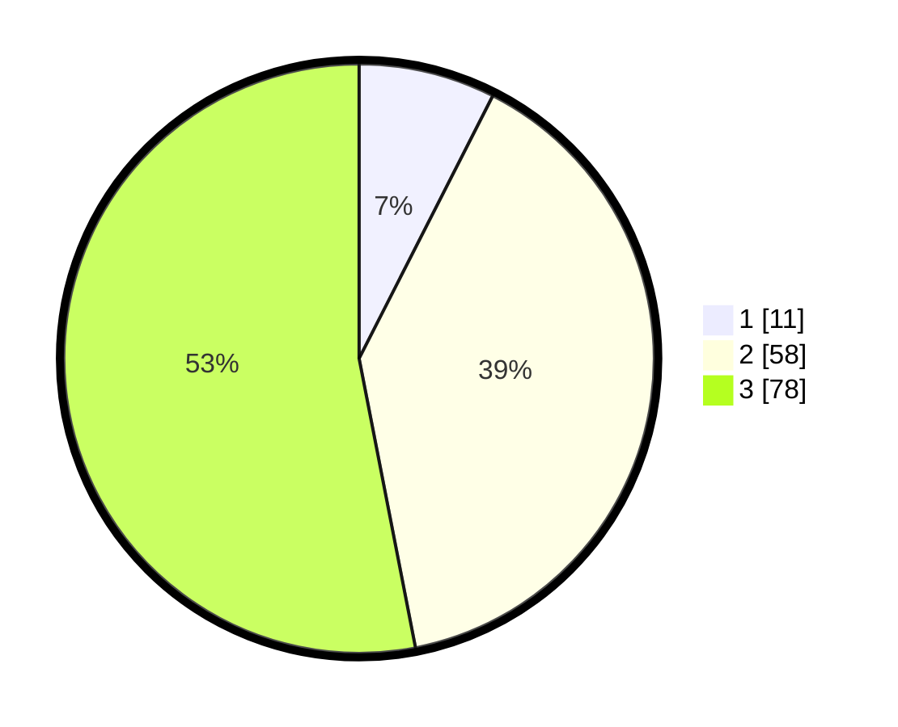

# Hasil

## Grafik

## Tabel

| No. | Nama Paslon    | Suara | Suara (raw) | Persentase |
|:--- |:-------------- | -----:| -----------:| ----------:|
| 1   | ANIES MUHAIMIN | 11    | [11][p-1]   | 7,48       |
| 2   | PRABOWO GIBRAN | 58    | [58][p-2]   | 39,46      |
| 3   | GANJAR MAHFUD  | 78    | [78][p-3]   | 53,06      |

[p-1]: https://github.com/gigit-pemilu/pemilu-2024-33-jawa-tengah/blob/main/pilpres/hitung-suara/sub/33-jawa-tengah/sub/05-kebumen/sub/22-sadang/sub/2005-cangkring/sub/004-tps/sub/paslon-1.txt
[p-2]: https://github.com/gigit-pemilu/pemilu-2024-33-jawa-tengah/blob/main/pilpres/hitung-suara/sub/33-jawa-tengah/sub/05-kebumen/sub/22-sadang/sub/2005-cangkring/sub/004-tps/sub/paslon-2.txt
[p-3]: https://github.com/gigit-pemilu/pemilu-2024-33-jawa-tengah/blob/main/pilpres/hitung-suara/sub/33-jawa-tengah/sub/05-kebumen/sub/22-sadang/sub/2005-cangkring/sub/004-tps/sub/paslon-3.txt

## Foto C Plano

https://sirekap-obj-formc.kpu.go.id/905a/pemilu/ppwp/33/05/22/20/05/3305222005004-20240214-235230--415e6df8-5089-4f14-9f48-4539157b3b38.jpg

https://sirekap-obj-formc.kpu.go.id/905a/pemilu/ppwp/33/05/22/20/05/3305222005004-20240214-235319--948bc50b-aa61-40a5-91e6-29d372682bd7.jpg

https://sirekap-obj-formc.kpu.go.id/905a/pemilu/ppwp/33/05/22/20/05/3305222005004-20240214-235442--3fbf455e-d04b-4a10-8d57-1de9813b195f.jpg

## Metadata

| Key        | Value               |
| ---------- | ------------------- |
| Time Stamp | 2024-02-15 21:30:27 |

