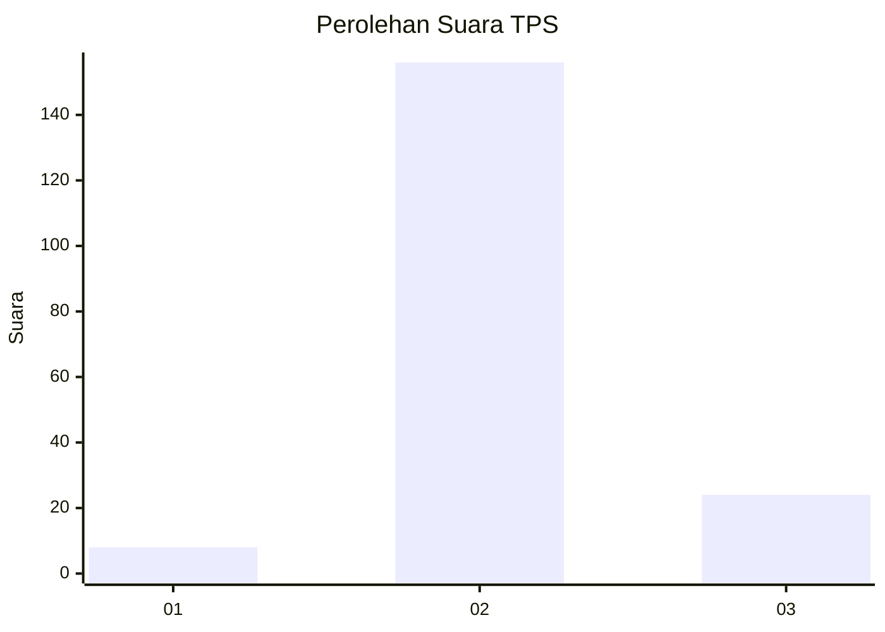
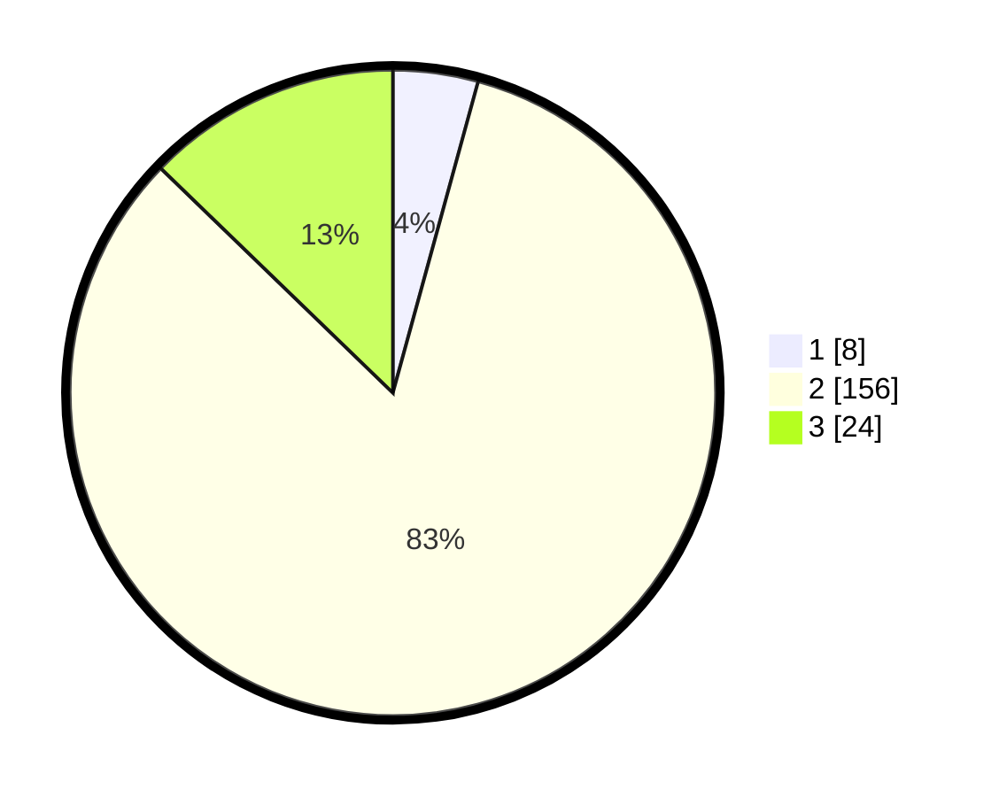

# Hasil

## Grafik

## Tabel

| No. | Nama Paslon    | Suara | Suara (raw) | Persentase |
|:--- |:-------------- | -----:| -----------:| ----------:|
| 1   | ANIES MUHAIMIN | 8     | [8][p-1]    | 4,26       |
| 2   | PRABOWO GIBRAN | 156   | [156][p-2]  | 82,98      |
| 3   | GANJAR MAHFUD  | 24    | [24][p-3]   | 12,77      |

[p-1]: https://github.com/gigit-pemilu/pemilu-2024-33-jawa-tengah/blob/main/pilpres/hitung-suara/sub/33-jawa-tengah/sub/05-kebumen/sub/23-bonorowo/sub/2001-patukrejo/sub/003-tps/sub/paslon-1.txt
[p-2]: https://github.com/gigit-pemilu/pemilu-2024-33-jawa-tengah/blob/main/pilpres/hitung-suara/sub/33-jawa-tengah/sub/05-kebumen/sub/23-bonorowo/sub/2001-patukrejo/sub/003-tps/sub/paslon-2.txt
[p-3]: https://github.com/gigit-pemilu/pemilu-2024-33-jawa-tengah/blob/main/pilpres/hitung-suara/sub/33-jawa-tengah/sub/05-kebumen/sub/23-bonorowo/sub/2001-patukrejo/sub/003-tps/sub/paslon-3.txt

## Foto C Plano

https://sirekap-obj-formc.kpu.go.id/9f37/pemilu/ppwp/33/05/23/20/01/3305232001003-20240217-110427--78d24eab-5f94-4085-b55b-777beb9aa0ea.jpg

https://sirekap-obj-formc.kpu.go.id/9f37/pemilu/ppwp/33/05/23/20/01/3305232001003-20240217-110822--dfe05256-4c00-44b9-9751-975ed97fca4c.jpg

https://sirekap-obj-formc.kpu.go.id/9f37/pemilu/ppwp/33/05/23/20/01/3305232001003-20240217-111313--3111eb31-74e8-4c03-a67c-8ac33d06436d.jpg

## Metadata

| Key        | Value               |
| ---------- | ------------------- |
| Time Stamp | 2024-02-17 11:30:03 |

