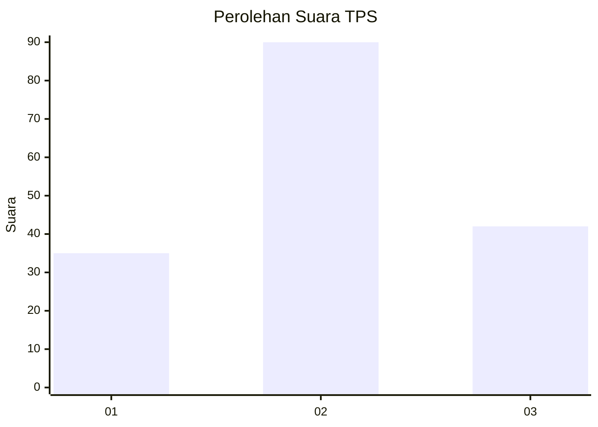
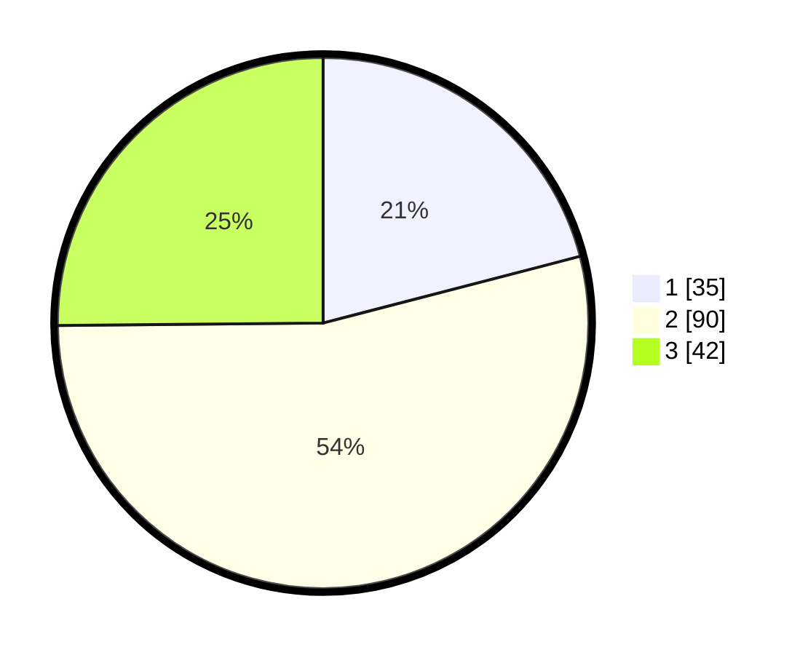

# Hasil

## Grafik

## Tabel

| No. | Nama Paslon    | Suara | Suara (raw) | Persentase |
|:--- |:-------------- | -----:| -----------:| ----------:|
| 1   | ANIES MUHAIMIN | 35    | [35][p-1]   | 20,96      |
| 2   | PRABOWO GIBRAN | 90    | [90][p-2]   | 53,89      |
| 3   | GANJAR MAHFUD  | 42    | [42][p-3]   | 25,15      |

[p-1]: https://github.com/gigit-pemilu/pemilu-2024/blob/main/pilpres/hitung-suara/sub/33-jawa-tengah/sub/05-kebumen/sub/23-bonorowo/sub/2011-mrentul/sub/006-tps/sub/paslon-1.txt
[p-2]: https://github.com/gigit-pemilu/pemilu-2024/blob/main/pilpres/hitung-suara/sub/33-jawa-tengah/sub/05-kebumen/sub/23-bonorowo/sub/2011-mrentul/sub/006-tps/sub/paslon-2.txt
[p-3]: https://github.com/gigit-pemilu/pemilu-2024/blob/main/pilpres/hitung-suara/sub/33-jawa-tengah/sub/05-kebumen/sub/23-bonorowo/sub/2011-mrentul/sub/006-tps/sub/paslon-3.txt

## Foto C Plano

https://sirekap-obj-formc.kpu.go.id/e7d9/pemilu/ppwp/33/05/23/20/11/3305232011006-20240214-230311--09924c52-8f96-4ac6-84d4-cb424f4b67cd.jpg

https://sirekap-obj-formc.kpu.go.id/e7d9/pemilu/ppwp/33/05/23/20/11/3305232011006-20240215-000140--57c93ec5-0abd-4606-b889-4ea8cb08934a.jpg

https://sirekap-obj-formc.kpu.go.id/e7d9/pemilu/ppwp/33/05/23/20/11/3305232011006-20240215-000330--0ce4ab79-6cb7-4dfb-99aa-d0e9ecaa7707.jpg

## Metadata

| Key        | Value               |
| ---------- | ------------------- |
| Time Stamp | 2024-02-15 15:00:29 |

