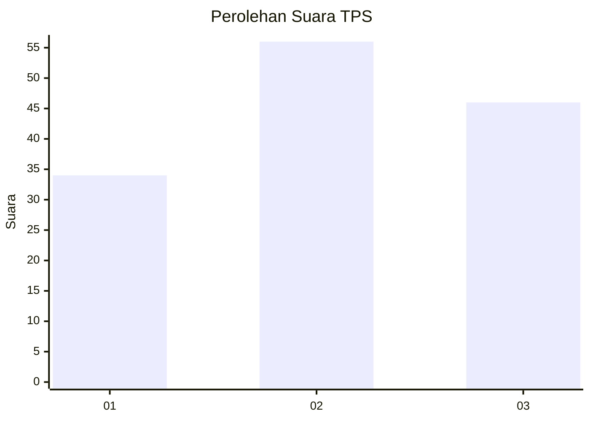
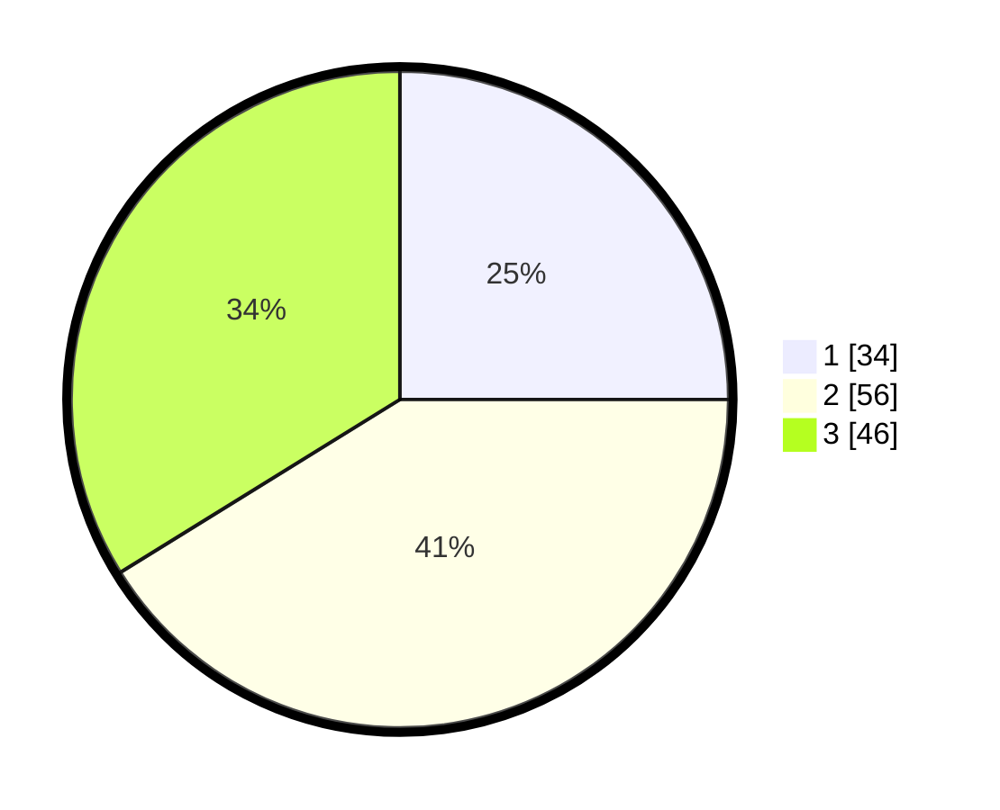

# Hasil

## Grafik

## Tabel

| No. | Nama Paslon    | Suara | Suara (raw) | Persentase |
|:--- |:-------------- | -----:| -----------:| ----------:|
| 1   | ANIES MUHAIMIN | 34    | [34][p-1]   | 25,00      |
| 2   | PRABOWO GIBRAN | 56    | [56][p-2]   | 41,18      |
| 3   | GANJAR MAHFUD  | 46    | [46][p-3]   | 33,82      |

[p-1]: https://github.com/gigit-pemilu/pemilu-2024-33-jawa-tengah/blob/main/pilpres/hitung-suara/sub/33-jawa-tengah/sub/05-kebumen/sub/24-padureso/sub/2005-kaligubug/sub/002-tps/sub/paslon-1.txt
[p-2]: https://github.com/gigit-pemilu/pemilu-2024-33-jawa-tengah/blob/main/pilpres/hitung-suara/sub/33-jawa-tengah/sub/05-kebumen/sub/24-padureso/sub/2005-kaligubug/sub/002-tps/sub/paslon-2.txt
[p-3]: https://github.com/gigit-pemilu/pemilu-2024-33-jawa-tengah/blob/main/pilpres/hitung-suara/sub/33-jawa-tengah/sub/05-kebumen/sub/24-padureso/sub/2005-kaligubug/sub/002-tps/sub/paslon-3.txt

## Foto C Plano

https://sirekap-obj-formc.kpu.go.id/43db/pemilu/ppwp/33/05/24/20/05/3305242005002-20240214-193005--351a86f6-2795-4bd2-a04a-aff7b0794df3.jpg

https://sirekap-obj-formc.kpu.go.id/43db/pemilu/ppwp/33/05/24/20/05/3305242005002-20240214-193120--d750113f-89b8-4d85-97d2-619272e473e0.jpg

https://sirekap-obj-formc.kpu.go.id/43db/pemilu/ppwp/33/05/24/20/05/3305242005002-20240214-193231--a57e83ab-be00-4113-b032-d84561a82946.jpg

## Metadata

| Key        | Value               |
| ---------- | ------------------- |
| Time Stamp | 2024-02-14 21:46:01 |

