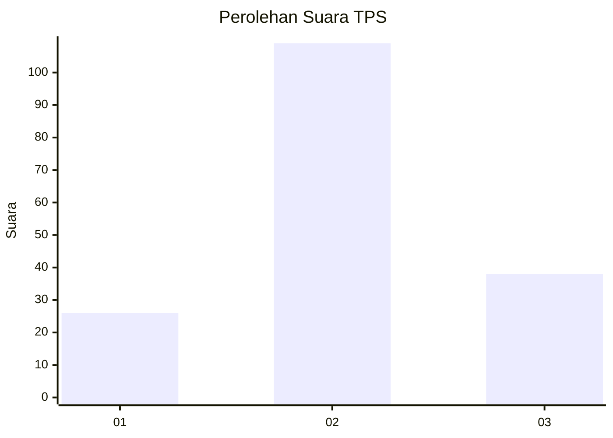
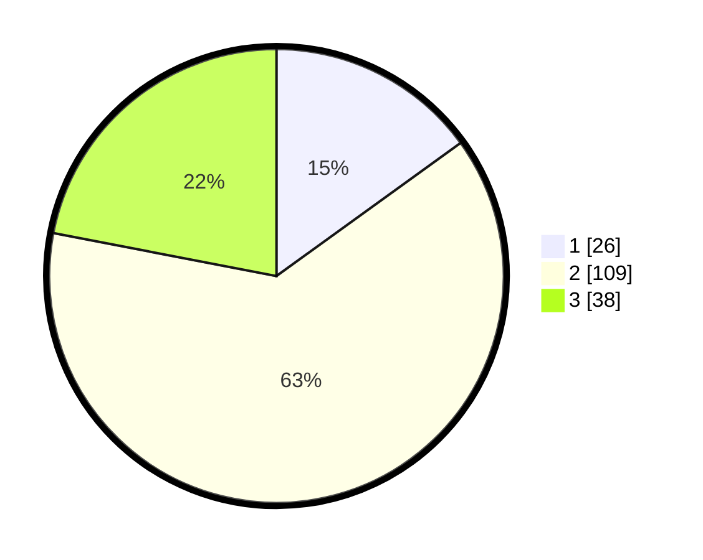

# Hasil

## Grafik

## Tabel

| No. | Nama Paslon    | Suara | Suara (raw) | Persentase |
|:--- |:-------------- | -----:| -----------:| ----------:|
| 1   | ANIES MUHAIMIN | 26    | [26][p-1]   | 15,03      |
| 2   | PRABOWO GIBRAN | 109   | [109][p-2]  | 63,01      |
| 3   | GANJAR MAHFUD  | 38    | [38][p-3]   | 21,97      |

[p-1]: https://github.com/gigit-pemilu/pemilu-2024/blob/main/pilpres/hitung-suara/sub/33-jawa-tengah/sub/05-kebumen/sub/25-poncowarno/sub/2001-jatipurus/sub/001-tps/sub/paslon-1.txt
[p-2]: https://github.com/gigit-pemilu/pemilu-2024/blob/main/pilpres/hitung-suara/sub/33-jawa-tengah/sub/05-kebumen/sub/25-poncowarno/sub/2001-jatipurus/sub/001-tps/sub/paslon-2.txt
[p-3]: https://github.com/gigit-pemilu/pemilu-2024/blob/main/pilpres/hitung-suara/sub/33-jawa-tengah/sub/05-kebumen/sub/25-poncowarno/sub/2001-jatipurus/sub/001-tps/sub/paslon-3.txt

## Foto C Plano

https://sirekap-obj-formc.kpu.go.id/c7e5/pemilu/ppwp/33/05/25/20/01/3305252001001-20240216-182918--ef21e437-46d7-4157-bb9f-1b59d2093ae8.jpg

https://sirekap-obj-formc.kpu.go.id/c7e5/pemilu/ppwp/33/05/25/20/01/3305252001001-20240218-090541--7a9d6a43-ff4f-4396-b8dc-ea5226f49069.jpg

https://sirekap-obj-formc.kpu.go.id/c7e5/pemilu/ppwp/33/05/25/20/01/3305252001001-20240216-065145--6a3347e2-42ed-471c-8daf-42710748e4cf.jpg

## Metadata

| Key        | Value               |
| ---------- | ------------------- |
| Time Stamp | 2024-02-19 06:16:00 |

