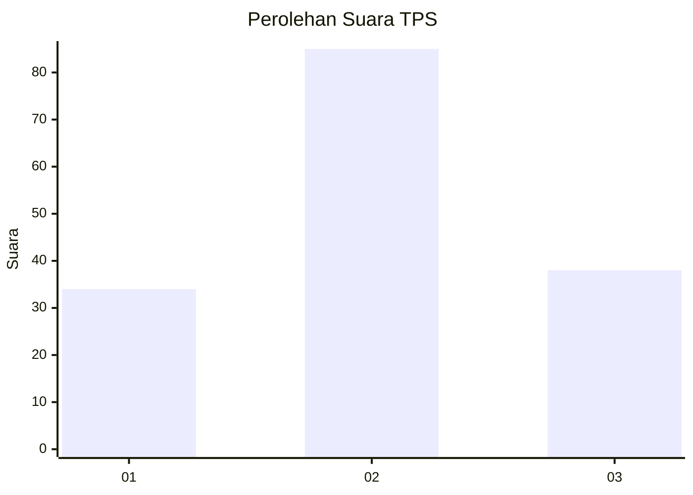
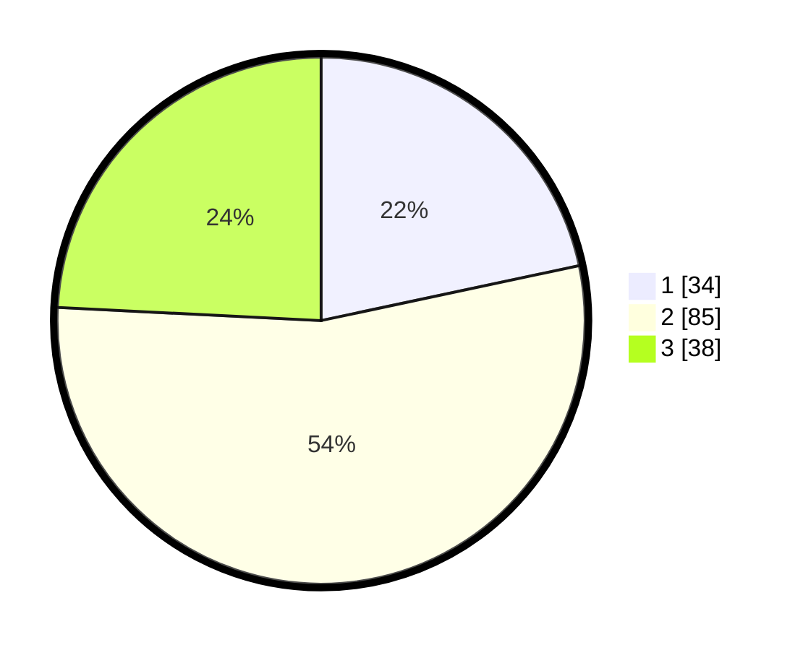

# Hasil

## Grafik

## Tabel

| No. | Nama Paslon    | Suara | Suara (raw) | Persentase |
|:--- |:-------------- | -----:| -----------:| ----------:|
| 1   | ANIES MUHAIMIN | 34    | [34][p-1]   | 21,66      |
| 2   | PRABOWO GIBRAN | 85    | [85][p-2]   | 54,14      |
| 3   | GANJAR MAHFUD  | 38    | [38][p-3]   | 24,20      |

[p-1]: https://github.com/gigit-pemilu/pemilu-2024-33-jawa-tengah/blob/main/pilpres/hitung-suara/sub/33-jawa-tengah/sub/05-kebumen/sub/26-karangsambung/sub/2004-kedungwaru/sub/003-tps/sub/paslon-1.txt
[p-2]: https://github.com/gigit-pemilu/pemilu-2024-33-jawa-tengah/blob/main/pilpres/hitung-suara/sub/33-jawa-tengah/sub/05-kebumen/sub/26-karangsambung/sub/2004-kedungwaru/sub/003-tps/sub/paslon-2.txt
[p-3]: https://github.com/gigit-pemilu/pemilu-2024-33-jawa-tengah/blob/main/pilpres/hitung-suara/sub/33-jawa-tengah/sub/05-kebumen/sub/26-karangsambung/sub/2004-kedungwaru/sub/003-tps/sub/paslon-3.txt

## Foto C Plano

https://sirekap-obj-formc.kpu.go.id/4cb2/pemilu/ppwp/33/05/26/20/04/3305262004003-20240214-194503--ac884acc-d1c2-4f7d-a4ac-e2bef004ea19.jpg

https://sirekap-obj-formc.kpu.go.id/4cb2/pemilu/ppwp/33/05/26/20/04/3305262004003-20240214-193751--d899ec73-c3b1-47fc-a861-173fc391c1c1.jpg

https://sirekap-obj-formc.kpu.go.id/4cb2/pemilu/ppwp/33/05/26/20/04/3305262004003-20240214-213912--3a6675e4-3300-409c-ad71-61c711dfeb05.jpg

## Metadata

| Key        | Value               |
| ---------- | ------------------- |
| Time Stamp | 2024-02-15 01:47:43 |

