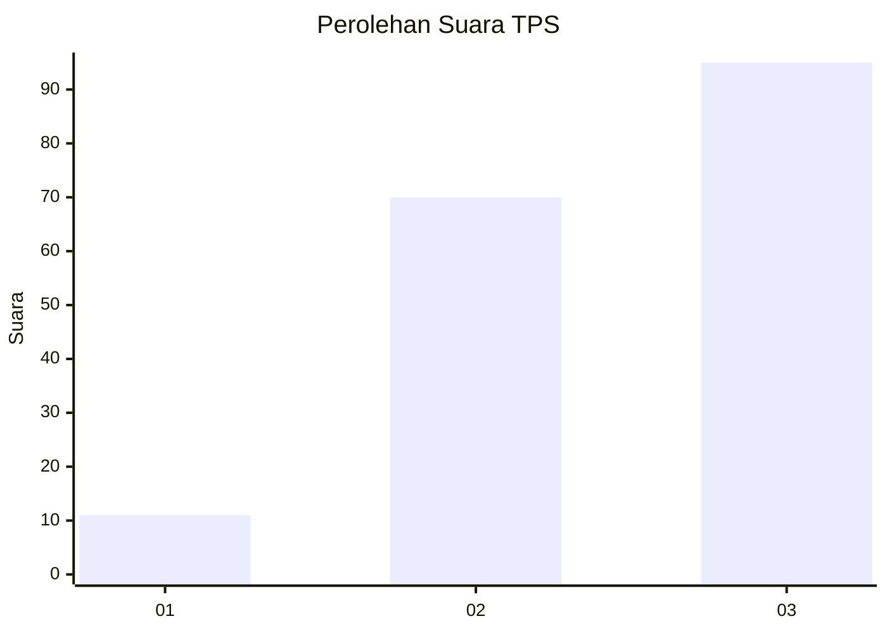
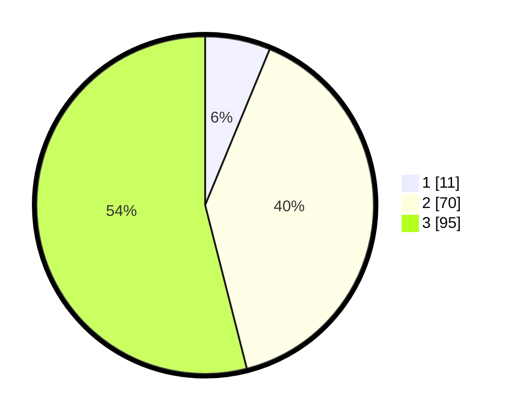

# Hasil

## Grafik

## Tabel

| No. | Nama Paslon    | Suara | Suara (raw) | Persentase |
|:--- |:-------------- | -----:| -----------:| ----------:|
| 1   | ANIES MUHAIMIN | 11    | [11][p-1]   | 6,25       |
| 2   | PRABOWO GIBRAN | 70    | [70][p-2]   | 39,77      |
| 3   | GANJAR MAHFUD  | 95    | [95][p-3]   | 53,98      |

[p-1]: https://github.com/gigit-pemilu/pemilu-2024/blob/main/pilpres/hitung-suara/sub/33-jawa-tengah/sub/05-kebumen/sub/26-karangsambung/sub/2006-plumbon/sub/020-tps/sub/paslon-1.txt
[p-2]: https://github.com/gigit-pemilu/pemilu-2024/blob/main/pilpres/hitung-suara/sub/33-jawa-tengah/sub/05-kebumen/sub/26-karangsambung/sub/2006-plumbon/sub/020-tps/sub/paslon-2.txt
[p-3]: https://github.com/gigit-pemilu/pemilu-2024/blob/main/pilpres/hitung-suara/sub/33-jawa-tengah/sub/05-kebumen/sub/26-karangsambung/sub/2006-plumbon/sub/020-tps/sub/paslon-3.txt

## Foto C Plano

https://sirekap-obj-formc.kpu.go.id/9a50/pemilu/ppwp/33/05/26/20/06/3305262006020-20240217-083710--ac112612-f314-4bd4-91c6-1b72b5ed46ce.jpg

https://sirekap-obj-formc.kpu.go.id/9a50/pemilu/ppwp/33/05/26/20/06/3305262006020-20240217-151637--e69080e7-6373-4f67-a120-827eb1a40ac7.jpg

https://sirekap-obj-formc.kpu.go.id/9a50/pemilu/ppwp/33/05/26/20/06/3305262006020-20240217-083728--f641fc48-f48c-4c66-960b-41d9e1d8d104.jpg

## Metadata

| Key        | Value               |
| ---------- | ------------------- |
| Time Stamp | 2024-02-17 16:00:02 |

