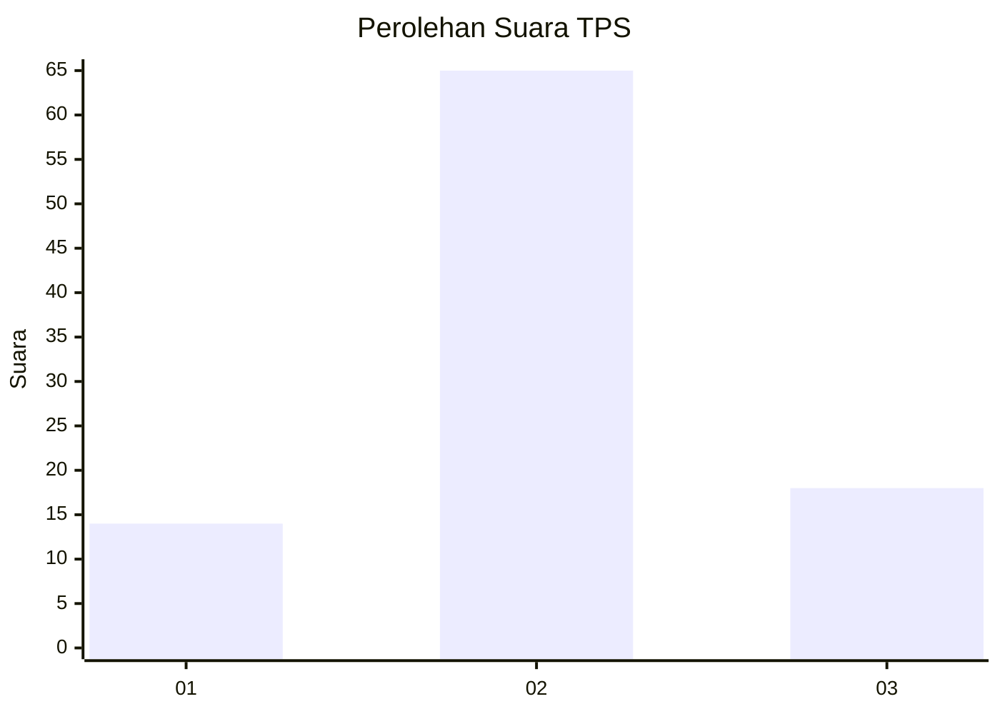
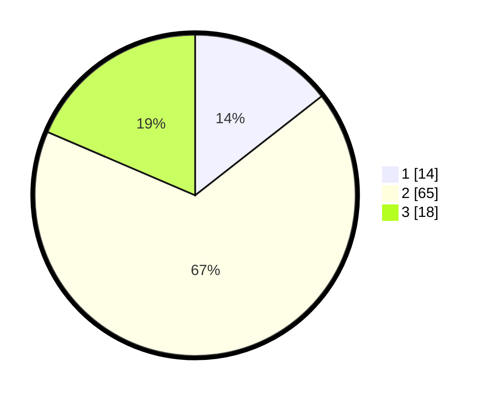

# Hasil

## Grafik

## Tabel

| No. | Nama Paslon    | Suara | Suara (raw) | Persentase |
|:--- |:-------------- | -----:| -----------:| ----------:|
| 1   | ANIES MUHAIMIN | 14    | [14][p-1]   | 14,43      |
| 2   | PRABOWO GIBRAN | 65    | [65][p-2]   | 67,01      |
| 3   | GANJAR MAHFUD  | 18    | [18][p-3]   | 18,56      |

[p-1]: https://github.com/gigit-pemilu/pemilu-2024/blob/main/pilpres/hitung-suara/sub/33-jawa-tengah/sub/05-kebumen/sub/26-karangsambung/sub/2007-pujotirto/sub/016-tps/sub/paslon-1.txt
[p-2]: https://github.com/gigit-pemilu/pemilu-2024/blob/main/pilpres/hitung-suara/sub/33-jawa-tengah/sub/05-kebumen/sub/26-karangsambung/sub/2007-pujotirto/sub/016-tps/sub/paslon-2.txt
[p-3]: https://github.com/gigit-pemilu/pemilu-2024/blob/main/pilpres/hitung-suara/sub/33-jawa-tengah/sub/05-kebumen/sub/26-karangsambung/sub/2007-pujotirto/sub/016-tps/sub/paslon-3.txt

## Foto C Plano

https://sirekap-obj-formc.kpu.go.id/be03/pemilu/ppwp/33/05/26/20/07/3305262007016-20240214-160120--91ddccbd-e361-4e3c-bcb4-f7269690c5db.jpg

https://sirekap-obj-formc.kpu.go.id/be03/pemilu/ppwp/33/05/26/20/07/3305262007016-20240216-161219--09e891b1-c463-4b4b-9d66-9aa7de88c0ef.jpg

https://sirekap-obj-formc.kpu.go.id/be03/pemilu/ppwp/33/05/26/20/07/3305262007016-20240216-171839--b8465e58-790a-4165-9818-be61dffb7a91.jpg

## Metadata

| Key        | Value               |
| ---------- | ------------------- |
| Time Stamp | 2024-02-21 21:00:04 |

