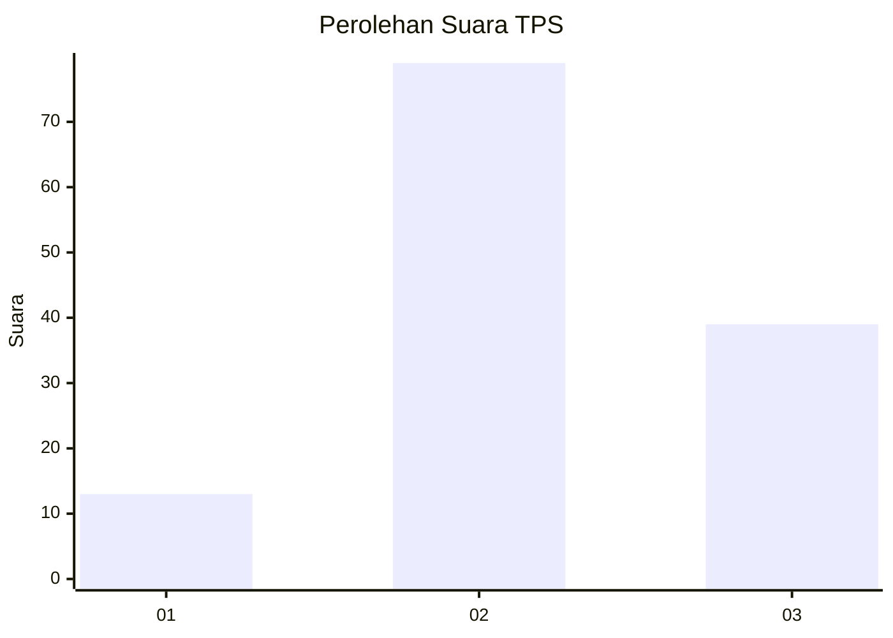
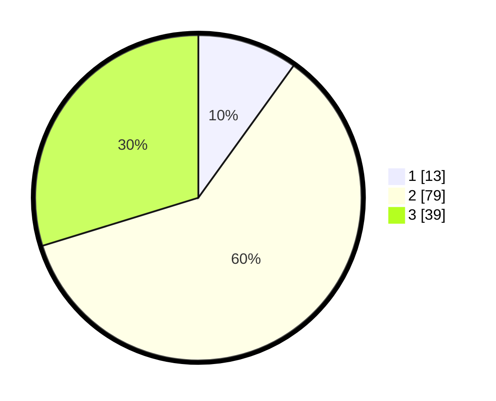

# Hasil

## Grafik

## Tabel

| No. | Nama Paslon    | Suara | Suara (raw) | Persentase |
|:--- |:-------------- | -----:| -----------:| ----------:|
| 1   | ANIES MUHAIMIN | 13    | [13][p-1]   | 9,92       |
| 2   | PRABOWO GIBRAN | 79    | [79][p-2]   | 60,31      |
| 3   | GANJAR MAHFUD  | 39    | [39][p-3]   | 29,77      |

[p-1]: https://github.com/gigit-pemilu/pemilu-2024/blob/main/pilpres/hitung-suara/sub/33-jawa-tengah/sub/05-kebumen/sub/26-karangsambung/sub/2007-pujotirto/sub/019-tps/sub/paslon-1.txt
[p-2]: https://github.com/gigit-pemilu/pemilu-2024/blob/main/pilpres/hitung-suara/sub/33-jawa-tengah/sub/05-kebumen/sub/26-karangsambung/sub/2007-pujotirto/sub/019-tps/sub/paslon-2.txt
[p-3]: https://github.com/gigit-pemilu/pemilu-2024/blob/main/pilpres/hitung-suara/sub/33-jawa-tengah/sub/05-kebumen/sub/26-karangsambung/sub/2007-pujotirto/sub/019-tps/sub/paslon-3.txt

## Foto C Plano

https://sirekap-obj-formc.kpu.go.id/b124/pemilu/ppwp/33/05/26/20/07/3305262007019-20240217-170410--b5e6b2ef-690f-41a1-857b-4074a1263ecb.jpg

https://sirekap-obj-formc.kpu.go.id/b124/pemilu/ppwp/33/05/26/20/07/3305262007019-20240215-003138--89ebab00-6ac1-42c2-8f15-3c9dc9b539df.jpg

https://sirekap-obj-formc.kpu.go.id/b124/pemilu/ppwp/33/05/26/20/07/3305262007019-20240215-003315--11302a7f-d74b-4b68-8adf-461a869ae382.jpg

## Metadata

| Key        | Value               |
| ---------- | ------------------- |
| Time Stamp | 2024-02-19 17:00:00 |

