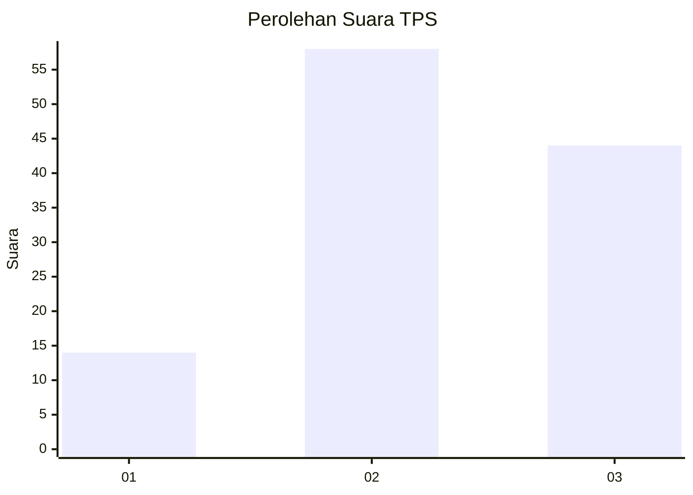
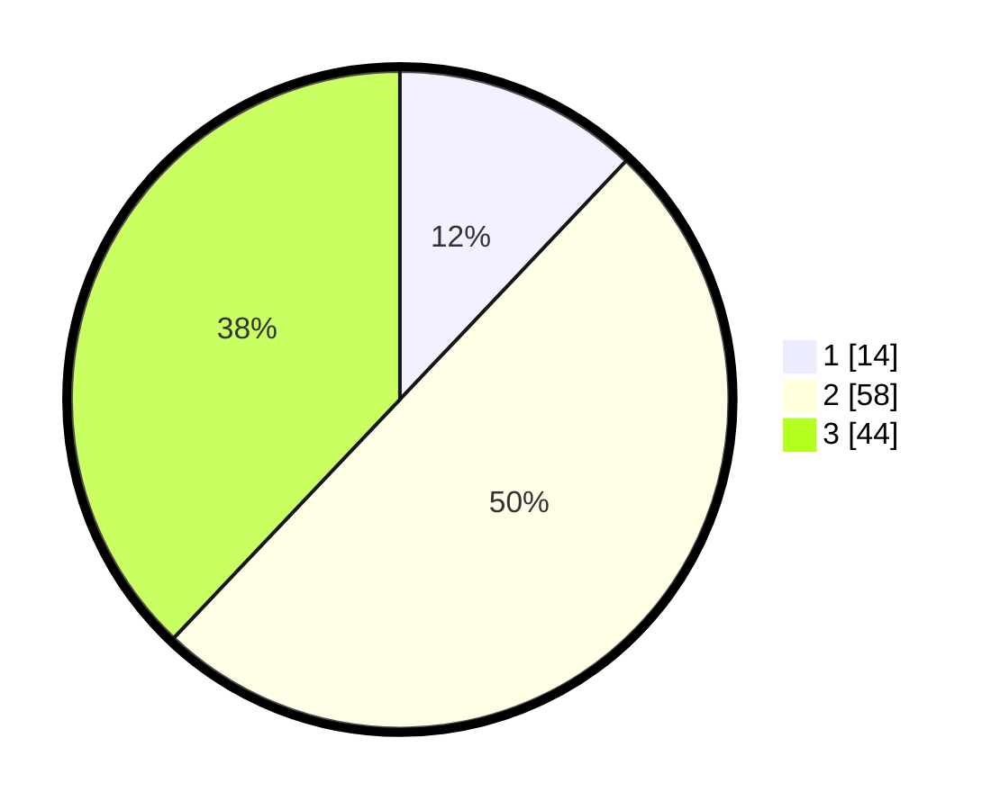

# Hasil

## Grafik

## Tabel

| No. | Nama Paslon    | Suara | Suara (raw) | Persentase |
|:--- |:-------------- | -----:| -----------:| ----------:|
| 1   | ANIES MUHAIMIN | 14    | [14][p-1]   | 12,07      |
| 2   | PRABOWO GIBRAN | 58    | [58][p-2]   | 50,00      |
| 3   | GANJAR MAHFUD  | 44    | [44][p-3]   | 37,93      |

[p-1]: https://github.com/gigit-pemilu/pemilu-2024-33-jawa-tengah/blob/main/pilpres/hitung-suara/sub/33-jawa-tengah/sub/05-kebumen/sub/26-karangsambung/sub/2007-pujotirto/sub/020-tps/sub/paslon-1.txt
[p-2]: https://github.com/gigit-pemilu/pemilu-2024-33-jawa-tengah/blob/main/pilpres/hitung-suara/sub/33-jawa-tengah/sub/05-kebumen/sub/26-karangsambung/sub/2007-pujotirto/sub/020-tps/sub/paslon-2.txt
[p-3]: https://github.com/gigit-pemilu/pemilu-2024-33-jawa-tengah/blob/main/pilpres/hitung-suara/sub/33-jawa-tengah/sub/05-kebumen/sub/26-karangsambung/sub/2007-pujotirto/sub/020-tps/sub/paslon-3.txt

## Foto C Plano

https://sirekap-obj-formc.kpu.go.id/ff00/pemilu/ppwp/33/05/26/20/07/3305262007020-20240215-003020--3da9f9ef-914c-43eb-966a-1809d31b0b8e.jpg

https://sirekap-obj-formc.kpu.go.id/ff00/pemilu/ppwp/33/05/26/20/07/3305262007020-20240215-003152--f3e7c8eb-6d0a-4edb-a2ac-7027cf60814d.jpg

https://sirekap-obj-formc.kpu.go.id/ff00/pemilu/ppwp/33/05/26/20/07/3305262007020-20240215-003314--1c66c9e8-af8b-4b34-85e0-fa4532e3993a.jpg

## Metadata

| Key        | Value               |
| ---------- | ------------------- |
| Time Stamp | 2024-02-19 17:00:00 |

