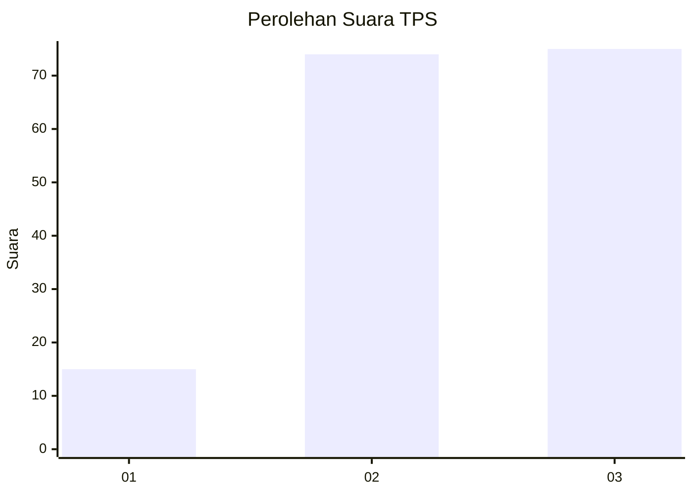
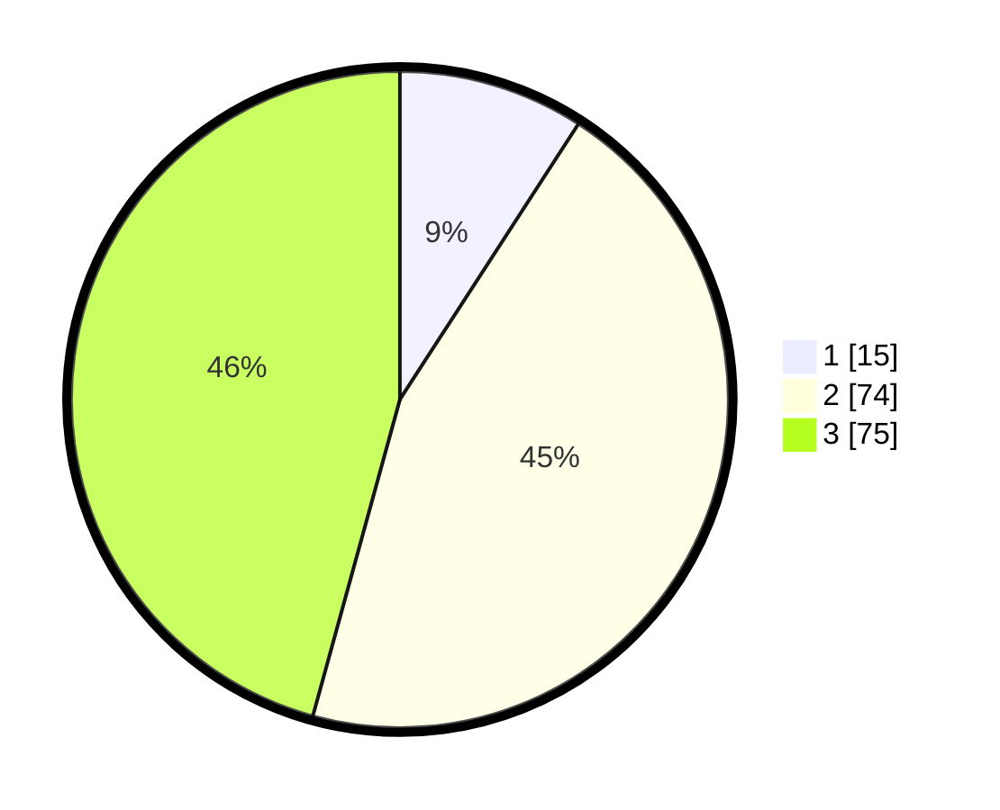

# Hasil

## Grafik

## Tabel

| No. | Nama Paslon    | Suara | Suara (raw) | Persentase |
|:--- |:-------------- | -----:| -----------:| ----------:|
| 1   | ANIES MUHAIMIN | 15    | [15][p-1]   | 9,15       |
| 2   | PRABOWO GIBRAN | 74    | [74][p-2]   | 45,12      |
| 3   | GANJAR MAHFUD  | 75    | [75][p-3]   | 45,73      |

[p-1]: https://github.com/gigit-pemilu/pemilu-2024-33-jawa-tengah/blob/main/pilpres/hitung-suara/sub/33-jawa-tengah/sub/05-kebumen/sub/26-karangsambung/sub/2009-tlepok/sub/002-tps/sub/paslon-1.txt
[p-2]: https://github.com/gigit-pemilu/pemilu-2024-33-jawa-tengah/blob/main/pilpres/hitung-suara/sub/33-jawa-tengah/sub/05-kebumen/sub/26-karangsambung/sub/2009-tlepok/sub/002-tps/sub/paslon-2.txt
[p-3]: https://github.com/gigit-pemilu/pemilu-2024-33-jawa-tengah/blob/main/pilpres/hitung-suara/sub/33-jawa-tengah/sub/05-kebumen/sub/26-karangsambung/sub/2009-tlepok/sub/002-tps/sub/paslon-3.txt

## Foto C Plano

https://sirekap-obj-formc.kpu.go.id/c6f4/pemilu/ppwp/33/05/26/20/09/3305262009002-20240215-040746--b78b9c2c-37b3-4959-a09c-10ffaad3029b.jpg

https://sirekap-obj-formc.kpu.go.id/c6f4/pemilu/ppwp/33/05/26/20/09/3305262009002-20240215-040718--3e4105a4-d88e-4c27-95da-6a9a4ffa4afa.jpg

https://sirekap-obj-formc.kpu.go.id/c6f4/pemilu/ppwp/33/05/26/20/09/3305262009002-20240216-092041--979ab8f0-7be8-4fbc-8b9e-15d9eb4738bc.jpg

## Metadata

| Key        | Value               |
| ---------- | ------------------- |
| Time Stamp | 2024-02-19 11:00:00 |

