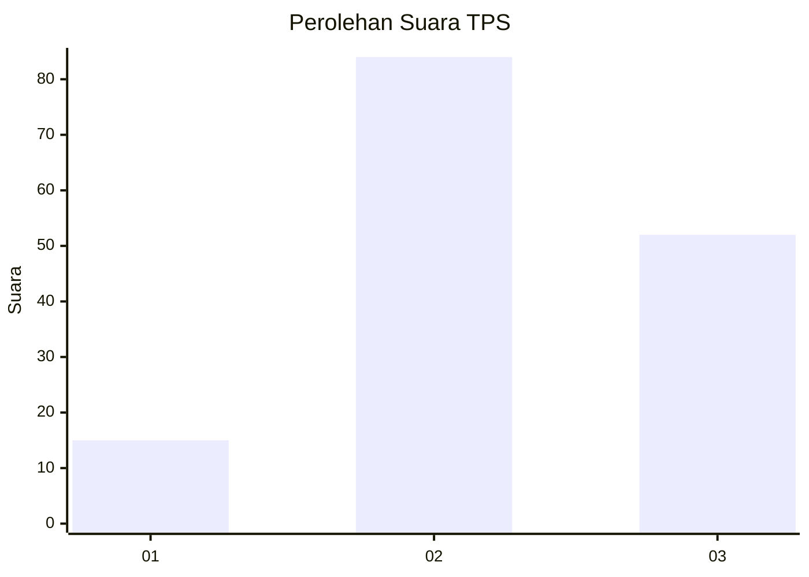
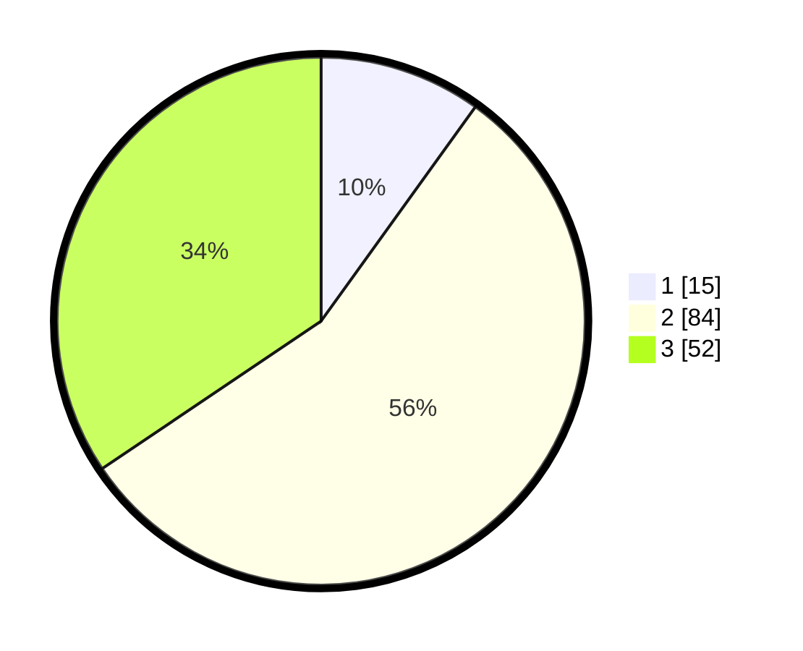

# Hasil

## Grafik

## Tabel

| No. | Nama Paslon    | Suara | Suara (raw) | Persentase |
|:--- |:-------------- | -----:| -----------:| ----------:|
| 1   | ANIES MUHAIMIN | 15    | [15][p-1]   | 9,93       |
| 2   | PRABOWO GIBRAN | 84    | [84][p-2]   | 55,63      |
| 3   | GANJAR MAHFUD  | 52    | [52][p-3]   | 34,44      |

[p-1]: https://github.com/gigit-pemilu/pemilu-2024-33-jawa-tengah/blob/main/pilpres/hitung-suara/sub/33-jawa-tengah/sub/05-kebumen/sub/26-karangsambung/sub/2009-tlepok/sub/006-tps/sub/paslon-1.txt
[p-2]: https://github.com/gigit-pemilu/pemilu-2024-33-jawa-tengah/blob/main/pilpres/hitung-suara/sub/33-jawa-tengah/sub/05-kebumen/sub/26-karangsambung/sub/2009-tlepok/sub/006-tps/sub/paslon-2.txt
[p-3]: https://github.com/gigit-pemilu/pemilu-2024-33-jawa-tengah/blob/main/pilpres/hitung-suara/sub/33-jawa-tengah/sub/05-kebumen/sub/26-karangsambung/sub/2009-tlepok/sub/006-tps/sub/paslon-3.txt

## Foto C Plano

https://sirekap-obj-formc.kpu.go.id/2051/pemilu/ppwp/33/05/26/20/09/3305262009006-20240214-141834--0705bd0b-a147-4452-a774-3531e58e3370.jpg

https://sirekap-obj-formc.kpu.go.id/2051/pemilu/ppwp/33/05/26/20/09/3305262009006-20240214-141520--24293103-8a8e-4d6c-8eec-bd3ef6ea9386.jpg

https://sirekap-obj-formc.kpu.go.id/2051/pemilu/ppwp/33/05/26/20/09/3305262009006-20240214-141725--d9dd41e1-40eb-4f61-998d-2aef8c4d1019.jpg

## Metadata

| Key        | Value               |
| ---------- | ------------------- |
| Time Stamp | 2024-02-19 11:00:00 |

