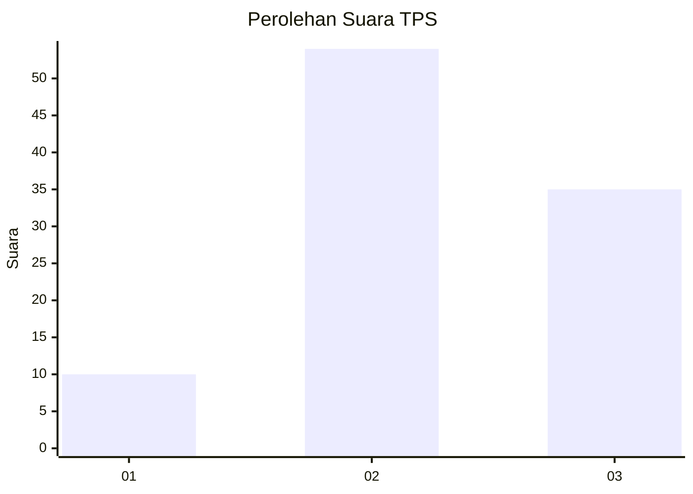
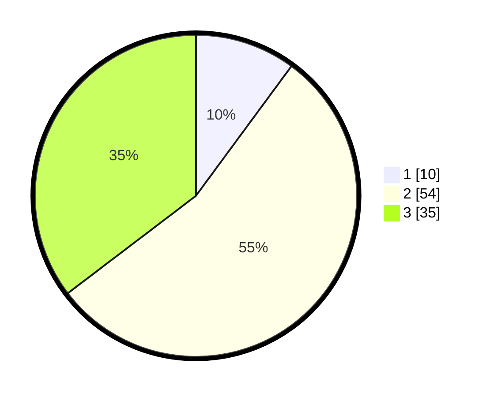

# Hasil

## Grafik

## Tabel

| No. | Nama Paslon    | Suara | Suara (raw) | Persentase |
|:--- |:-------------- | -----:| -----------:| ----------:|
| 1   | ANIES MUHAIMIN | 10    | [10][p-1]   | 10,10      |
| 2   | PRABOWO GIBRAN | 54    | [54][p-2]   | 54,55      |
| 3   | GANJAR MAHFUD  | 35    | [35][p-3]   | 35,35      |

[p-1]: https://github.com/gigit-pemilu/pemilu-2024/blob/main/pilpres/hitung-suara/sub/33-jawa-tengah/sub/05-kebumen/sub/26-karangsambung/sub/2010-kalisana/sub/006-tps/sub/paslon-1.txt
[p-2]: https://github.com/gigit-pemilu/pemilu-2024/blob/main/pilpres/hitung-suara/sub/33-jawa-tengah/sub/05-kebumen/sub/26-karangsambung/sub/2010-kalisana/sub/006-tps/sub/paslon-2.txt
[p-3]: https://github.com/gigit-pemilu/pemilu-2024/blob/main/pilpres/hitung-suara/sub/33-jawa-tengah/sub/05-kebumen/sub/26-karangsambung/sub/2010-kalisana/sub/006-tps/sub/paslon-3.txt

## Foto C Plano

https://sirekap-obj-formc.kpu.go.id/90e1/pemilu/ppwp/33/05/26/20/10/3305262010006-20240217-085544--e14f3633-a3a6-4820-86e7-fd7eaf1dd2f2.jpg

https://sirekap-obj-formc.kpu.go.id/90e1/pemilu/ppwp/33/05/26/20/10/3305262010006-20240217-083417--83d33e8b-3fe1-4d03-9fa9-87cabdbe080e.jpg

https://sirekap-obj-formc.kpu.go.id/90e1/pemilu/ppwp/33/05/26/20/10/3305262010006-20240217-083911--b1336bb9-bb8d-4c92-8dce-213f7f870f71.jpg

## Metadata

| Key        | Value               |
| ---------- | ------------------- |
| Time Stamp | 2024-02-17 12:00:00 |

