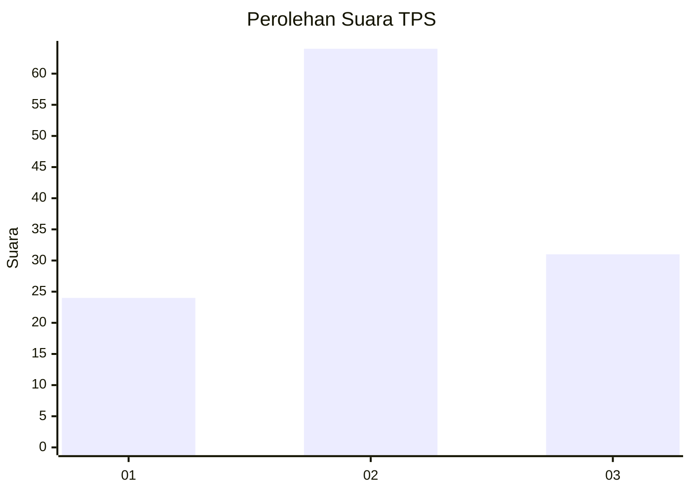
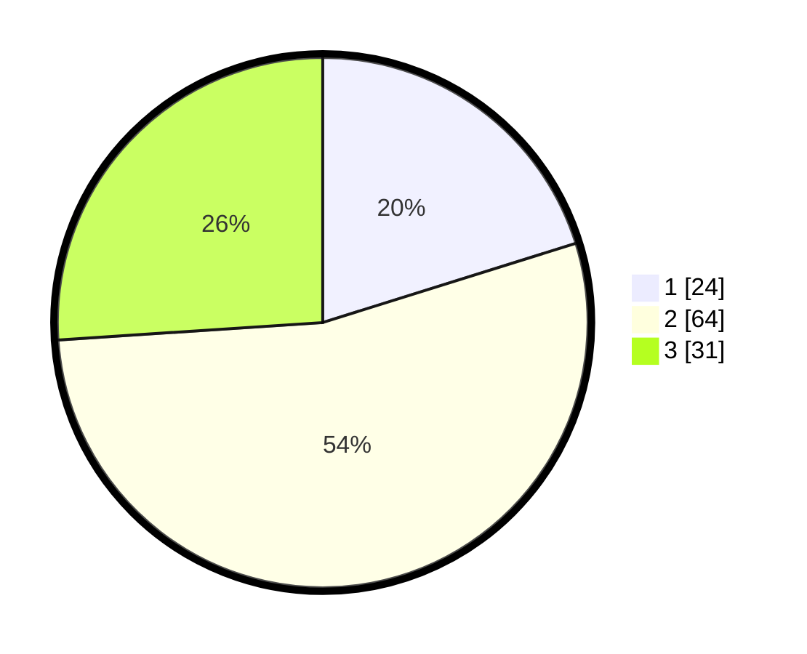

# Hasil

## Grafik

## Tabel

| No. | Nama Paslon    | Suara | Suara (raw) | Persentase |
|:--- |:-------------- | -----:| -----------:| ----------:|
| 1   | ANIES MUHAIMIN | 24    | [24][p-1]   | 20,17      |
| 2   | PRABOWO GIBRAN | 64    | [64][p-2]   | 53,78      |
| 3   | GANJAR MAHFUD  | 31    | [31][p-3]   | 26,05      |

[p-1]: https://github.com/gigit-pemilu/pemilu-2024/blob/main/pilpres/hitung-suara/sub/33-jawa-tengah/sub/05-kebumen/sub/26-karangsambung/sub/2013-karangsambung/sub/004-tps/sub/paslon-1.txt
[p-2]: https://github.com/gigit-pemilu/pemilu-2024/blob/main/pilpres/hitung-suara/sub/33-jawa-tengah/sub/05-kebumen/sub/26-karangsambung/sub/2013-karangsambung/sub/004-tps/sub/paslon-2.txt
[p-3]: https://github.com/gigit-pemilu/pemilu-2024/blob/main/pilpres/hitung-suara/sub/33-jawa-tengah/sub/05-kebumen/sub/26-karangsambung/sub/2013-karangsambung/sub/004-tps/sub/paslon-3.txt

## Foto C Plano

https://sirekap-obj-formc.kpu.go.id/76e8/pemilu/ppwp/33/05/26/20/13/3305262013004-20240214-234730--fdb9ccc8-c6c8-4ad5-a1c2-92aef6b59a8d.jpg

https://sirekap-obj-formc.kpu.go.id/76e8/pemilu/ppwp/33/05/26/20/13/3305262013004-20240215-000040--5565d779-03a9-4bcd-8387-1122d4da14d8.jpg

https://sirekap-obj-formc.kpu.go.id/76e8/pemilu/ppwp/33/05/26/20/13/3305262013004-20240214-235914--2776f6b9-d744-4761-9ed8-92c9970b9ded.jpg

## Metadata

| Key        | Value               |
| ---------- | ------------------- |
| Time Stamp | 2024-02-15 21:30:27 |

