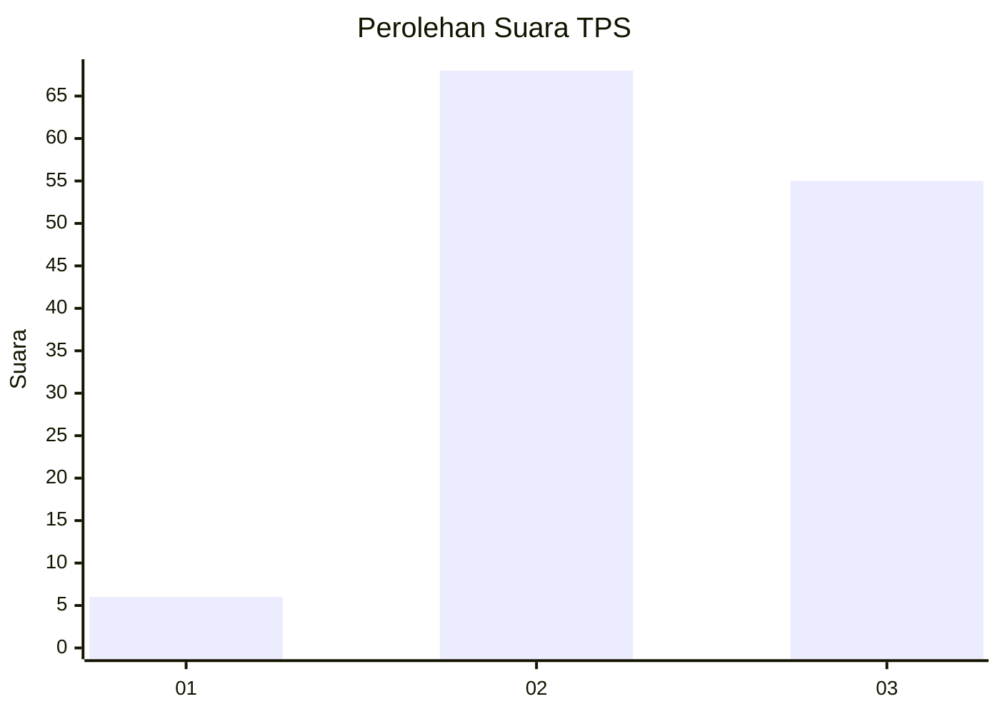
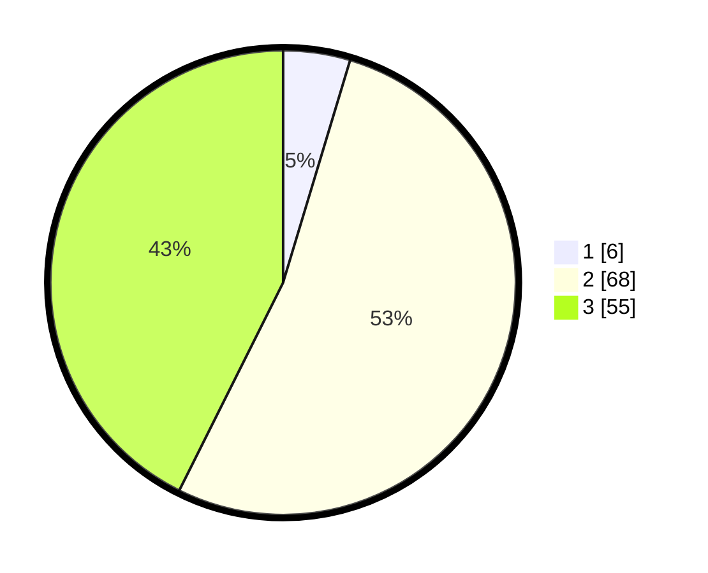

# Hasil

## Grafik

## Tabel

| No. | Nama Paslon    | Suara | Suara (raw) | Persentase |
|:--- |:-------------- | -----:| -----------:| ----------:|
| 1   | ANIES MUHAIMIN | 6     | [6][p-1]    | 4,65       |
| 2   | PRABOWO GIBRAN | 68    | [68][p-2]   | 52,71      |
| 3   | GANJAR MAHFUD  | 55    | [55][p-3]   | 42,64      |

[p-1]: https://github.com/gigit-pemilu/pemilu-2024-33-jawa-tengah/blob/main/pilpres/hitung-suara/sub/33-jawa-tengah/sub/05-kebumen/sub/26-karangsambung/sub/2013-karangsambung/sub/007-tps/sub/paslon-1.txt
[p-2]: https://github.com/gigit-pemilu/pemilu-2024-33-jawa-tengah/blob/main/pilpres/hitung-suara/sub/33-jawa-tengah/sub/05-kebumen/sub/26-karangsambung/sub/2013-karangsambung/sub/007-tps/sub/paslon-2.txt
[p-3]: https://github.com/gigit-pemilu/pemilu-2024-33-jawa-tengah/blob/main/pilpres/hitung-suara/sub/33-jawa-tengah/sub/05-kebumen/sub/26-karangsambung/sub/2013-karangsambung/sub/007-tps/sub/paslon-3.txt

## Foto C Plano

https://sirekap-obj-formc.kpu.go.id/a184/pemilu/ppwp/33/05/26/20/13/3305262013007-20240215-055405--c636a6be-e972-4420-bfb9-bae08a0152ad.jpg

https://sirekap-obj-formc.kpu.go.id/a184/pemilu/ppwp/33/05/26/20/13/3305262013007-20240215-055542--f462d1a0-04fe-453b-94ac-f7afd7d94131.jpg

https://sirekap-obj-formc.kpu.go.id/a184/pemilu/ppwp/33/05/26/20/13/3305262013007-20240215-055717--f9514824-c054-4901-b127-bd66832751fe.jpg

## Metadata

| Key        | Value               |
| ---------- | ------------------- |
| Time Stamp | 2024-02-25 12:00:00 |

