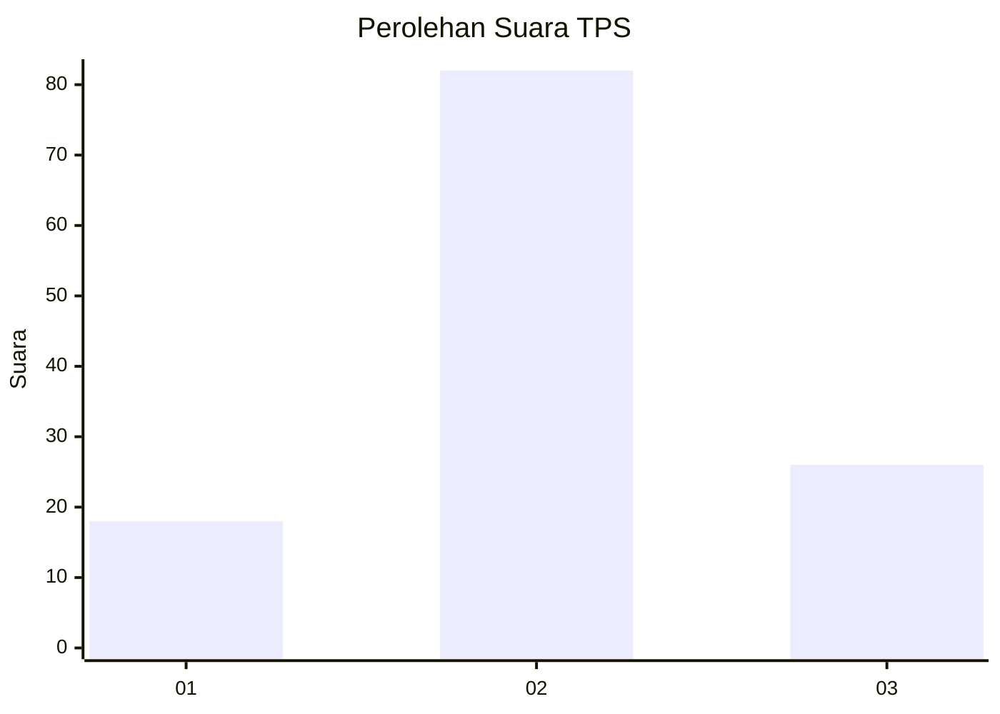
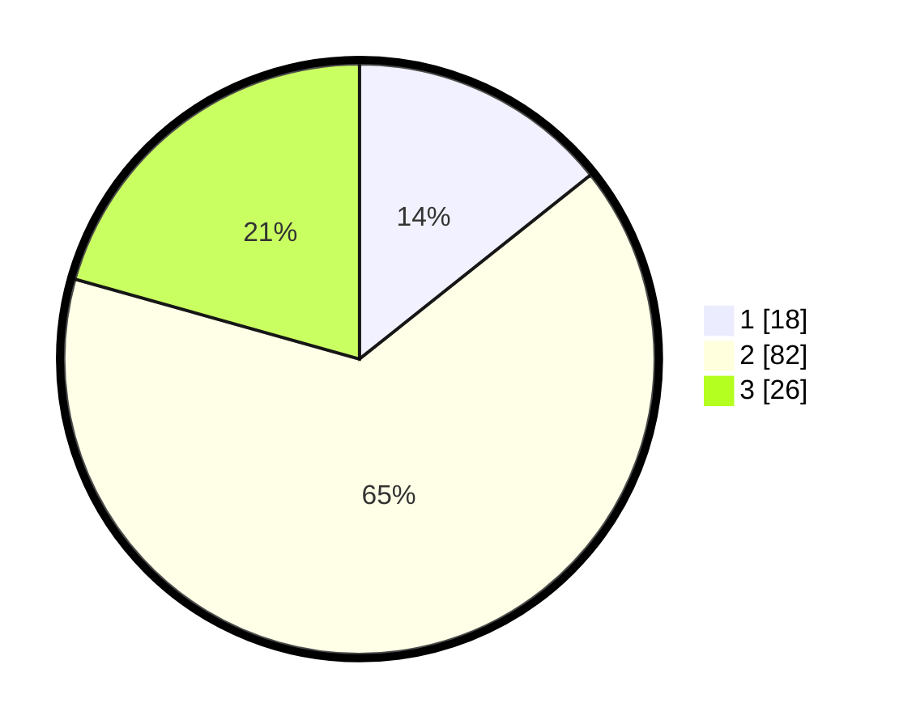

# Hasil

## Grafik

## Tabel

| No. | Nama Paslon    | Suara | Suara (raw) | Persentase |
|:--- |:-------------- | -----:| -----------:| ----------:|
| 1   | ANIES MUHAIMIN | 18    | [18][p-1]   | 14,29      |
| 2   | PRABOWO GIBRAN | 82    | [82][p-2]   | 65,08      |
| 3   | GANJAR MAHFUD  | 26    | [26][p-3]   | 20,63      |

[p-1]: https://github.com/gigit-pemilu/pemilu-2024/blob/main/pilpres/hitung-suara/sub/33-jawa-tengah/sub/05-kebumen/sub/26-karangsambung/sub/2013-karangsambung/sub/012-tps/sub/paslon-1.txt
[p-2]: https://github.com/gigit-pemilu/pemilu-2024/blob/main/pilpres/hitung-suara/sub/33-jawa-tengah/sub/05-kebumen/sub/26-karangsambung/sub/2013-karangsambung/sub/012-tps/sub/paslon-2.txt
[p-3]: https://github.com/gigit-pemilu/pemilu-2024/blob/main/pilpres/hitung-suara/sub/33-jawa-tengah/sub/05-kebumen/sub/26-karangsambung/sub/2013-karangsambung/sub/012-tps/sub/paslon-3.txt

## Foto C Plano

https://sirekap-obj-formc.kpu.go.id/47d9/pemilu/ppwp/33/05/26/20/13/3305262013012-20240214-204355--08adc427-c01b-43ca-b5c6-56e63f416020.jpg

https://sirekap-obj-formc.kpu.go.id/47d9/pemilu/ppwp/33/05/26/20/13/3305262013012-20240214-204718--9e92522b-0c8c-49d4-9de0-b61de4fef14c.jpg

https://sirekap-obj-formc.kpu.go.id/47d9/pemilu/ppwp/33/05/26/20/13/3305262013012-20240214-204735--4c828875-2642-4d3e-a9da-4595668a2824.jpg

## Metadata

| Key        | Value               |
| ---------- | ------------------- |
| Time Stamp | 2024-02-15 21:30:27 |

