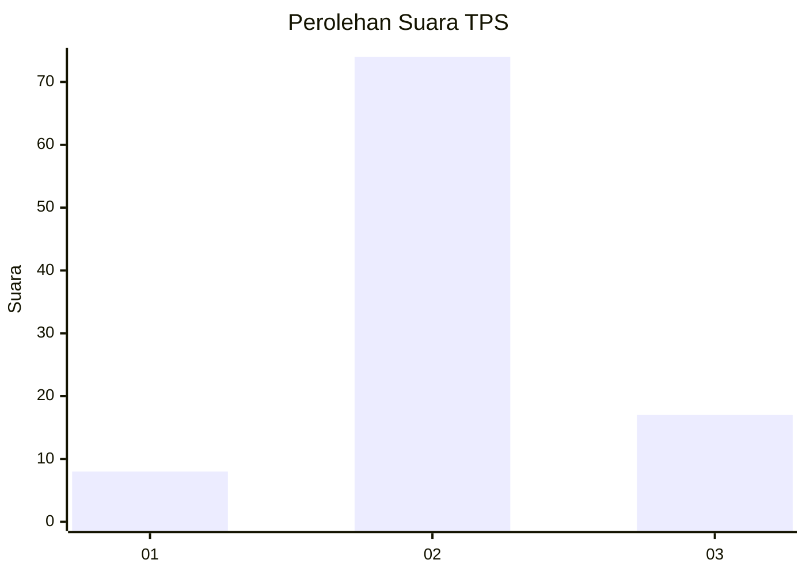
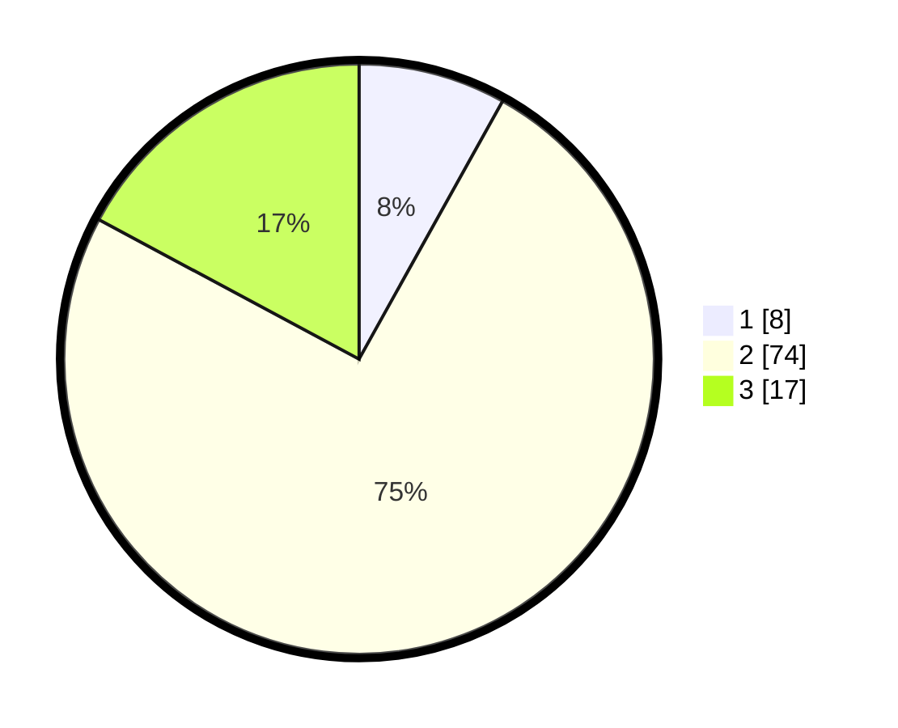

# Hasil

## Grafik

## Tabel

| No. | Nama Paslon    | Suara | Suara (raw) | Persentase |
|:--- |:-------------- | -----:| -----------:| ----------:|
| 1   | ANIES MUHAIMIN | 8     | [8][p-1]    | 8,08       |
| 2   | PRABOWO GIBRAN | 74    | [74][p-2]   | 74,75      |
| 3   | GANJAR MAHFUD  | 17    | [17][p-3]   | 17,17      |

[p-1]: https://github.com/gigit-pemilu/pemilu-2024-33-jawa-tengah/blob/main/pilpres/hitung-suara/sub/33-jawa-tengah/sub/05-kebumen/sub/26-karangsambung/sub/2013-karangsambung/sub/013-tps/sub/paslon-1.txt
[p-2]: https://github.com/gigit-pemilu/pemilu-2024-33-jawa-tengah/blob/main/pilpres/hitung-suara/sub/33-jawa-tengah/sub/05-kebumen/sub/26-karangsambung/sub/2013-karangsambung/sub/013-tps/sub/paslon-2.txt
[p-3]: https://github.com/gigit-pemilu/pemilu-2024-33-jawa-tengah/blob/main/pilpres/hitung-suara/sub/33-jawa-tengah/sub/05-kebumen/sub/26-karangsambung/sub/2013-karangsambung/sub/013-tps/sub/paslon-3.txt

## Foto C Plano

https://sirekap-obj-formc.kpu.go.id/6dce/pemilu/ppwp/33/05/26/20/13/3305262013013-20240214-214725--b0c001fd-532b-4884-b80e-273b8ed6dc8c.jpg

https://sirekap-obj-formc.kpu.go.id/6dce/pemilu/ppwp/33/05/26/20/13/3305262013013-20240214-214859--aae9d119-3a22-4802-980b-37e8e0d5ca9f.jpg

https://sirekap-obj-formc.kpu.go.id/6dce/pemilu/ppwp/33/05/26/20/13/3305262013013-20240214-215009--2ae694ea-ac87-4392-87de-cc79d11719d8.jpg

## Metadata

| Key        | Value               |
| ---------- | ------------------- |
| Time Stamp | 2024-02-19 17:00:00 |

