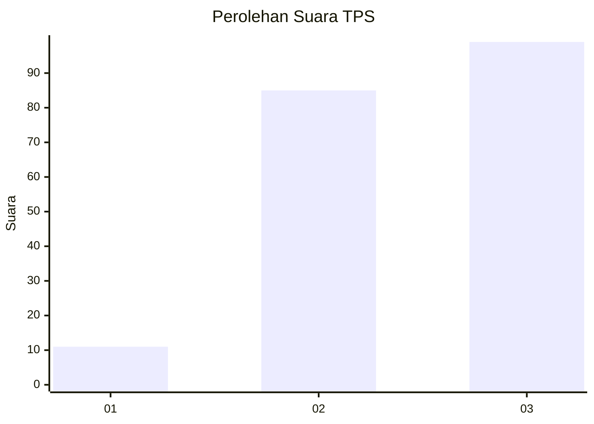
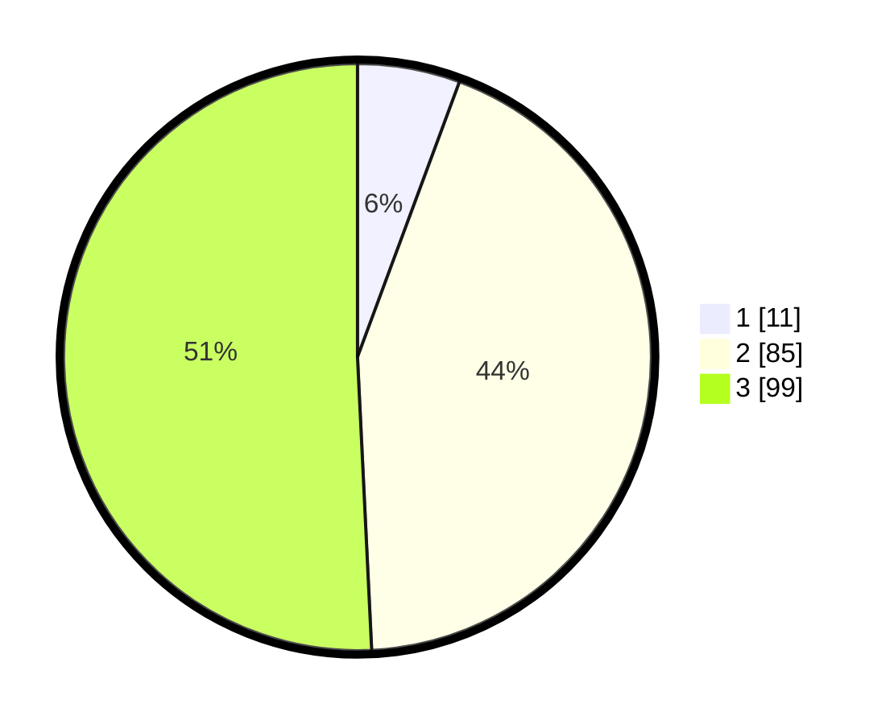

# Hasil

## Grafik

## Tabel

| No. | Nama Paslon    | Suara | Suara (raw) | Persentase |
|:--- |:-------------- | -----:| -----------:| ----------:|
| 1   | ANIES MUHAIMIN | 11    | [11][p-1]   | 5,64       |
| 2   | PRABOWO GIBRAN | 85    | [85][p-2]   | 43,59      |
| 3   | GANJAR MAHFUD  | 99    | [99][p-3]   | 50,77      |

[p-1]: https://github.com/gigit-pemilu/pemilu-2024/blob/main/pilpres/hitung-suara/sub/33-jawa-tengah/sub/06-purworejo/sub/01-grabag/sub/2005-kertojayan/sub/001-tps/sub/paslon-1.txt
[p-2]: https://github.com/gigit-pemilu/pemilu-2024/blob/main/pilpres/hitung-suara/sub/33-jawa-tengah/sub/06-purworejo/sub/01-grabag/sub/2005-kertojayan/sub/001-tps/sub/paslon-2.txt
[p-3]: https://github.com/gigit-pemilu/pemilu-2024/blob/main/pilpres/hitung-suara/sub/33-jawa-tengah/sub/06-purworejo/sub/01-grabag/sub/2005-kertojayan/sub/001-tps/sub/paslon-3.txt

## Foto C Plano

https://sirekap-obj-formc.kpu.go.id/9fb7/pemilu/ppwp/33/06/01/20/05/3306012005001-20240214-232413--0f7792ea-1b93-43d2-b8e7-c820db59f01c.jpg

https://sirekap-obj-formc.kpu.go.id/9fb7/pemilu/ppwp/33/06/01/20/05/3306012005001-20240214-232555--33351ef1-58cb-463f-a4c3-49613a66af39.jpg

https://sirekap-obj-formc.kpu.go.id/9fb7/pemilu/ppwp/33/06/01/20/05/3306012005001-20240214-232644--0b0b00c8-35f4-4d12-bfe8-e4608931a8de.jpg

## Metadata

| Key        | Value               |
| ---------- | ------------------- |
| Time Stamp | 2024-02-15 21:30:27 |

