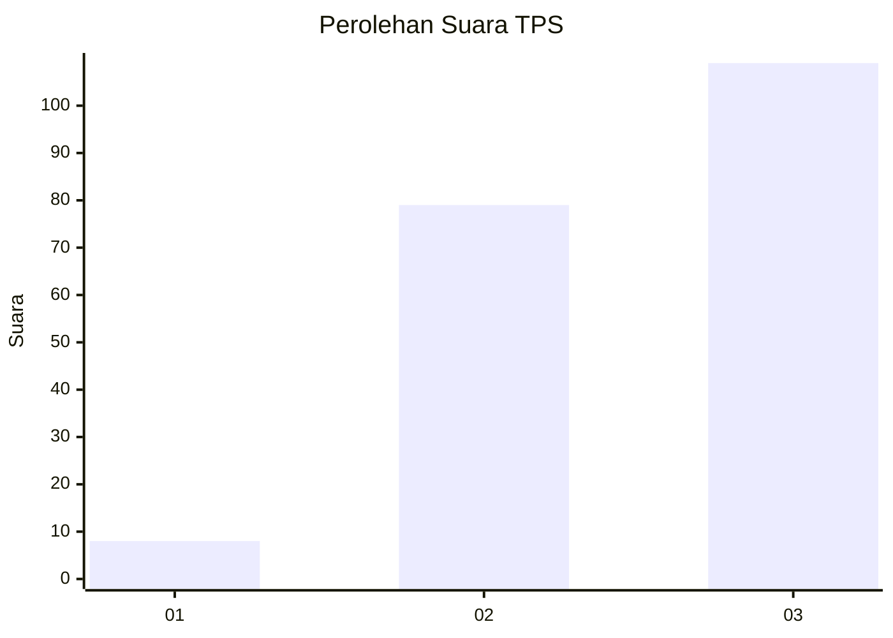
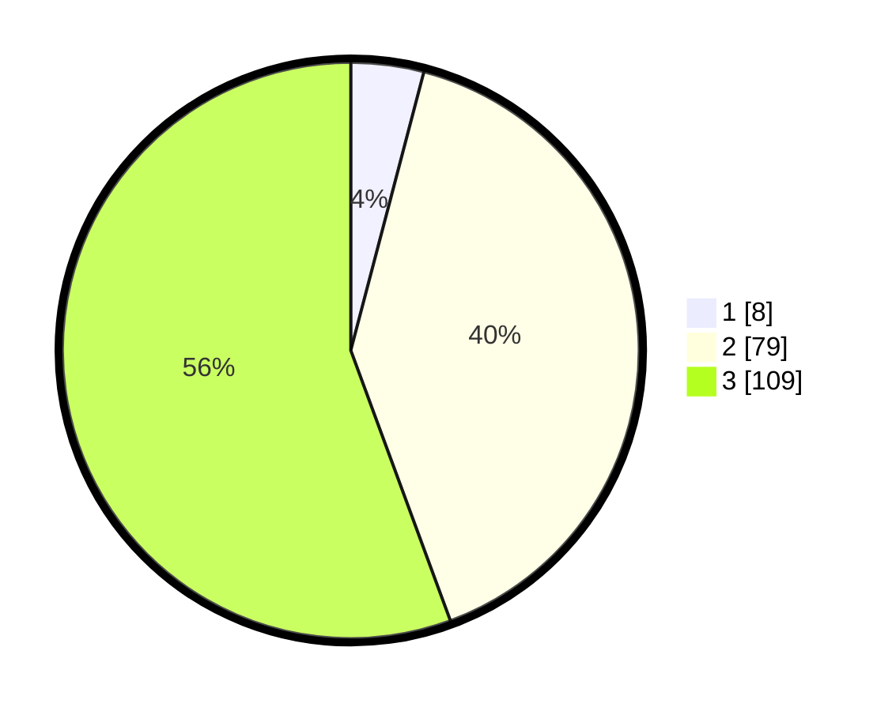

# Hasil

## Grafik

## Tabel

| No. | Nama Paslon    | Suara | Suara (raw) | Persentase |
|:--- |:-------------- | -----:| -----------:| ----------:|
| 1   | ANIES MUHAIMIN | 8     | [8][p-1]    | 4,08       |
| 2   | PRABOWO GIBRAN | 79    | [79][p-2]   | 40,31      |
| 3   | GANJAR MAHFUD  | 109   | [109][p-3]  | 55,61      |

[p-1]: https://github.com/gigit-pemilu/pemilu-2024/blob/main/pilpres/hitung-suara/sub/33-jawa-tengah/sub/06-purworejo/sub/01-grabag/sub/2009-sumberagung/sub/006-tps/sub/paslon-1.txt
[p-2]: https://github.com/gigit-pemilu/pemilu-2024/blob/main/pilpres/hitung-suara/sub/33-jawa-tengah/sub/06-purworejo/sub/01-grabag/sub/2009-sumberagung/sub/006-tps/sub/paslon-2.txt
[p-3]: https://github.com/gigit-pemilu/pemilu-2024/blob/main/pilpres/hitung-suara/sub/33-jawa-tengah/sub/06-purworejo/sub/01-grabag/sub/2009-sumberagung/sub/006-tps/sub/paslon-3.txt

## Foto C Plano

https://sirekap-obj-formc.kpu.go.id/03a2/pemilu/ppwp/33/06/01/20/09/3306012009006-20240215-004424--25771f5b-064d-48e8-b58c-f5a41d44e085.jpg

https://sirekap-obj-formc.kpu.go.id/03a2/pemilu/ppwp/33/06/01/20/09/3306012009006-20240214-141204--c7de5b14-8010-4e2d-a4e4-9ef1758cf054.jpg

https://sirekap-obj-formc.kpu.go.id/03a2/pemilu/ppwp/33/06/01/20/09/3306012009006-20240214-141326--4c159f7f-ed94-4225-afef-c13a3ee3d083.jpg

## Metadata

| Key        | Value               |
| ---------- | ------------------- |
| Time Stamp | 2024-02-15 21:30:27 |

