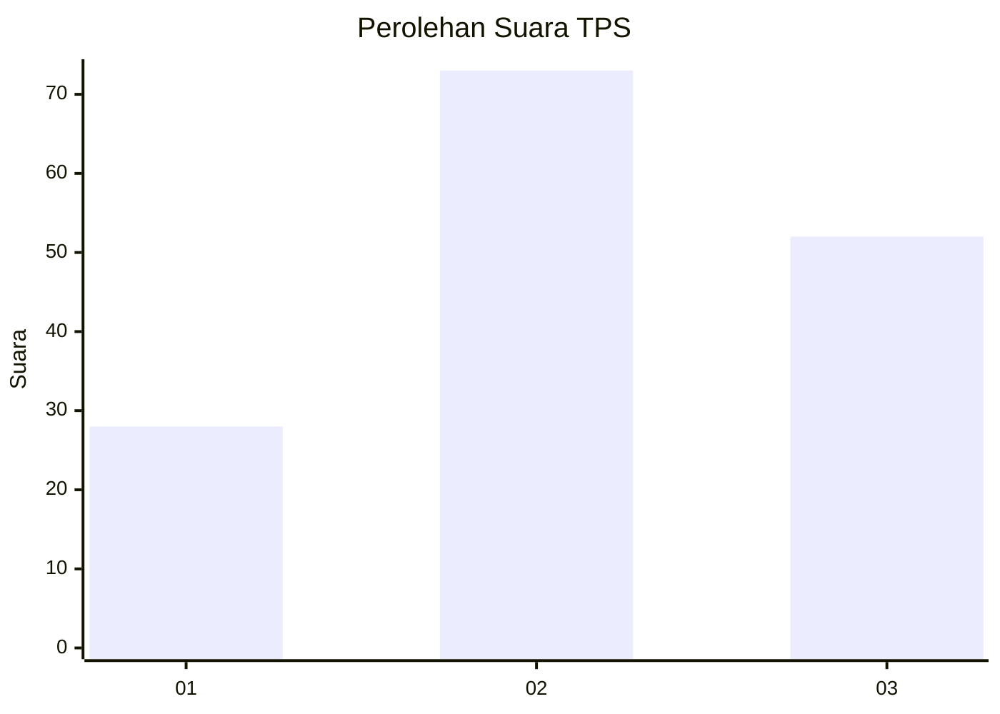
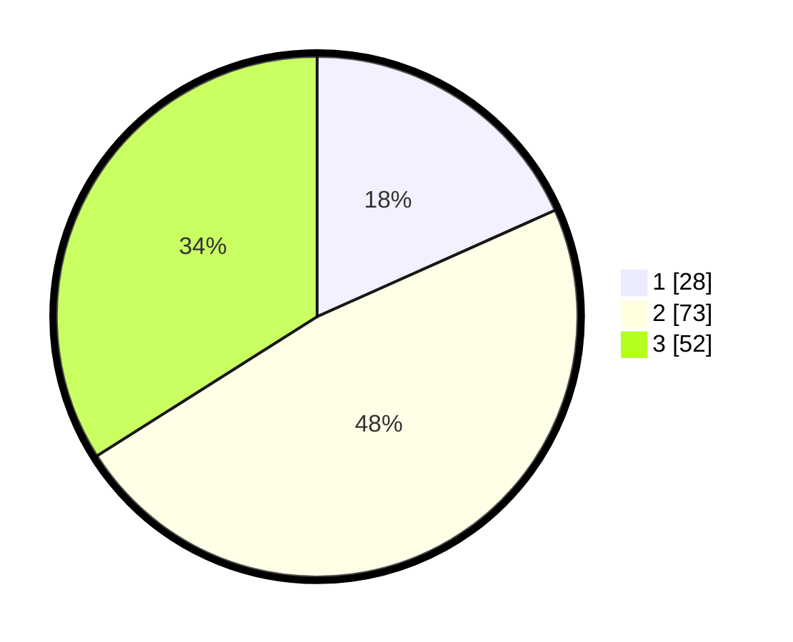

# Hasil

## Grafik

## Tabel

| No. | Nama Paslon    | Suara | Suara (raw) | Persentase |
|:--- |:-------------- | -----:| -----------:| ----------:|
| 1   | ANIES MUHAIMIN | 28    | [28][p-1]   | 18,30      |
| 2   | PRABOWO GIBRAN | 73    | [73][p-2]   | 47,71      |
| 3   | GANJAR MAHFUD  | 52    | [52][p-3]   | 33,99      |

[p-1]: https://github.com/gigit-pemilu/pemilu-2024/blob/main/pilpres/hitung-suara/sub/33-jawa-tengah/sub/06-purworejo/sub/01-grabag/sub/2018-tegalrejo/sub/003-tps/sub/paslon-1.txt
[p-2]: https://github.com/gigit-pemilu/pemilu-2024/blob/main/pilpres/hitung-suara/sub/33-jawa-tengah/sub/06-purworejo/sub/01-grabag/sub/2018-tegalrejo/sub/003-tps/sub/paslon-2.txt
[p-3]: https://github.com/gigit-pemilu/pemilu-2024/blob/main/pilpres/hitung-suara/sub/33-jawa-tengah/sub/06-purworejo/sub/01-grabag/sub/2018-tegalrejo/sub/003-tps/sub/paslon-3.txt

## Foto C Plano

https://sirekap-obj-formc.kpu.go.id/d2d5/pemilu/ppwp/33/06/01/20/18/3306012018003-20240218-200308--557ab32c-e65e-40a8-9b42-3b287e77028e.jpg

https://sirekap-obj-formc.kpu.go.id/d2d5/pemilu/ppwp/33/06/01/20/18/3306012018003-20240218-204137--3efc3bee-d280-4d6a-9647-32488b6bb8b9.jpg

https://sirekap-obj-formc.kpu.go.id/d2d5/pemilu/ppwp/33/06/01/20/18/3306012018003-20240218-201645--1c37886c-77ee-496d-b18b-e8029e188532.jpg

## Metadata

| Key        | Value               |
| ---------- | ------------------- |
| Time Stamp | 2024-02-25 11:00:00 |

