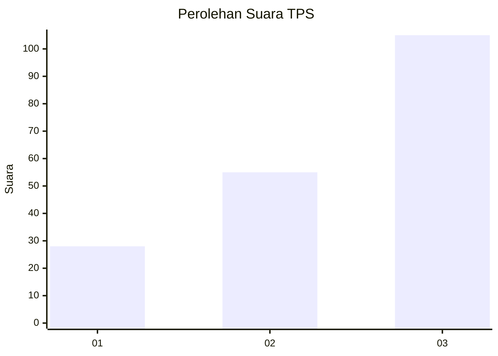
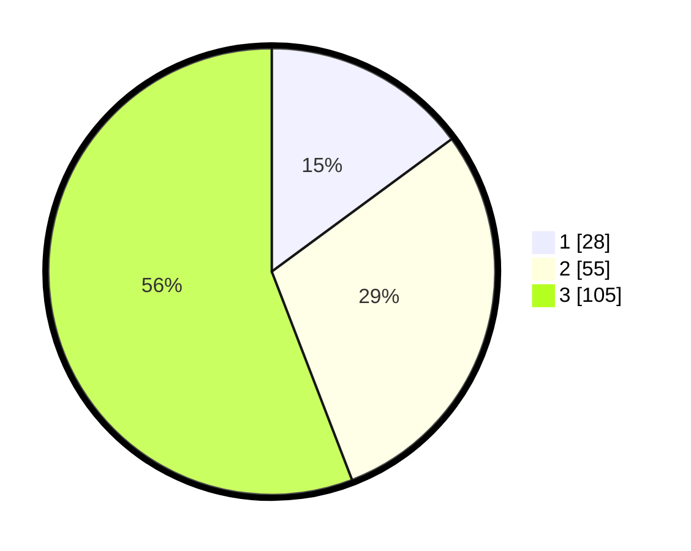

# Hasil

## Grafik

## Tabel

| No. | Nama Paslon    | Suara | Suara (raw) | Persentase |
|:--- |:-------------- | -----:| -----------:| ----------:|
| 1   | ANIES MUHAIMIN | 28    | [28][p-1]   | 14,89      |
| 2   | PRABOWO GIBRAN | 55    | [55][p-2]   | 29,26      |
| 3   | GANJAR MAHFUD  | 105   | [105][p-3]  | 55,85      |

[p-1]: https://github.com/gigit-pemilu/pemilu-2024/blob/main/pilpres/hitung-suara/sub/33-jawa-tengah/sub/06-purworejo/sub/01-grabag/sub/2023-aglik/sub/003-tps/sub/paslon-1.txt
[p-2]: https://github.com/gigit-pemilu/pemilu-2024/blob/main/pilpres/hitung-suara/sub/33-jawa-tengah/sub/06-purworejo/sub/01-grabag/sub/2023-aglik/sub/003-tps/sub/paslon-2.txt
[p-3]: https://github.com/gigit-pemilu/pemilu-2024/blob/main/pilpres/hitung-suara/sub/33-jawa-tengah/sub/06-purworejo/sub/01-grabag/sub/2023-aglik/sub/003-tps/sub/paslon-3.txt

## Foto C Plano

https://sirekap-obj-formc.kpu.go.id/4173/pemilu/ppwp/33/06/01/20/23/3306012023003-20240214-191222--ca86f437-71d5-45fb-b74f-1855cb7cc227.jpg

https://sirekap-obj-formc.kpu.go.id/4173/pemilu/ppwp/33/06/01/20/23/3306012023003-20240214-191340--9fb74357-1d40-4d7b-9018-43e22e2e9ab5.jpg

https://sirekap-obj-formc.kpu.go.id/4173/pemilu/ppwp/33/06/01/20/23/3306012023003-20240214-191802--7b8021fa-603a-4fec-89ec-2fabd56b05f7.jpg

## Metadata

| Key        | Value               |
| ---------- | ------------------- |
| Time Stamp | 2024-02-14 21:46:01 |

