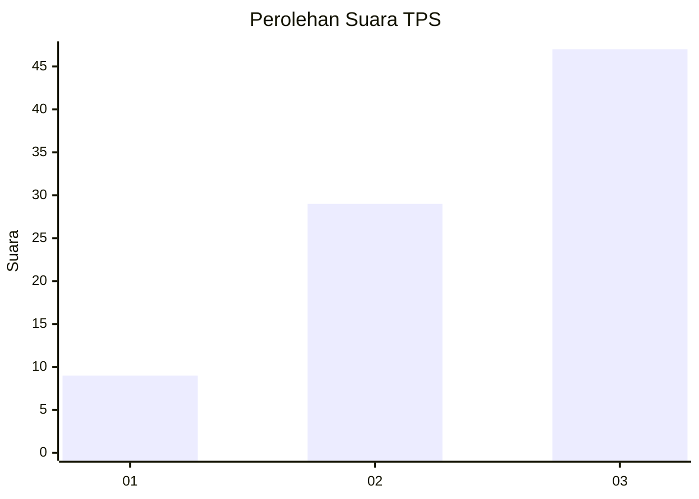
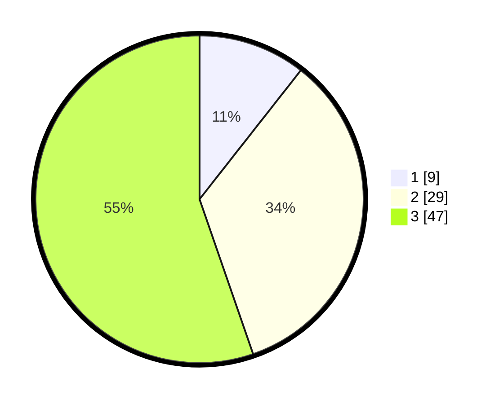

# Hasil

## Grafik

## Tabel

| No. | Nama Paslon    | Suara | Suara (raw) | Persentase |
|:--- |:-------------- | -----:| -----------:| ----------:|
| 1   | ANIES MUHAIMIN | 9     | [9][p-1]    | 10,59      |
| 2   | PRABOWO GIBRAN | 29    | [29][p-2]   | 34,12      |
| 3   | GANJAR MAHFUD  | 47    | [47][p-3]   | 55,29      |

[p-1]: https://github.com/gigit-pemilu/pemilu-2024-33-jawa-tengah/blob/main/pilpres/hitung-suara/sub/33-jawa-tengah/sub/06-purworejo/sub/02-ngombol/sub/2002-girirejo/sub/001-tps/sub/paslon-1.txt
[p-2]: https://github.com/gigit-pemilu/pemilu-2024-33-jawa-tengah/blob/main/pilpres/hitung-suara/sub/33-jawa-tengah/sub/06-purworejo/sub/02-ngombol/sub/2002-girirejo/sub/001-tps/sub/paslon-2.txt
[p-3]: https://github.com/gigit-pemilu/pemilu-2024-33-jawa-tengah/blob/main/pilpres/hitung-suara/sub/33-jawa-tengah/sub/06-purworejo/sub/02-ngombol/sub/2002-girirejo/sub/001-tps/sub/paslon-3.txt

## Foto C Plano

https://sirekap-obj-formc.kpu.go.id/2354/pemilu/ppwp/33/06/02/20/02/3306022002001-20240214-234528--4f411d8c-0a03-4c57-a871-c574443782fe.jpg

https://sirekap-obj-formc.kpu.go.id/2354/pemilu/ppwp/33/06/02/20/02/3306022002001-20240214-210610--26c7225d-8d90-4be0-a999-03009f62b62b.jpg

https://sirekap-obj-formc.kpu.go.id/2354/pemilu/ppwp/33/06/02/20/02/3306022002001-20240214-210419--5befef88-cbd2-4409-bc55-e7d41dbb4575.jpg

## Metadata

| Key        | Value               |
| ---------- | ------------------- |
| Time Stamp | 2024-02-15 05:00:24 |

## DATA PEMILIH TETAP

Jumlah pemilih dalam DPT: **112**.
 * L: **54**.
 * P: **58**.

## DATA PENGGUNA HAK PILIH

Jumlah pengguna hak pilih dalam DPT: **84**.
 * L: **44**.
 * P: **40**.

Jumlah pengguna hak pilih dalam DPTb: **4**.
 * L: **2**.
 * P: **2**.

Jumlah pengguna hak pilih dalam DPK: **0**.
 * L: **0**.
 * P: **0**.

Jumlah pengguna hak pilih: **88**.
 * L: **46**.
 * P: **42**.

## JUMLAH SUARA SAH DAN TIDAK SAH

JUMLAH SELURUH SUARA SAH: **85**.

JUMLAH SUARA TIDAK SAH: **3**.

JUMLAH SELURUH SUARA SAH DAN SUARA TIDAK SAH: **88**.

